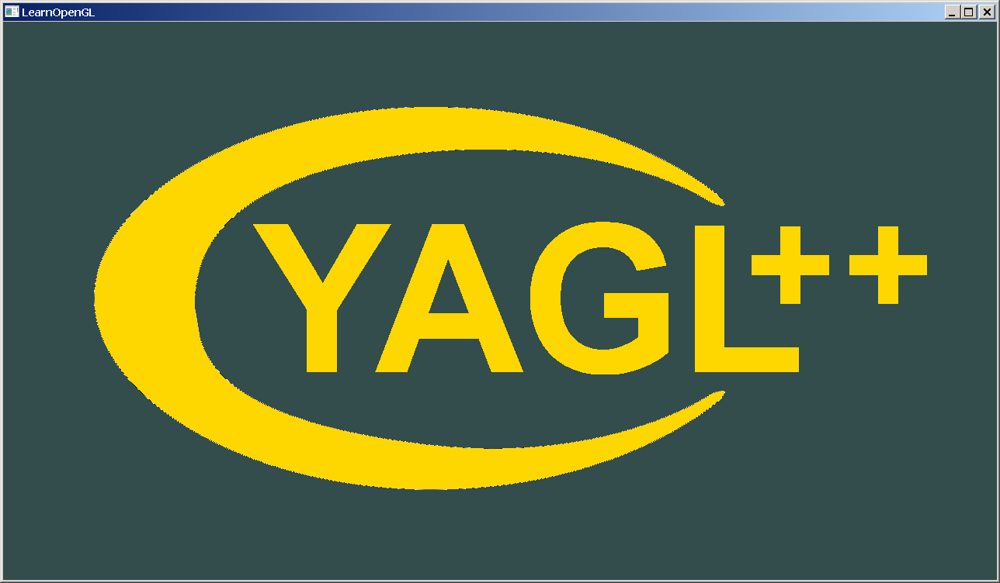
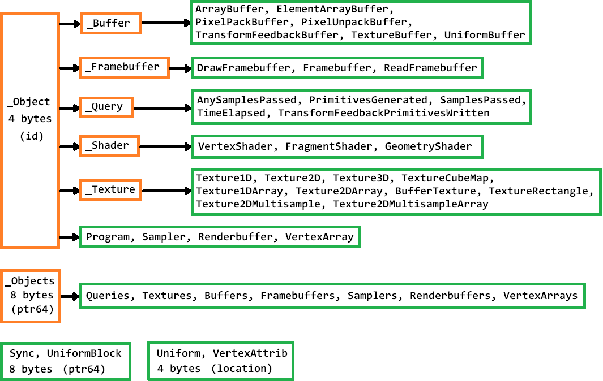

# Yet Another GL++ library
[INSTALLATION &rarr;](docs/INSTALLATION.md)<br>
[USAGE &rarr;](docs/USAGE.md)<br>
[EXAMPLES &rarr;](docs/EXAMPLES.md)<br>
- [Naming concept](README.md#naming-concept)
- [IntelliSense](README.md#intellisense)
- [The main switches](README.md#the-main-switches)
- [GLAD classess](README.md#glad-classes)
- [Class tree](README.md#class-tree)
- [GLFW classes](README.md#glfw-classes)
- [Helper classes](README.md#helper-classes)

YAGL++ is _"yet another"_ attempt to develop a C++ gear for the OpenGL API, merging its assets into the C++ objects. There are plenty of similar projects on the GitHub. So, why another one? The present project aims to fill the gap as a _thoughtful_, _transparent_ and _complete_ library, meaning that not a single API asset is missing in its code. Primarily, YAGL++ was designed as a tool to help [learning OpenGL API](https://learnopengl.com/), but after a while it turned out to be quite efficient. It takes care of the routine work, allowing to develop the OpenGL application in less complicated manner, and without substantial overhead. The C++ features make the OpenGL programming more compact, clear and stable. For example, using the [overloaded functions](https://learn.microsoft.com/en-us/cpp/cpp/function-overloading) is much more convenient than to recall the every exact API name, such as **`glUniform3fv`**. Instead, it is possible to just call **`uniform`** method with appropriate parameters.

The library consists only of the _header files_, and requires the C++ 11 compiler or later. It impliments the [SAL](https://learn.microsoft.com/en-us/cpp/code-quality/using-sal-annotations-to-reduce-c-cpp-code-defects) concept (Microsoft Source Code Annotation Language) only in Debug mode, making the usage of the library less error-prone. At the moment, it is being developped for Visual Studio under OS Windows. The code of the library can be viewed in the repository's [include](include) directory. To properly install and use the library, follow the instructions in the [INSTALLATION](docs/INSTALLATION.md) and [USAGE](docs/USAGE.md) documents. The library is extremely easy to start up, it requires only two lines, while the first one should be used only once per application:
```
#define YAGLPP_IMPLEMENTATION
#include <yaglpp/glpp.h>
```
The library works with OpenGL context versions 2.0 to 3.3, and [GLFW](https://www.glfw.org/) version 3.4+. It is also integated with the [STB](https://github.com/nothings/stb) image library as one of its direct dependencies. The [Assimp](https://github.com/assimp/assimp) and [GLM](https://github.com/g-truc/glm) libraries, are silently included in the main header file [glpp.h](include/glpp.h). Since they are both written in C++, there is no any workaround. It is possible to select the required OpenGL context version by altering the **`YAGLPP_CONTEXT_VERSION_MAJOR`** and **`YAGLPP_CONTEXT_VERSION_MINOR`** main switches in the [glpp.h](include/glpp.h) header file. The used context version affects the build, making available only the supported API assets.

The library uses two ways of data input: the _file_ and the _binary resource_, which has to be of **`RCDATA`** type. Every call to the API function in the library is provided with the appropriate error checking, which has an effect only in Debug mode. On the contrary, under the Release build, the library attempts to impliment the inline calls, depending on the compiler setting. Here is the average YAGL++ member function implementation under the Debug mode:
```
void Uniform::uniform(GLsizei count, _In_reads_(count) const glm::vec3* value)
{
	glUniform3fv(_location(), count, (GLfloat*)value); // GLAD API call
	YAGLPP_GLAD_ERROR;                                 // Error checking macro
}
```
Where as under Release mode it compiles as:
```
inline void Uniform::uniform(GLsizei count, _In_reads_(count) const glm::vec3* value)
{
	glUniform3fv(_miLocation, count, (GLfloat*)value);
}
```
The most valuable feature of the library is the **_"lasy" creation and binding concept_**, where the OpenGL object is automatically created and binded _only when required_. The creation of a class object does not mean the OpenGL object immediate creation or binding. This allows the YAGL++ objects to exist before the creation of OpenGL context. The library performs a background check before any valid operation with OpenGL object. Thus, the functions for creation and bindind are not required, but still preserved to allow the programmer to call them when needed, for example, to explicitly create an object at specific point of the code, or to bind an object to its target in another OpenGL context.

> [!NOTE]
> Some of YAGL++ objects do not follow this rule. The **`gl::VertexArray`** object must be _bound_ explicitly at a certain point of the code, the **`gl::Sampler`** object must be _bound_ with a parameter, the **`gl::Sync`** object must be _created_ explicitly with **`fenceSync`** method, where as _multi-objects_ and all **`glfw::`** objects have to be _created_ with specific parameters.

### Naming concept
For the sake of _transparency_, the original API names are carefully preserved. The most of the class names are based on the OpenGL _targets_, e.g., **`Texture2D`** class name is based on **`GL_TEXTURE_2D`** target. But some changes could be applied in rare conflicting cases. For example, the **`GL_TEXTURE_BUFFER`** target is being used by buffer and texture objects, therefore the **`TextureBuffer`** class is a buffer, while the **`BufferTexture`** is a texture. As the API functions are grouped around the classes, the API constants are grouped around the enum classes. This approach makes the library less error-prone, since the usage of a wrong enumerator type or value simply won't compile.

The library assets are defined within **`gl::`** and **`glfw::`** namespaces for GLAD and GLFW APIs respectively. The two helper classes, **`DataStore`** and **`StbImage`**, reside in the global namespace. You may bypass the **`gl::`** and **`glfw::`** prefixes with **`using namespace`** directives, but it is advised to keep them at least while learning the OpenGL API. The prefixes will also prevent name conflict while managing large projects. 

The names in YAGL++ library are obtained by stripping _gl_ or _glfw_ prefixes of the original API names, and applying the camil-case rule for the rest. The class member names of the **`StbImage`** class, are obtaining by stripping _stbi_ prefix of the original STB image function names. For the constant names, every underscore symbol is used as a word delimiter. Such an approach ensures the library's _transparency_: while learning the original API symbols, it allows the relatively easy switch to OpenGL C programming in the future. Some of the API functions such as **`glDisable`**, **`glEnable`**, **`glGet`**, **`glIsEnabled`**, and **`glPixelStore`** are used with the names of their constant values. For example:
```
glDisable(GL_SAMPLE_COVERAGE)
glEnable(GL_SCISSOR_TEST)
glGetIntegerv(GL_COLOR_CLEAR_VALUE, color)
glIsEnabled(GL_POLYGON_SMOOTH)
glPixelStoref(GL_UNPACK_ROW_LENGTH, length)
glfwWindowHint(GLFW_VISIBLE, visible)
```
in YAGL++ library become:
```
gl::disableSampleCoverage()
gl::enableScissorTest()
gl::getColorClearValue(color)
gl::isPolygonSmooth()
gl::setUnpackRowLength(length)
glfw::setVisible(visible)
```
Some global library's functions are duplicated as a static members of a class, it helps to find them on the context basis, e.g. the two following functions are doing the same:
```
GLfloat gl::getMaxTextureLodBias();            // Global function
GLfloat gl::Texture2D::getMaxTextureLodBias(); // Static member function
```
To handle the object parameters and states, along with the classical setters and getters, the YAGL++ classes are supplied with the [Class Properties](https://learn.microsoft.com/en-us/cpp/cpp/property-cpp?view=msvc-170), which are well known as the _C++ syntactical sugar_, at some degree simplifiying the readability of the code. In case if this feature is not supported by the compiler, or if the YAGL++ library is used as a part of another library, the **`YAGLPP_CLASS_PROPERTIES`** main switch in the [glpp.h](include/glpp.h) file should be commented. The property name is obtained by stripping the appropriate _set_, _get_ or _is_ function prefix. These prefixes may also be selectively added to an original name, to avoid name conflict with a property name. For example, the original name **`glUniformBlockBinding`** is used by a class member **`setUniformBlockBinding`**, which is used as a setter of the **`uniformBlockBinding`** read-write property. The following function calls:
```
texture2D.setTextureBaseLevel(0);
GLfloat f = texture2D.getTextureMaxLod();
GLboolean b = texture2D.isTexture();
```
could be also invoked via property fields:
```
texture2D.textureBaseLevel = 0;
GLfloat f = texture2D.textureMaxLod;
GLboolean b = texture2D.texture;
```

> [!CAUTION]
> The underscore at the beginning of a name means a private assignment, it should NOT be used directly. The global symbols starting with **`YAGLPP_`** are also preserved by the library.

### IntelliSense
Every class, function or enum member in the library is provided with a comment shown in Visual Studio by the [IntelliSense](https://learn.microsoft.com/en-us/visualstudio/ide/using-intellisense) with the description, parameter list and return value. This is a nice opportunity to briefly recap what the function does while typing the code, instead of going online time after time. All information in such comments is taken from [Khronos website](https://registry.khronos.org/OpenGL-Refpages/gl4/).

If the description starts with the number in parentheses, it means either the supported OpenGL context version (as floating point number), or the number of overloaded function (as integer number). If the version number is missing, OpenGL 2.0 support is assumed. For example, the description of a function starting with **`(3.0) (18)`** means the support of OpenGL version 3.0 and above, plus it specifies that this is the 18's overloaded function. The description of the GLFW object function may start with **`(M)`** or **`(S)`** symbols meaning that the function can be called only from the _main_ or _secondary_ threads.

> [!IMPORTANT]
> The provided comments are brief, and if the function looks unfamiliar, it is recommended to consult its official documentation.

### The main switches
The symbols defined after **`#pragma once`** directive in the [glpp.h](include/glpp.h) file are the main switches, they affect the library setup. The first seven switches could be just commented, the others may have different values. The **`YAGLPP_CONTEXT_VERSION_MAJOR`** and **`YAGLPP_CONTEXT_VERSION_MINOR`** must exist and should never be commented:
- Switches **`YAGLPP_COCOA_CHDIR_RESOURCES`**, **`YAGLPP_COCOA_MENUBAR`** and **`YAGLPP_JOYSTICK_HAT_BUTTONS`** are the GLFW hints set at the initialization, they are on by default;
- Commenting the **`YAGLPP_CLASS_PROPERTIES`** switch will exlude the class properties from the library;
- Commenting the **`YAGLPP_GLM_HEADERS`** switch will exclude GLM library headers, this allows to include only specific GLM headers, while slightly reducing the compile time;
- Commenting the **`YAGLPP_NO_AFX_LAYOUT`** switch will transform the YAGL++ into the AFX-alike environment, without the **`main`** function. Instead, the code must contain the global variable of a class derived from **`glfw::Thread`**. Otherwise, classical layout with the **`main`** function is expected;
- Commenting the **`YAGLPP_NO_GLFW_LEGACY`** switch allows to build YAGL++ with GLFW v3.3.10, the latest version supporting Windows XP. In this case, the recent GLFW features become unavailable;
- The **`YAGLPP_CONTEXT_VERSION_MAJOR`** and **`YAGLPP_CONTEXT_VERSION_MINOR`** switches indicate the OpenGL context version supported by the library. Accepted combination of these values are: 2/0, 2/1, 3/0, 3/1, 3/2 and 3/3 to represent the supported versions 2.0 to 3.3 respectively;
- The **`YAGLPP_ASSIMP`** and **`YAGLPP_GLFW`** switches contain the Assimp and GLFW and library file names. Ccommenting those switches will exclude the corresponding library from the build

> [!TIP]
> It is possible to override the main swithes, placing them inside a project. To do that, first define a symbol **`YAGLPP_CONFIG`**, then all the above switches, prior to include the main [glpp.h](include/glpp.h) header file.

### GLAD classes
All classes in the _gl::_ namespace are counterparts of the GLAD API. They all have the default constructor creating an empty class object, allowing it to exist before OpenGL initialization. From the other hand, every GLAD class have a copy constructor, duplicating the source object, this allows to use it in an assignment statement, as a function parameter, or as a return value. Every class has a unique data member, a 4-byte _id integer_, or a _pointer_. The class object is considered _empty_, if its data member is set to zero. All derived classes are guaranteed to have the same data size as their parent class, thus allowing to easily combine them within another stucture or class. The lifetime of the OpenGL object is controlled by the class destructor, it does not always destroy OpenGL object, depening on how this object was created. There are basically three kinds of GLAD class objects: if the class is created as a _single object_, it automatically destroys an OpenGL object, where as _reference object_ does not. The _multi-object_ creates and destroys many OpenGL objects at once.

**_Single object_** is the one creating its own _single_ OpenGL object, while its _reference flag_ is set to false. There could be _only one_ single object at the time for each OpenGL _id_. This is done to avoid an unwanted cleanup of a duplicate objects. The single object could be duplicated with **`duplicate..`** method, where its _id_ and _reference flag_ are copied into destination object making it a _single_ or _reference_ object, while its own _reference flag_ is set to true making it a _reference_ object. The same algorithm is used in object's copy constructor, this allows to pass the single object as a return value without prematurely cleaning up its id:
```
gl::Renderbuffer rb;   // Empty object within a function
rb.bindRenderbuffer(); // Create and bind a single object
return rb;             // Return a single object duplicate, while rb becomes a reference object
```
**_Rreference object_** is actually another kind of a _single_ object. It has the same functionality, but it simply copies the _id_ from an already created one. It does not take any mesures to handle the OpenGL object lifetime, leaving it to the source single object. When it is deleted, it becomes empty without clearing the object _id_. In contrary to a single object, it is possible to have many objects referencing the same OpenGL _id_ at the time. The reference object could be used as temporary asset in a current or another OpenGL context. It could be obtained from a single or another reference object with **`reference..`** method:
```
gl::Texture2D t1, t2, t3; // Empty objects
t1.bindTexture();         // t1 is a single object
t2.referenceTexture(t1);  // t2 is a reference object, while t1 remains a single object
t3.duplicateTexture(t2);  // t3 become a single, while t2 transforms into a reference object
```
**_Multi-object_** has the size of a _pointer_, creating the required array of object _ids_ dynamically in the client memory. When this object is duplicated or deleted, it increases or decreases its reference count. The only final object's _ids_ will be cleared, this is not the case for a single objects: using such algorithm would be too expensive for a single 4-byte value. The multi-object can generate or delete the object _ids_ via **`gen..`** or **`delete..`** functions. The valid object saves the _reference_ number, the array size, and assigned object types (Debug only). The multi-object could not be used by itself, every object _id_ should be used through a reference obtained via **`get..`** methods. In Debug mode, it checks the object type at every assignment, since the usage of the same _id_ with a different _target_ is not allowed by OpenGL (e.g. _ArrayBuffer_ should not be later used as _ElementArrayBuffer_):
```
gl::Buffers bs(10);                                         // Generate 10 object names
gl::ArrayBuffer& b1 = bs.getArrayBuffer(0);                 // Alias to a reference object
// gl::ElementArrayBuffer b2 = bs.getElementArrayBuffer(0); // Error: different type
gl::ElementArrayBuffer b2 = bs.getElementArrayBuffer(1);    // Copy of a reference object
```
To find out whether or not the class has the OpenGL object(s), use the **`isObject()`** method. The single object is automatically created as soon as it undergo a valid OpenGL operation, the reference object must be created from an existing one. To find out whether or not the single object is a reference object, use the **`isReference()`** method. The classes derived from **`gl::_Object`**, are single objects, most of their methods automatically create and bind an OpenGL object when necessary, except the **`is..`** methods, they work exactly as their API counterparts:
```
GLboolean b1 = rb.isSampler();        // as glIsSampler(id)
GLboolean b2 = rb.isSamplerBinding(); // as glGetIntegerv(GL_SAMPLER_BINDING..) == id
```

### Class tree
The classes in **`gl::`** namespace are derived mostly from **`gl::_Object`** class, operating a single _id_. When its value is set to zero, these classes are considered _empty_ objects. They control the OpenGL [Buffer](https://www.khronos.org/opengl/wiki/Buffer_Object), [Texture](https://www.khronos.org/opengl/wiki/Texture), [Framebuffer](https://www.khronos.org/opengl/wiki/Framebuffer_Object), [Renderbuffer](https://www.khronos.org/opengl/wiki/Renderbuffer_Object), [Query](https://www.khronos.org/opengl/wiki/Query_Object), [Sampler](https://www.khronos.org/opengl/wiki/Sampler_Object) and [Vertex Array](https://www.khronos.org/opengl/wiki/Vertex_Specification#Vertex_Array_Object) objects, they could be automatically _created_ and _binded_ when applicable. Their _ids_ could also be generated or cleared once in big number via their _multi-object_ counterparts, which are the classes derived from **`gl::_Objects`** class, carriyng an array of OpenGL object _ids_ of varriyng length. The multi-object class data member is single pointer, this is also the case for _Sync_ and _UniformBlock_ classes. Its **`NULL`** value means an _empty_ object. The OpenGL [Program](https://www.khronos.org/opengl/wiki/GLSL_Object#Program_objects) and [Shader](https://www.khronos.org/opengl/wiki/Shader) objects could be also automatically _created_, they do not have their multi-object counterparts, as well as binding capacity. Instead, the Program object must to be explicitly _linked_, where as the Shader object must be explicitly _compiled_, the appropriate constructors exist as well. The data member of _Uniform_ and _VertexAttrib_ classes is a single 4-byte signed integer, operating a location value. It could be **`-1`**, meaning an _empty_ object. The following class tree exposes the classes's inheritance, as well as their data size in bytes:



> [!NOTE]
> The unsigned integer data member **`_muId`** of the **gl::_Object`** class is using its highest bit as a _reference flag_, allowing to differentiate single and reference objects. The pointers in Win32 application are 4-byte long. So will be the size of the class object using a pointer.

> [!CAUTION]
> The names starting with underscore character stand for the base abstract classes, they have only protected constructors, and therefore could NOT be used.

The ***Uniform*** and ***VertexAttrib*** classes have no destructors, they operate the location index value of a [Uniform](https://www.khronos.org/opengl/wiki/Uniform_(GLSL)) and a [Vertex Attribute](https://www.khronos.org/opengl/wiki/Vertex_Specification) respectively, which remains valid as long as the [Program](https://www.khronos.org/opengl/wiki/GLSL_Object#Program_objects) object remains linked. Since the location value must be set, they cannot be created automatically. The **`getUniformLocation`** and **`getAttribLocation`** methods aquire the location using a program object and the uniform or attribute name. If the location index is known, it could be set directly with **`setUniformLocation`** and **`setAttribLocation`** methods. The appropriate constructors exist as well. To find out if the location value was set successfully, use **`isUniform`** and **`isVertexAttrib`** methods.

The ***Sync*** class operates the OpenGL [Synchronization](https://www.khronos.org/opengl/wiki/Sync_Object) object, which is the pointer to an opaque API object. It must be created at the specific point of a program with **`fenceSync`** method, therefore its methods **`clientWaitSync`**, **`getSync`** and **`waitSync`** require the valid object.

The ***UniformBlock*** class allows to operate many uniform variables at once, it works closely with [Uniform Buffer Object](https://www.khronos.org/opengl/wiki/Uniform_Buffer_Object). The class data has a uniform block index, which is aquired with **`getUniformBlockIndex`** or directly set with **`setUniformBlockIndex`** methods, or by the appropriate constructor. These methods save as well the program _id_, number of uniforms, data block size and copy uniform block indices. This allows to use the saved data in next operations without the need to save it outside of a class. Since the number of indices is unknown, the whole class data is created dynamically, and the class object has the size of a pointer. The _offset map_ is a special class feature allowing much easier uniform block data exchange. It is a user-defined stucture of pointers of the type specified in GLSL shader. The **`uniformBlockOffsetMap`** method calculates all uniform offsets in the specified memory block, and sets the absolute addresses to the stucture pointers, allowing to interchange uniform values directly through these pointers.

### GLFW classes
The classes in the _glfw::_ namespace are counterparts of the GLFW API. They all have the default constructor creating an empty class object, but unlike the GLAD objects, GLFW objects do not require binding, they must be explicitly created or selected via their methods. Consisting of multiple data members, these cumbersome objects are less suitable to be combined within a stucture or another class. According to the [GLFW documentation](https://www.glfw.org/docs/latest/intro_guide.html#thread_safety), the most of GLFW API functions _must only be called from the main thread_. Despite the GLFW library itself does not raise an error, the YAGL++ library will always assert the proper calling of these functions only in Debug mode, since otherwise their behaviour on the different platforms is not guaranteed. Starting from the version 3.4, YAGL++ use GLFW custom allocator, this allows customized memory managment via the general library macros.

The **_Cursor_** class operates a GLFW [Cursor](https://www.glfw.org/docs/3.3/input_guide.html#cursor_object) object. It has only **`createStandardCursor`** method and two overloaded **`createCursor`** methods to explicitly create the GLFW cursor object from different sources. The appropriate constructors exist as well. The **`destroyCursor`** method is called from the class destructor, if the object was not cleared before.

The **_Joystick_** class controls a GLFW [Joystick](https://www.glfw.org/docs/3.3/input_guide.html#joystick) input functionality, which exist from the GLFW initialization, and terefore its lifetime could not be controlled. Instead, the joystick device could be _selected_ via appropriate constructor, two overloaded **`selectJoystick`** or **`selectJoystickGUID`** methods, and _deselected_ via class destructor or **`deselectJoystick`** method. It is not possible to have multiple Joystick classes referencing the same joystick device, the class previously selecting that device will be automatically deselected when another class picks it up. The _gamepad_ methods work only for the devices supporting the [Gamepad](https://www.glfw.org/docs/3.3/input_guide.html#gamepad) input, to find out if this is the case, call **`joystickIsGamepad`** method. The Joystick class supports event handling, the single **`onDisconnect`** virtual function notifies the class object when associated physical device is disconnected, before that object is being voided. It is also possible to catch the joystick device connected event by setting **`JoystickConnectedCallback`** procedure via **`setJoystickConnectedCallback`** global function or static method.

> [!TIP]
> In order to use the joystick disconnected event handler, it is necessary to derive a class from **`glfw::Joystick`**, and write over its **`onDisconnect`** virtual function.

The **_Monitor_** class is somewhat similar to Joystick class, it controls GLFW [Monitor](https://www.glfw.org/docs/3.3/monitor_guide.html#monitor_object) object used to set the OpenGL application into fullscreen mode, it exist from the GLFW initialization. The monitor device could be _selected_ via appropriate constructor or three overloaded **`selectMonitor`** methods, and _deselected_ via class destructor or **`deselectMonitor`** method. As for Joystick class, it is not possible to have multiple Monitor classes referencing the same monitor device, so the same mechanism is applied here. As Joystick class, Monitor class has **`onDisconnect`** virtual function. To catch monitor connected event, set **`MonitorConnectedCallback`** procedure via **`setMonitorkConnectedCallback`** global function or static method.

The **_Thread_** class is not a part of GLFW library, it is added to **`glfw::`** namespace exclusively to handle the OS Windows [Threads](https://learn.microsoft.com/en-us/windows/win32/procthread/processes-and-threads) and thread syncronization. Its default constructor sets up an empty object, except that the main application Thread object exists since the GLFW initialization, it can be retreived through **`getMainThread`** global function or a static method. If the YAGL++ library is set into an AFX-alike mode, this function returns a pointer to a global application variable. Every other class object can start a new application thread. While the block message flag is unset (default), the Thread class allows to set up inter-thread communication, as well as to handle thread specific parameters, such as thread status, priority etc. The main working loop can be overwritten using the **`onRun`** virtual function. The other virtual functions **`onInit`**, **`onInput`**, **`onRender`**, **`onMessage`**, **`onIdle`**, and **`onExit`** are called from the main working loop, notifying the class object at every corresponding thread stage. It is recommended to use these function names if the **`onRun`** function is overwritten. This will prevent the unnecessary growth of the class virtual table in the derived class. While the YAGL++ library is not in AFX-alike mode, the **`getMainThread`** function returns the pointer to **`glfw::Thread`** base class. Despite its virtual functions could not be overwritten, it is still possible to handle its posted messages within the window rendering loop by calling **`dispatchMessage`** method:
```
glfw::Message msg;
while (glfw::dispatchMessage(&msg))
{
    // msg structure contains message data
}
```

The **_Window_** class operates a GLFW [Window](https://www.glfw.org/docs/3.3/window_guide.html#window_object) object. This is the largest library object, and the most of the GLFW API functions are merged around it. The window object is created via appropriate constructor or four overloaded **`createWindow`** methods, and deleted via class destructor or **`destroyWindow`** method. The **`createWindow`** method has an optional **`setting`** parameter, which is the pointer to **`ContextSetting`** structure, this allows to set all GLFW window hints at once. After window creation, it is important to call the **`makeContextCurrent`** method, to make the OpenGL context current on the calling thread. The associated thread object is saved in Window class data, and could be later retreived via **`getContextThread`** method. The very first call of **`makeContextCurrent`** method also initialize the OpenGL, it is very important to made it on the main calling thread. A context must only be made current on a single thread at a time and each thread can have only a single current context at a time. The **`makeContextNonCurrent`** method dissociates the window from the calling thread. The Window object has 17 virtual functions to handle the GLFW window original events. The library automatically transfers the event to the secondary thread, if a window operates outside of the main thread context. If the window _block transfer flag_ is unset (default), the event handler is called twice: in main application thread, and then in the window host thread. The class saves the associated window data, such as the cursor position, it is possible to retreive this data from any thread via inline methods. These values are updated on background at an appropriate event, or direct API call:
```
double x = glWindow.getCursorPosX(); // Value since last cursor position event
glWindow.getCursorPos();             // Updates class X and Y values via API call
double y = glWindow.getCursorPosY(); // Value since the actual API call above
```
Some of the class members allows the _API transfer_ feature, which is the possibility to perform the API call of the secondary thread by sending the appropriate message to the main thread. This requires the use of **`dispatchMessage`** and **`translateMessage`** functions within the main rendering loop. After the API transfer is complete, the main thread is sending a **`onWindowTransfer`** notification back to the sender window:
```
glfw::Message msg;
while (glfw::dispatchMessage(&msg))
{
    if (!glfw::translateMessage(&msg))
    {
        // Custom messages handling
    }
}
```

### Helper classes
The YAGL++ library classes in global namespace are not a part of GLAD or GLFW API, they are included to simplify the I/O data handling. The _DataStore_ class is managing the client memory block, the _StbImage_ is designed to manage the image data. Both helper classes have a default constructor building an empty object. There are two global helper functions: **`fileExists`** checks if the file with given path exists using _stat_ structure, and **`freeMemory`** deallocates the memory block by the library defined de-allocator.

The **_DataStore_** class controls the lifetime of allocated memory block. It could be used while working with the [Buffer](https://www.khronos.org/opengl/wiki/Buffer_Object) object classes, with _UniformBlock_ class, or in any custom implementation. The **`createDataStore`** and **`deleteDataStore`** methods create and destroy the memory block. The **`getData`** and **`getSubData`** methods are used to get the pointer to a whole or a part of memory block. The optional _length_ parameter is required to check the available data, and it is ignored in Release mode. The **`loadData`** overloaded member functions allocate the memory and load data from a binary resource of **`RCDATA`** type, from a file, or from another DataStore object. At the same time, **`loadSubData`** loads a part from only another DataStore object. The appropriate constructors exist as well. The **`writeData`** and  **`writeSubData`** methods can save the memory block or its part into a file. The **`copySubData`** method replaces a part of destination memory block with a part of source memory block.

The **_StbImage_** class is a C++ interface of [stb_image](https://github.com/nothings/stb/tree/master) library, the lightweight and the most popular among the OpenGL programmers. StbImage class directly works with the [Cursor](https://www.glfw.org/docs/3.3/input_guide.html#cursor_object), [Texture](https://www.khronos.org/opengl/wiki/Texture) and [Window](https://www.glfw.org/docs/3.3/window_guide.html#window_object) object classes, it supports various internal pixel formats, it can resize the image, and it does write into a file. The stb_image library allows an error callback function, so any error will be printed out only in Debug mode. After personal correspondance with its creator, [Sean Barrett](https://github.com/nothings), the class has been rewritten to better fit the library's maintenance. _According to the stb_image developers, the gif multi-layered loader is now depricated, and should come out one day. Nevertheless, the StbImage class will try to maintain this functionality as long as possible_. The class handles tree ways of data input: _binary resource_, _phisical file_ and _I/O callbacks_. The I/O callbacks data input uses the **`StbCallbacks`** stucture, it allows to read from arbitrary sources, like packaged files etc. The stb_image library has internal conversion functions allowing to load an image in many pixel formats. The number of channels can be from 1 to 4, and each channel can be _8-bit unsigned integer_, _16-bit unsigned integer_ or _32-bit float_. The **`StbFormat`** enum class selects the desired pixel format, its _Default_ value allows to load the original format without any conversion.

The image could be loaded with overloaded **`load`**, or **`loadGif`** methods for generic or multi-layered gif images. The image information could be retreived with overloaded **`info`** methods, setting the class data without loading an actual image. This image data could be retreived with inline **`getWidth`**, **`getHeight`**, **`getChannels`**, **`getDepth`**, and **`getFormat`** methods, where as the **`getFormat`** method returns both channels and depth as the StbFormat enum class value. The static overloaded **`is16bit`**, and **`isHdr`** methods allow to find out, if the image source has _16-bit unsigned integer_ or _32-bit float_ pixel format. There are also various static members, setting up the global class parameters, e.g. _setFlipVerticallyOnLoad_. The **`create`** method allocates memory for the required dimensions and pixel format, and the **`imageFree`** method unloads any previously loaded image, returning the class object into an empty state. The **`copy`**, **`copyRegion`**, and **`copySprite`** methods create memory block and copy from the source object an _entire image_, an _image region_, or the _indexed image sprite region_. The last one could be usefull while extacting a part from a bigger image containing multiple equally sized pictires, it calculates the required image location using the _index_ value. The image could be resized with **`resize`** and **`resizeRegion`** methods, and written into a file with **`writeBmp`**, **`writeHdr`**, **`writeJpg`**, **`writePng`**, and **`writeTga`** methods. The **`writeHdr`** requires the _32-bit float_ pixel data, otherwise it should be _8-bit unsigned_ integer.

> [!NOTE]
> The **`isImage`** method of the StbImage class only returns true, if the memory block for an image was allocated. This is the case for **`load`**, **`loadGif`**, and **`create`** methods. The **`info`** methods do not allocate a memory block, therefore the **`isImage`** returns false.

[&uarr; TOP](README.md#yet-another-gl-library)
