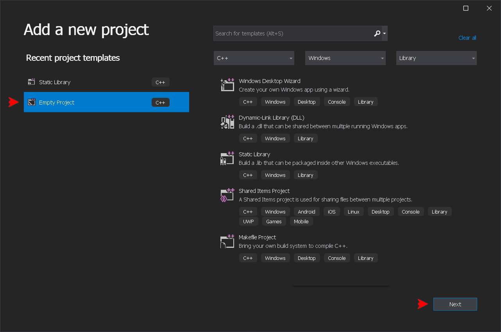
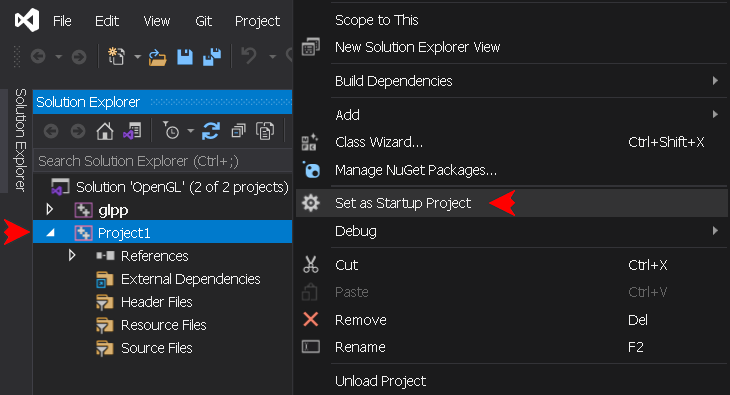
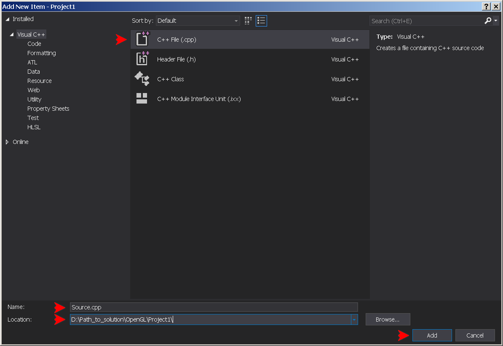
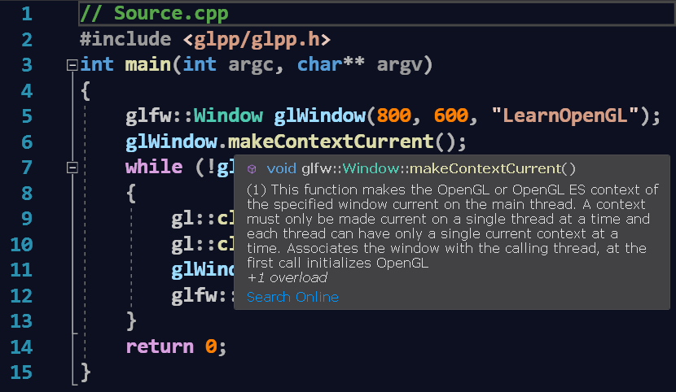
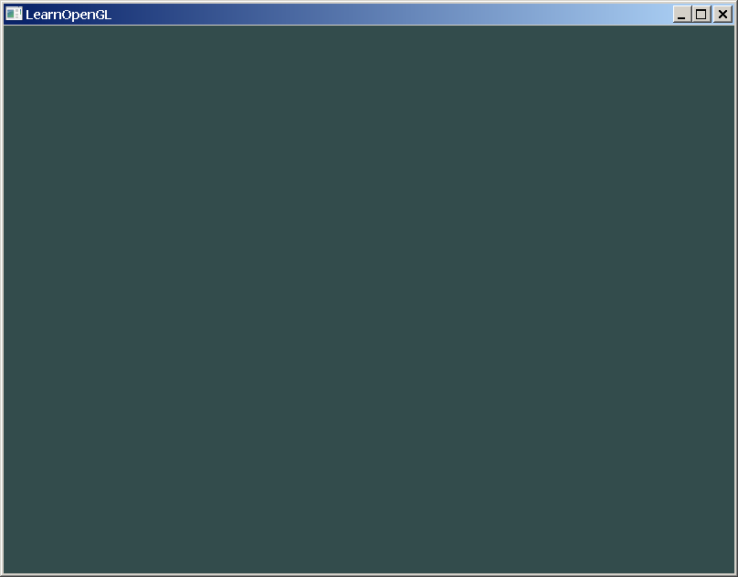

## USAGE
The described above library installation setup requires the OpenGL application project to be added to the same solution.

> [!NOTE]
> It is possible to create mutiple projects under the same solution, so the reinstallation of the library in not required.

### 1. Add the application project
To add the application project to the solution, use the same way as for the static library: in the Solution Explorer right-click the solution name bar (1st line), Click **`Add -> New project...`**:


Select **`Empty Project (C++)`**, press **`Next`**:



Choose any project name, check the path to the solution, and hit **`Create`**:


In the Solution Explorer, right-click the project's name and click **`Set as Startup Project`**, to set default running output application:



### 2. Set the application project properties
Right-click application project name bar and press **`Proprties (Alt+Enter)`**. In the Properties window set Configuration and Platform to Debug / x64:


In the Properties window set **`Configuration`** and **`Platform`** drop-down menus to **`Debug`** and **`x64`**. It is going to be the first platform configuration to set up:


As the library project, the application project may be used in one of the 4 platform configurations. In order to change the application platform configuration, it is necessary to build the library under that configuration. The application Debug platform configuration requires to set 4 configuration options, the application Release platform configuration requires an extra option to set the [entry point](https://learn.microsoft.com/en-us/cpp/build/reference/entry-entry-point-symbol).

- **`Debug / x64 (EXE)`**:
```
Debugging -> Environment: path=%path%;$(SolutionDir)\Common\bin\
VC++ Directories -> Include Directories: $(SolutionDir)\Common\include\;$(IncludePath)
VC++ Directories -> Library Directories: $(SolutionDir)\Common\lib\;$(LibraryPath)
Linker -> System -> SubSystem: 'Console (/SUBSYSTEM:CONSOLE)'
```
- **`Release / x64 (EXE)`**:
```
Debugging -> Environment: path=%path%;$(SolutionDir)\Common\bin\
VC++ Directories -> Include Directories: $(SolutionDir)\Common\include\;$(IncludePath)
VC++ Directories -> Library Directories: $(SolutionDir)\Common\lib\;$(LibraryPath)
Linker -> System -> SubSystem: 'Windows (/SUBSYSTEM:WINDOWS)'
Linker -> Advanced -> Entry Point: mainCRTStartup
```
- **`Debug / Win32 (EXE)`**:
```
Debugging -> Environment: path=%path%;$(SolutionDir)\Common\bin\Win32\
VC++ Directories -> Include Directories: $(SolutionDir)\Common\include\;$(IncludePath)
VC++ Directories -> Library Directories: $(SolutionDir)\Common\lib\;$(LibraryPath)
Linker -> System -> SubSystem: 'Console (/SUBSYSTEM:CONSOLE)'
```
- **`Release / Win32 (EXE)`**:
```
Debugging -> Environment: path=%path%;$(SolutionDir)\Common\bin\Win32\
VC++ Directories -> Include Directories: $(SolutionDir)\Common\include\;$(IncludePath)
VC++ Directories -> Library Directories: $(SolutionDir)\Common\lib\;$(LibraryPath)
Linker -> System -> SubSystem: 'Windows (/SUBSYSTEM:WINDOWS)'
Linker -> Advanced -> Entry Point: mainCRTStartup
```

> [!WARNING]
> Make sure to hit the **`Apply`** button after setting up each platform configuration.

### 3. Add the source file to the application project
In the Solution Explorer, right-click the project's Source Files filter icon. Click **`Add -> New Item... (Ctrl+Shift+A)`**:


Select **`C++ File (.cpp)`**, type any name, check the path, and hit **`Add`**



### 4. Type the code
In the editor window type the minimal glpp application code:
```
// Source.cpp
#include <glpp/glpp.h>
int main(int argc, char** argv)
{
	glfw::Window glWindow(800, 600, "LearnOpenGL");
	glWindow.makeContextCurrent();
	while (!glWindow.windowShouldClose())
	{
		gl::clearColor(0.2f, 0.3f, 0.3f, 1.0f);
		gl::clear(gl::BufferBitMask::ColorBufferBit);
		glWindow.swapBuffers();
		glfw::pollEvents();
	}
	return 0;
}
```

> [!NOTE]
> If there is no error, the IntelliSense shows the description of every library member:



The build output should look like this:
```
Rebuild started...
1>------ Rebuild All started: Project: Project1, Configuration: Debug x64 ------
1>Source.cpp
1>Project1.vcxproj -> D:\Path_to_solution\OpenGL\x64\Debug\Project1.exe
========== Rebuild All: 1 succeeded, 0 failed, 0 skipped ==========
```
Now to run the application, hit **`F5`**:



To overload window events, use the new window class derived from **`glfw::Window`**:
```
// Source.cpp
#include <glpp/glpp.h>
class LearnOpenGL : public glfw::Window
{
	using Window::Window; // Base constructors
	void onFramebuffer(int width, int height)
	{
		gl::viewport(0, 0, width, height);
	}
};
int main(int argc, char** argv)
{
	LearnOpenGL glWindow(800, 600, "LearnOpenGL");
	//...
```
Lastly, the example of the library usage in AFX-alike layout. The application class must be derived from **`glfw::Thread`** or **`glfw::ThreadWnd`** class. The second has more options:
```
// Source.cpp
#include <glpp/glpp.h>
class GLApplication : public glfw::ThreadWnd
{
	void onInitThread()
	{
		m_pWindow = new LearnOpenGL(1280, 720, "LearnOpenGL");
		m_pWindow->makeContextCurrent(this);
	}
	void onRenderWindow()
	{
		gl::clearColor(0.3f, 0.2f, 0.2f, 1.0f);
		gl::clear(gl::BufferBitMask::ColorBufferBit);
	}
};
GLApplication glApplication;
```

> [!WARNING]
> In order to use AFX-alike layout, do not forget to comment the **`GLPP_NO_AFX_LAYOUT`** switch in the **`glpp.h`** library header, and rebuild glpp.

> [!NOTE]
> AFX-alike layout is rather experimental, and at the moment it has only two classes. But it could become very promising direction for development in the future.
