## INSTALLATION (under revision)
[&nwarr; README](../README.md)<br>
- [1. Create a new solution](INSTALLATION.md#1-create-a-new-solution)
- [2. Download the OpenGL components](INSTALLATION.md#2-download-the-opengl-components)
- [3. Prepare the components's folder](INSTALLATION.md#3-prepare-the-componentss-folder)
- [4. Install CMake](INSTALLATION.md#4-install-cmake)
- [5. Generate GLFW project files](INSTALLATION.md#5-generate-glfw-project-files)
- [6. Build the GLFW library](INSTALLATION.md#6-build-the-glfw-library)
- [7. Add the static library project](INSTALLATION.md#7-add-the-static-library-project)
- [8. Add files to the library project](INSTALLATION.md#8-add-files-to-the-library-project)
- [9. Set the library project proprties](INSTALLATION.md#9-set-the-library-project-proprties)
- [10. Build the YAGL++ library](INSTALLATION.md#10-build-the-library)

The installation of YAGL++ library is basically a collection of the original OpenGL API components. The library itself includes those, while **`#pragma comments`** directives set the linking of all required libraries. Therefore it is unnecessary to add them everytime to the linker options. The path layout can be different, but it is strongly recommended to use all suggested names and paths, at least for the first time. The offered setup supports _x64_ and _Win32_ platforms, producing the console application in Debug mode, and Windows application in Release mode.

> [!IMPORTANT]
> Before the installation, make sure your graphics card supports OpenGL 3.3+. Download [GLview](https://www.realtech-vr.com/home/?page_id=1402), install it, and run the test. If OpenGL 3.3 in not supported, try to update the graphics card driver.

### 1. Create a new solution
Create the solution for the library and the main project. On the Visual Studio click **`File -> New -> Project... (Ctrl+Shift+N)`**:

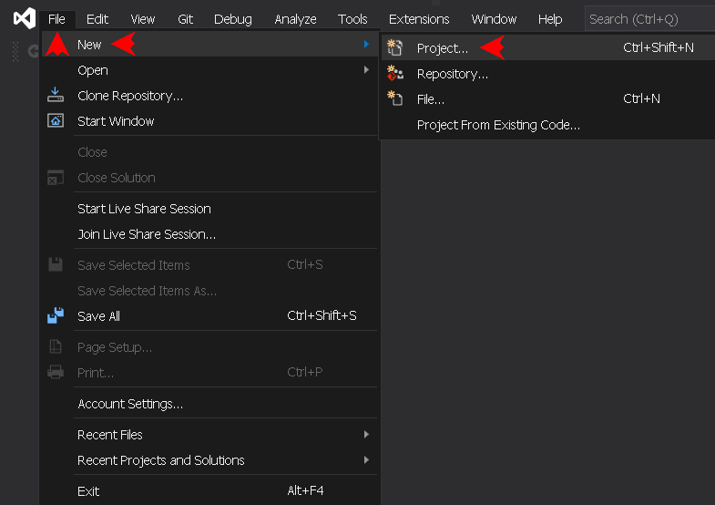

Select **`Blanc Solution`**, hit **`Next`**:


Choose any name and path to solution, e.g. _OpenGL_ on the appropriate drive, hit **`Create`**, then close the IDE for now:


### 2. Download the OpenGL components
> [!TIP]
> For the quick testing, the steps 2 and 3 of the installation may be skipped, while using the repository **`Common.7z`** archive. In this case, download it on the [repository page](https://github.com/dmitrycello/glpp/tree/main), and extract into **`Common`** folder within the newly created solution directory. However, it is still recommended to follow all steps, at least for the first time, just to feel the process. This is also the way the most programmers do, to ensure that each component is up to date and fit to computer environment.

- [GLAD](https://glad.dav1d.de) archive generated with _Specification_ set to **`OpenGL`**, _Profile_ set to **`Core`**, _API gl_ set to **`Version 3.3`**. Keep _API gles1, gles2, glsc2_ as **`None`**. Do not select any extension;
- [GLFW](https://www.glfw.org/download) Source package archive v3.4 or later. Older versions could be found [here](https://github.com/glfw/glfw/releases);
- [GLM](https://github.com/g-truc/glm) pack v1.0.1 or later;
- [stb_image](https://github.com/nothings/stb/tree/master) library. It is important to use the file versions tested with the current release. Every newer version of a file may require some additional testings. If there is no such version, try using newer version (it usually works), or get the one preserved in **`Common.7z`** archive of this repository. Currently required files are:
	+ **stb_image.h** v2.29,
	+ **stb_image_resize2.h** v2.06,
	+ **stb_image_write.h** v1.16;
- [FreeImage](https://freeimage.sourceforge.io) library 3.18.0 (optional). The only DLL distribution is supported (Win32/x64). The project is not being updated since 2015, so if you decide not to include it, make sure to comment the **`GLPP_FREEIMAGE_LIB`** switch in the [yaglpp.h](../include/yaglpp.h) file;
- [Latest release](https://github.com/dmitrycello/yaglpp/releases) of YAGL++ library, the **`dependencies.txt`** file within the archive lists every component version tested with current release.

### 3. Prepare the components's folder
Create the new folder under the name **`Common`** within the newly created solution directory. In that folder create 5 other subfolders: **`bin`**, **`include`**, **`lib`**, **`res`**, and **`src`**. Create subfolder **`Win32`** within **`Common/bin`**, as well as **`GLFW`** and **`Win32`** subfolders within **`Common/lib`**. Finally, create another **`GLFW`** subfolder within **`Common/lib/Win32`**. The folder tree should be as following:

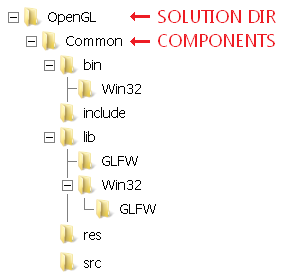

Extract all downloaded components, and move them into the following subdirectories:
```
Common\bin\FreeImage.dll <- FreeImage 64-bit Dll file
Common\bin\Win32\FreeImage.dll <- FreeImage 32-bit Dll file
Common\include\glad\glad.h <- GLAD header file from GLAD archive
Common\include\GLFW\ <- Copy of (2) header files from GLFW Source package
Common\include\glm\ <- The entire subfolder from the GLM archive
Common\include\KHR\khrplatform.h <- KHR header file from GLAD archive
Common\include\stb\ <- stb_image (3) header files
Common\include\yaglpp\ <- YAGL++ header files from latest release
Common\include\FreeImage.h <- FreeImage header file
Common\lib\FreeImage.lib <- FreeImage 64-bit Lib file
Common\lib\Win32\FreeImage.lib <- FreeImage 32-bit Lib file
Common\src\glfw-3.4\ <- GLFW Source package
Common\src\yaglpp\ <- YAGL++ source files from latest release
Common\src\glad.c <- GLAD source file from GLAD archive
```
### 4. Install CMake
If it was not done before, the CMake application must be installed, in order to build CMake projects. Download the [CMake](https://cmake.org/download/) latest application installer, lunch the wizard, and hit **`Next`**:

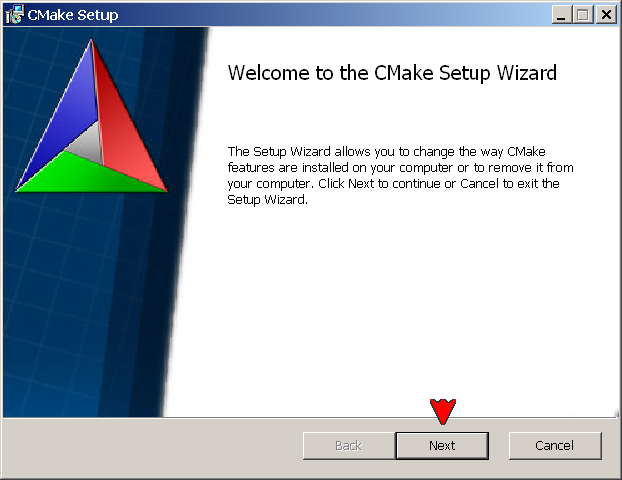

Accept the License Agreement, and hit **`Next`**:

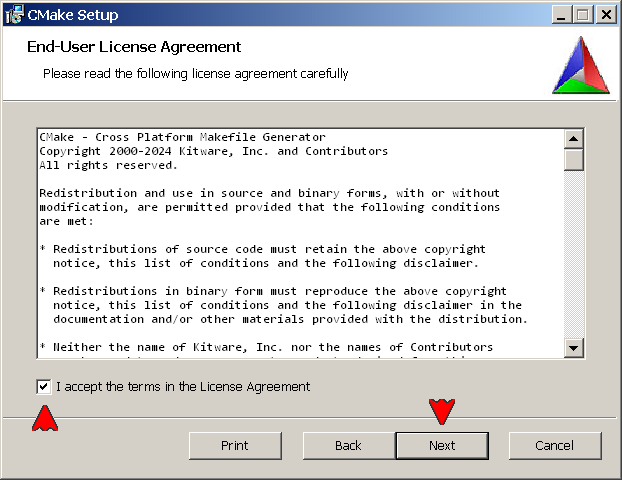

Leave the default setting, and hit **`Next`**:


Leave the default destination folder, and hit **`Next`**:


Click **`Install`** to begin the installation:


After installation is complete, hit **`Finish`** to exit the wizard:

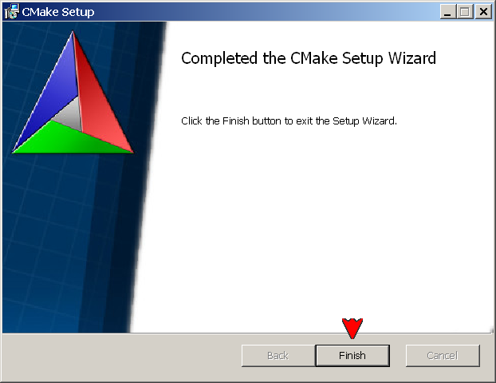

### 5. Generate GLFW project files
The YAGL++ works in 4 platform configuration: _Debug x64_, _Release x64_, _Debug Win32_, and _Release Win32_. So, the GLFW library should be built for every configuration. Before building from the GLFW Source package, in is necessary to generate its project files with CMake, so let's lunch it first. Hit **`Browse Source...`** and navigate to **`Common/src`** directory, select the **`glfw-3.4`** package folder. Next, hit **`Browse Build...`** and navigate to **`Common/lib`** directory, select the **`GLFW`** folder to set the destination for _x64_ library files. Then hit **`Configure`**:

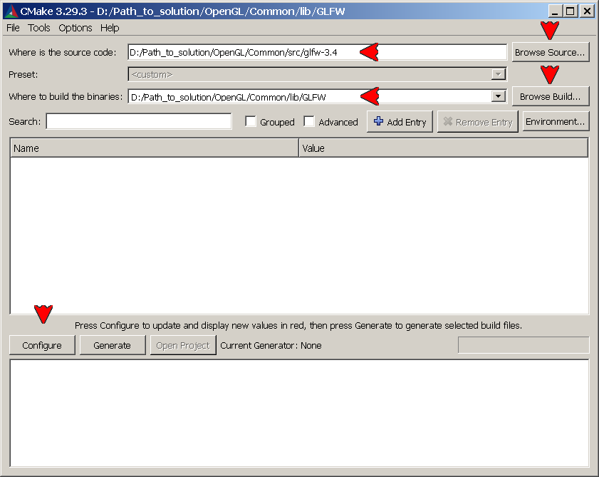

Choose the appropriate IDE, and select the **`x64`** platform. Then hit **`Finish`**:


Ignore the red background, hit **`Generate`**:

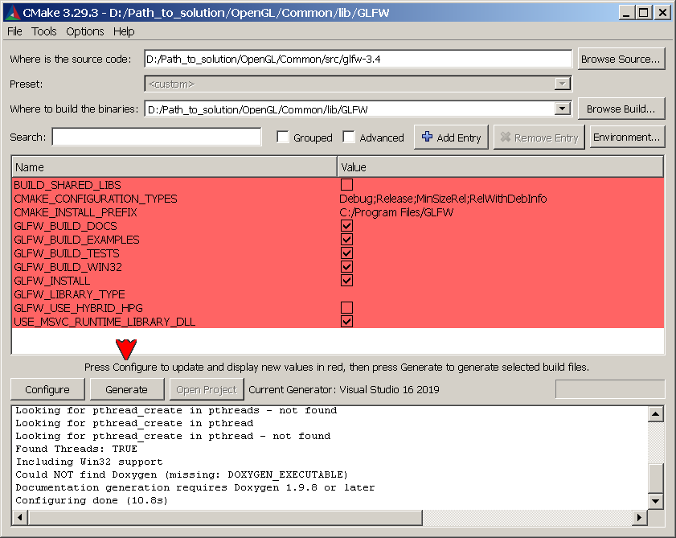

Make sure that the generating is done, do not close the window yet:

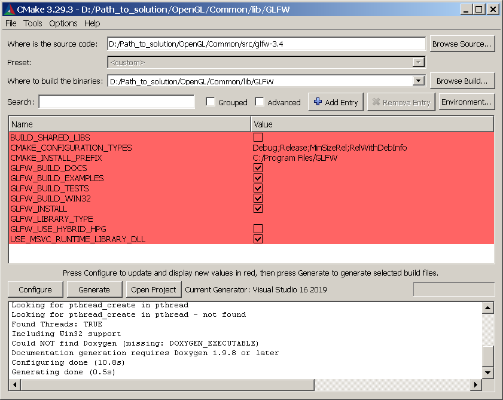

Now hit again **`Browse Build...`** and navigate to **`Common/lib/Win32`** directory, select the **`GLFW`** folder to set the destination for _Win32_ library files. Then hit **`Configure`**:

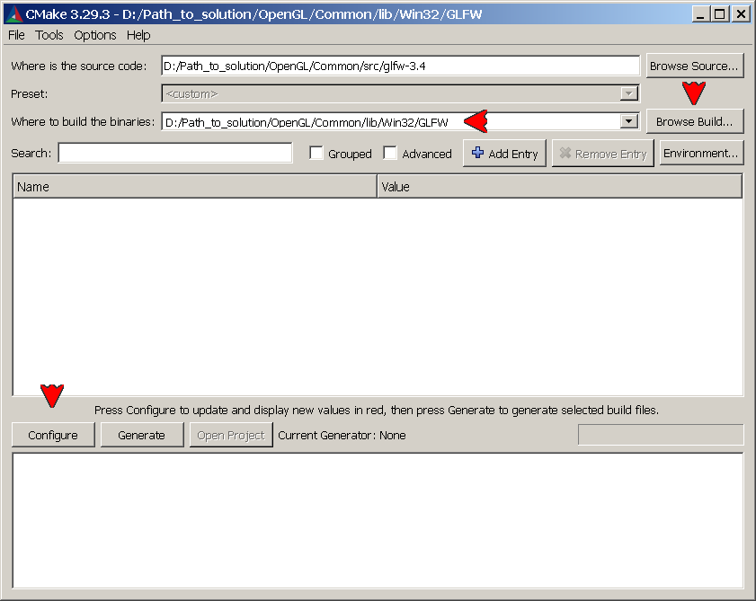

Keep the same IDE, and select the **`Win32`** platform. Then hit **`Finish`**:


As before, don't mind the red background, and hit **`Generate`**:

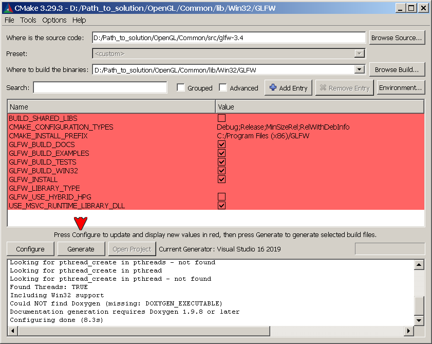

Make sure that the generating is done, and at this point close the window:

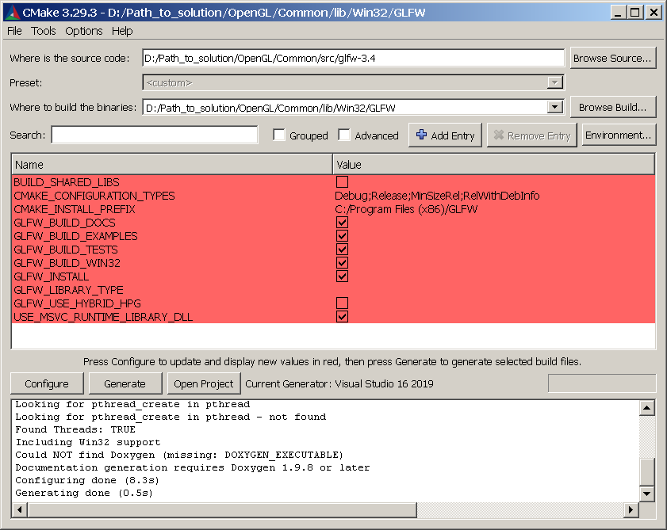

### 6. Build the GLFW library
The GLFW project files for _x64_ and _Win32_ platforms are now in **`Common/lib/GLFW`** and **`Common/lib/Win32/GLFW`** folders. To start the build, navigate first to **`Common/lib/GLFW`** folder, and double-click the **`GLFW.sln`** solution file:

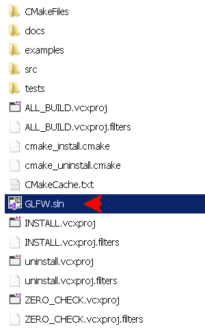

In the opened IDE, select _Debug x64_ configuration. In the _Solution Explorer_, right-click the **`glfw`** project, then click **`Rebuild`**:

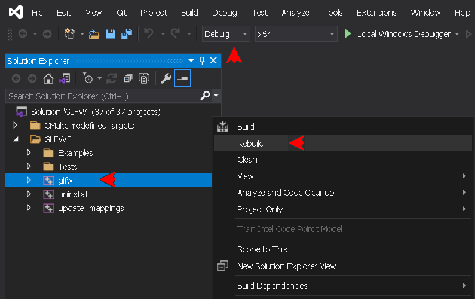

The output should be as follows:
```
Rebuild started...
1>------ Rebuild All started: Project: ZERO_CHECK, Configuration: Debug x64 ------
1>1>Checking Build System
2>------ Rebuild All started: Project: glfw, Configuration: Debug x64 ------
2>Building Custom Rule D:/Path_to_solution/OpenGL/Common/src/glfw-3.4/src/CMakeLists.txt
2>context.c
2>init.c
2>input.c
2>monitor.c
2>platform.c
2>vulkan.c
2>window.c
2>egl_context.c
2>osmesa_context.c
2>null_init.c
2>null_monitor.c
2>null_window.c
2>null_joystick.c
2>win32_module.c
2>win32_time.c
2>win32_thread.c
2>win32_init.c
2>win32_joystick.c
2>win32_monitor.c
2>win32_window.c
2>Generating Code...
2>Compiling...
2>wgl_context.c
2>Generating Code...
2>glfw.vcxproj -> D:\Path_to_solution\OpenGL\Common\lib\GLFW\src\Debug\glfw3.lib
========== Rebuild All: 2 succeeded, 0 failed, 0 skipped ==========
```
Now, select _Release x64_ configuration, and click **`Rebuild`** as before:


The output should be as follows:
```
Rebuild started...
1>------ Rebuild All started: Project: ZERO_CHECK, Configuration: Release x64 ------
1>1>Checking Build System
2>------ Rebuild All started: Project: glfw, Configuration: Release x64 ------
2>Building Custom Rule D:/Path_to_solution/OpenGL/Common/src/glfw-3.4/src/CMakeLists.txt
2>context.c
2>init.c
2>input.c
2>monitor.c
2>platform.c
2>vulkan.c
2>window.c
2>egl_context.c
2>osmesa_context.c
2>null_init.c
2>null_monitor.c
2>null_window.c
2>null_joystick.c
2>win32_module.c
2>win32_time.c
2>win32_thread.c
2>win32_init.c
2>win32_joystick.c
2>win32_monitor.c
2>win32_window.c
2>Generating Code...
2>Compiling...
2>wgl_context.c
2>Generating Code...
2>glfw.vcxproj -> D:\Path_to_solution\OpenGL\Common\lib\GLFW\src\Release\glfw3.lib
========== Rebuild All: 2 succeeded, 0 failed, 0 skipped ==========
```
> [!NOTE]
> Rebuild ensures to process the every source file from scratch. Use **`Build (Ctrl+B)`** to update the build.

Close the IDE. It is possible now to clean up the solution, unless it is required to later modify and rebuild the GLFW. If this is not the case, navigate first to **`Common/lib/GLFW`** folder, and delete its content, except the **`src`** subfolder:

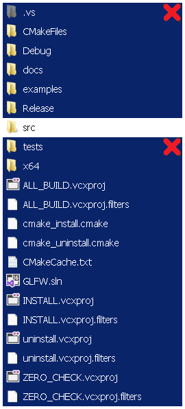

Then navigate to **`Common/lib/GLFW/src`** folder, and delete its content, except the **`Debug`** and **`Release`** subfolders:

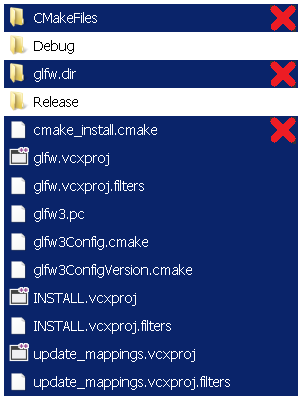

> [!TIP]
> The GLFW project files are a bit large to keep (~100M), but if these files must be kept for later, just delete the **`.vs`** hidden temporary folder, which is around 95% of total space. Make sure to close the solution before deleting.

To build _Win32_ library, navigate to **`Common/lib/Win32/GLFW`** folder, and double-click the **`GLFW.sln`** solution file from there. Rebuild GLFW the same way for _Debug Win32_ and _Release Win32_ platform configurations, close the IDE, then clean up the solution, if necessary.

> [!WARNING]
> Do not use the Visual Studio **`Build -> Clean Solution`** option. That deletes the output library files as well.

### 7. Add the static library project
Reopen the previously created blanc solution. In the _Solution Explorer_, right-click the solution name bar (1st line). Click **`Add -> New project...`**:


Select **`Static Library (C++)`**, hit **`Next`**:

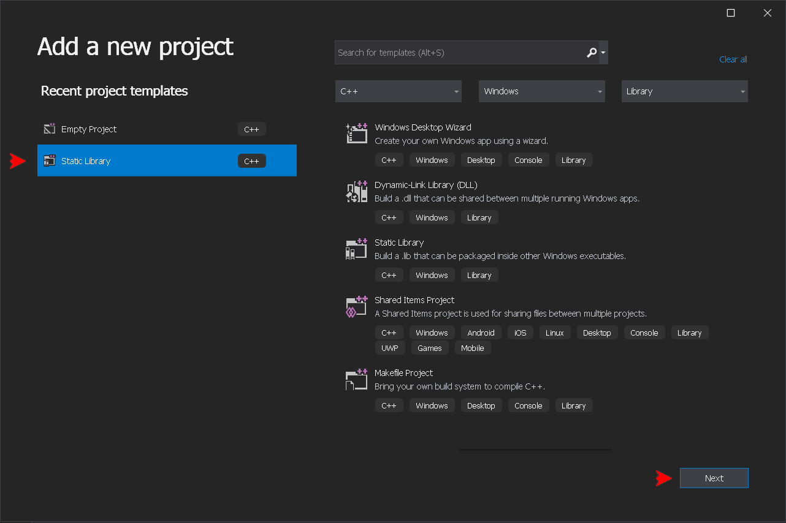

Type the static library project name, which must be exactly **_yaglpp_**, check the path to the solution, and hit **`Create`**:


### 8. Add files to the library project
In the _Solution Explorer_ remove all header and source files **`(Del)`**. These files no longer needed, so they could be deleted permanently:

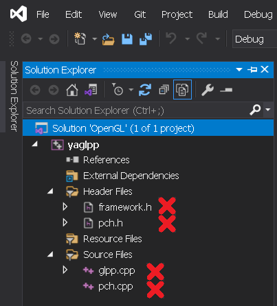

Right-click _Header Files_ filter icon, click **`Add -> Existing Item (Shift+Alt+A)`**. Navigate to **`$(SolutionDir)\Common\include\yaglpp`** directory, select [yaglpp.h](../include/yaglpp.h) file:

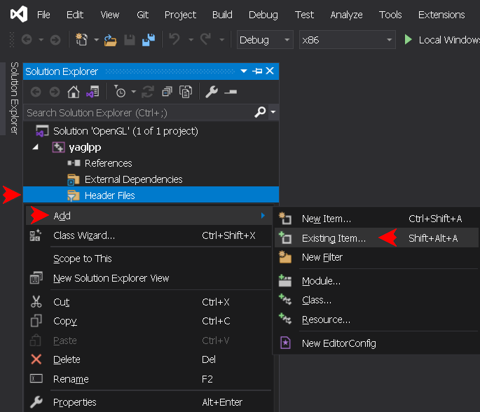

> [!NOTE]
> The header files here are irrelevant for the build, and may not be included at all. The [yaglpp.h](../include/yaglpp.h) file is added just to access the main switches.

Next, right-click _Source Files_ filter icon, click **`Add -> Existing Item (Shift+Alt+A)`**. Navigate to **`$(SolutionDir)\Common\src\yaglpp`** directory, and select all **`.cpp`** files:

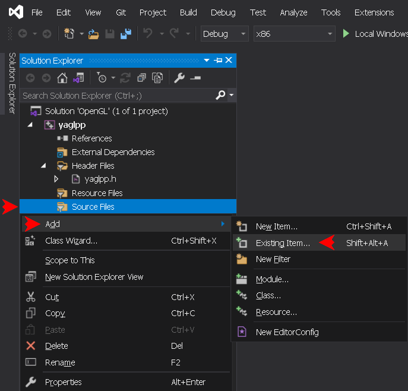

Finally, add the same way the **`$(SolutionDir)\Common\src\glad.c`** file to the _Source Files_ filter. The Solution Explorer should now look like this:

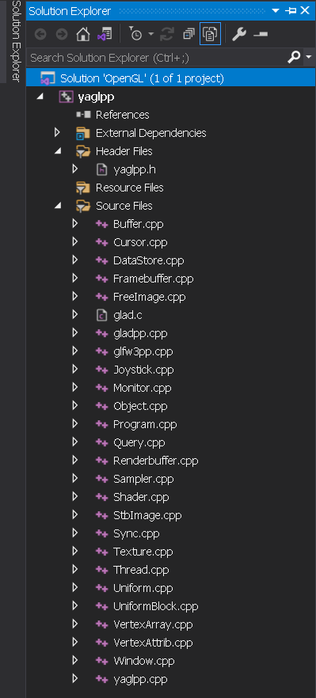

### 9. Set the library project proprties
Right-click **`yaglpp`** project name bar and press **`Proprties (Alt+Enter)`**:

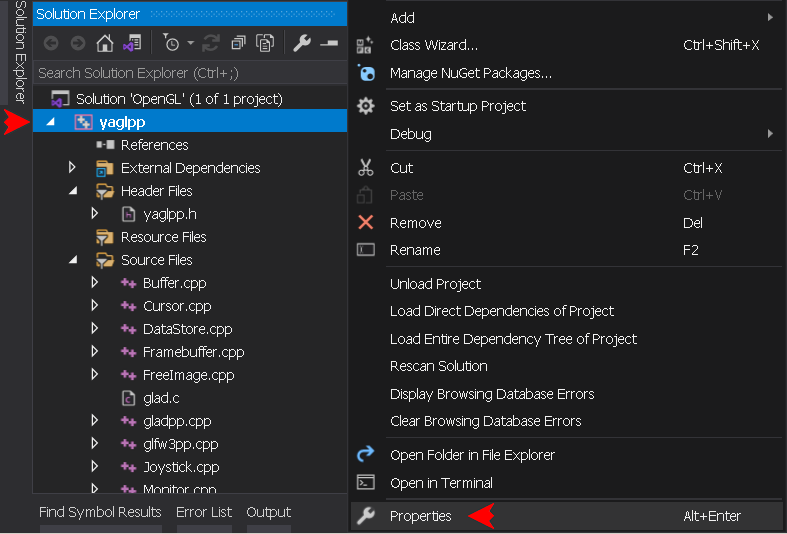

In the Properties window set **`Configuration`** and **`Platform`** drop-down menus to **`Debug`** and **`x64`**. It is going to be the first platform configuration to set up:

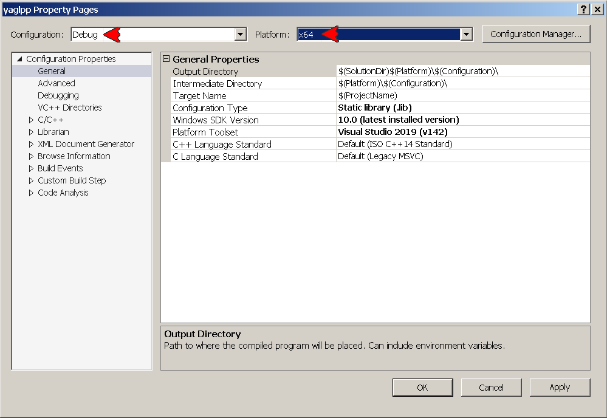

The YAGL++ needs to set 4 configuration options for each platform configuration. To set an option, select a category at the left-hand side, then select an option at the right-hand side. Click the drop-down menu at the right, then hit **`<Edit...>`**, or select the available option:

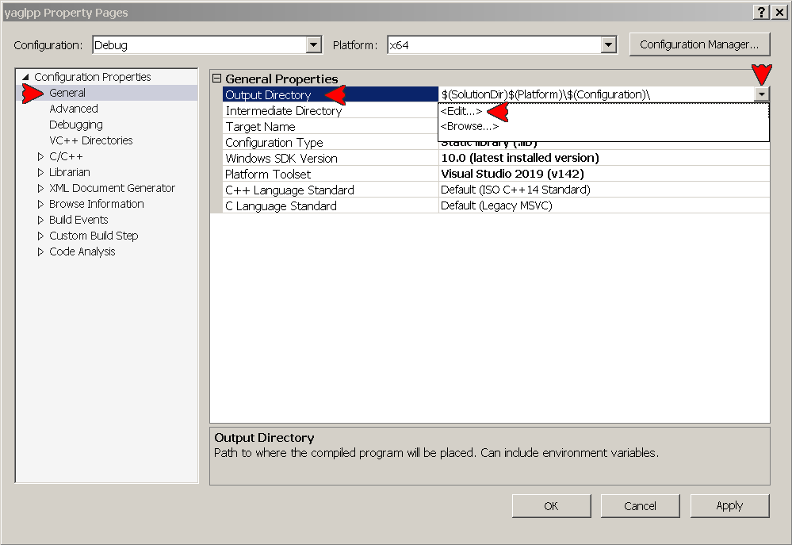

The YAGL++ library supports 4 platform configurations: **`Debug / x64`**, **`Release / x64`**, **`Debug / Win32`**, **`Release / Win32`**. Here is the list of the required options under each of the 4 platform configurations in form **_category -> name: value_**:

- **`Debug / x64 (LIB)`**:
```
General -> Output Directory: $(SolutionDir)\Common\lib\Debug\
VC++ Directories -> Include Directories: $(SolutionDir)\Common\include\;$(IncludePath
VC++ Directories -> Library Directories: $(SolutionDir)\Common\lib\;$(LibraryPath)
C/C++ -> Precompiled Headers -> Precompiled Header: 'Not Using Precompiled Headers'
```
- **`Release / x64 (LIB)`**:
```
General -> Output Directory: $(SolutionDir)\Common\lib\
VC++ Directories -> Include Directories: $(SolutionDir)\Common\include\;$(IncludePath)
VC++ Directories -> Library Directories: $(SolutionDir)\Common\lib\;$(LibraryPath)
C/C++ -> Precompiled Headers -> Precompiled Header: 'Not Using Precompiled Headers'
```
- **`Debug / Win32 (LIB)`**:
```
General -> Output Directory: $(SolutionDir)\Common\lib\Win32\Debug\
VC++ Directories -> Include Directories: $(SolutionDir)\Common\include\;$(IncludePath)
VC++ Directories -> Library Directories: $(SolutionDir)\Common\lib\Win32\;$(LibraryPath)
C/C++ -> Precompiled Headers -> Precompiled Header: 'Not Using Precompiled Headers'
```
- **`Release / Win32 (LIB)`**:
```
General -> Output Directory: $(SolutionDir)\Common\lib\Win32\
VC++ Directories -> Include Directories: $(SolutionDir)\Common\include\;$(IncludePath)
VC++ Directories -> Library Directories: $(SolutionDir)\Common\lib\Win32\;$(LibraryPath)
C/C++ -> Precompiled Headers -> Precompiled Header: 'Not Using Precompiled Headers'
```
> [!IMPORTANT]
> Some platform configurations may be never used. But it is recommended to set them all now, to avoid the mess later.

> [!WARNING]
> Make sure to hit the **`Apply`** button after setting up each platform configuration.

### 10. Build the library
Now close the Properties window. In the _Solution Explorer_ open [yaglpp.h](../include/yaglpp.h) file, so the IDE focuses on yaglpp project within the solution. Select any of the 4 platform configuration on the top of IDE:

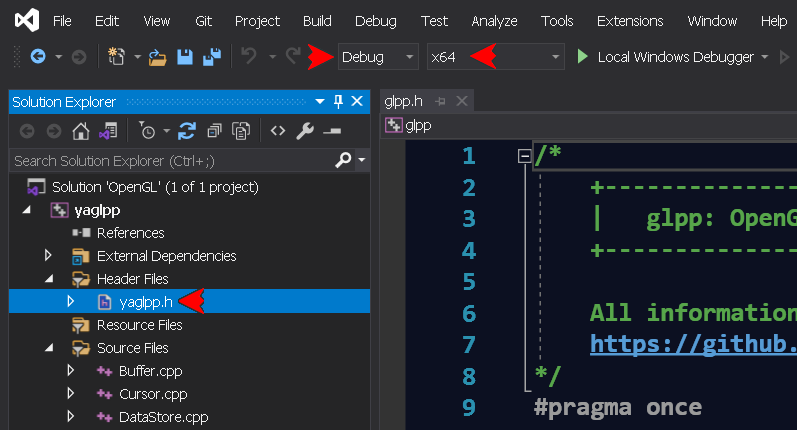

Click **`Build -> Rebuild yaglpp`**:

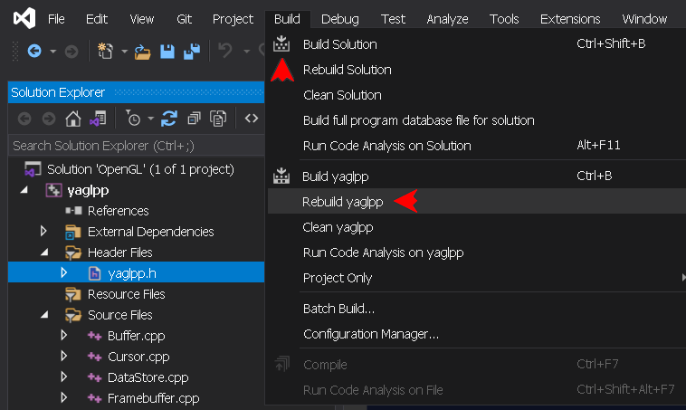

The output should look like this:
```
Rebuild started...
1>------ Rebuild All started: Project: yaglpp, Configuration: Debug x64 ------
1>glad.c
1>Buffer.cpp
1>Cursor.cpp
1>DataStore.cpp
1>Framebuffer.cpp
1>FreeImage.cpp
1>gladpp.cpp
1>gladpp.cpp: Compiling with GLAD version 3.3 support...
1>glfw3pp.cpp
1>glfw3pp.cpp: Compiling with GLFW version 3.4 nonlegacy support...
1>Joystick.cpp
1>Monitor.cpp
1>Object.cpp
1>Program.cpp
1>Query.cpp
1>Renderbuffer.cpp
1>Sampler.cpp
1>Shader.cpp
1>StbImage.cpp
1>Sync.cpp
1>Texture.cpp
1>Thread.cpp
1>Uniform.cpp
1>Generating Code...
1>Compiling...
1>UniformBlock.cpp
1>VertexArray.cpp
1>VertexAttrib.cpp
1>Window.cpp
1>yaglpp.cpp
1>Generating Code...
1>yaglpp.vcxproj -> D:\Path_to_solution\OpenGL\Common\lib\Debug\yaglpp.lib
========== Rebuild All: 1 succeeded, 0 failed, 0 skipped ==========
```
The library supports OpenGL versions 2.0 to 3.3. To downgrade the default version (3.3), you must generate a new GLAD archive with the same setting, but the _API gl_ set to **`Version X.X`**, extract its only **`glad.h`** file, and move it into a folder named **`X.X`** created within the **`include/glad`** directory. The version numbers supported by YAGL++ library are: _2.0_, _2.1_, _3.0_, _3.1_, _3.2_ and default _3.3_. Note that the default version of the file must always reside in the **`include/glad`** directory, it is referenced by another components of the API. The context version control is great tool for backward compatible coding.

> [!IMPORTANT]
> It is advised to generate all 6 supported GLAD versions, it's better to do now to avoid the mess later. This allows to quickly set the OpenGL context version by changing the **`GLPP_CONTEXT_VERSION_MAJOR`** and **`GLPP_CONTEXT_VERSION_MINOR`** switches. Just set the desired value, and rebuild the project. But to learn OpenGL, always stick to default version _3.3_!

[&uarr; TOP](INSTALLATION.md#installation) [USAGE &rarr;](USAGE.md)
