## INSTALLATION
[&nwarr; README](../README.md)<br>
- [1. Create a new solution](INSTALLATION.md#1-create-a-new-solution)
- [2. Download the OpenGL components](INSTALLATION.md#2-download-the-opengl-components)
- [3. Prepare the components's folder](INSTALLATION.md#3-prepare-the-componentss-folder)
- [4. Install CMake](INSTALLATION.md#4-install-cmake)
- [5. Generate GLFW project files](INSTALLATION.md#5-generate-glfw-project-files)
- [6. Build the GLFW library](INSTALLATION.md#6-build-the-glfw-library)
- [7. Build the Assimp library](INSTALLATION.md#7-build-the-assimp-library)

The installation of YAGL++ library is basically a collection of the original OpenGL API components. The library itself includes those, while **`#pragma comments`** directives set the linking of all required libraries. Therefore it is unnecessary to add them everytime to the linker options. The path layout can be different, but it is strongly recommended to use the suggested way, at least for the first time. The offered setup supports _x64_ and _Win32_ platforms, producing the console application in Debug mode, and Windows application in Release mode.

> [!IMPORTANT]
> Before the installation, make sure your graphics card supports OpenGL 3.3+. Download [GLview](https://www.realtech-vr.com/home/?page_id=1402), install it, and run the test. If OpenGL 3.3 in not supported, try to update the graphics card driver.

### 1. Create a new solution
Create the solution for the YAGL++ projects. On the Visual Studio click **`File -> New -> Project... (Ctrl+Shift+N)`**:

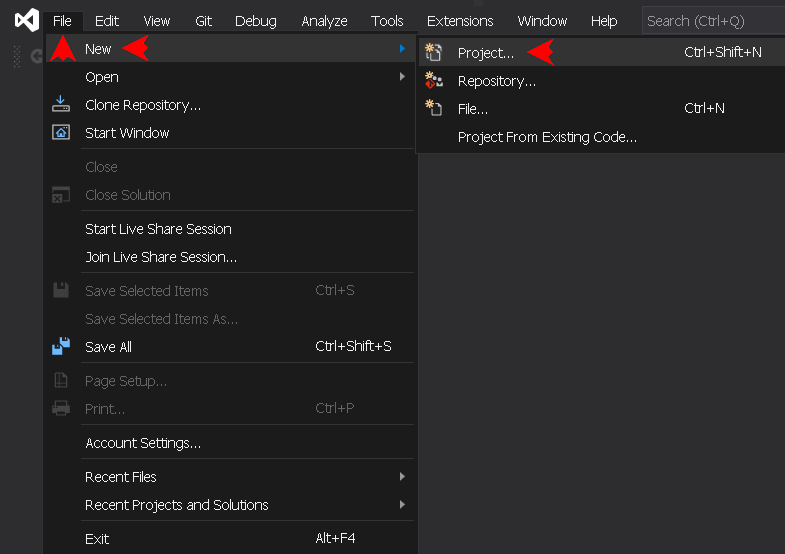

Select **`Blanc Solution`**, hit **`Next`**:

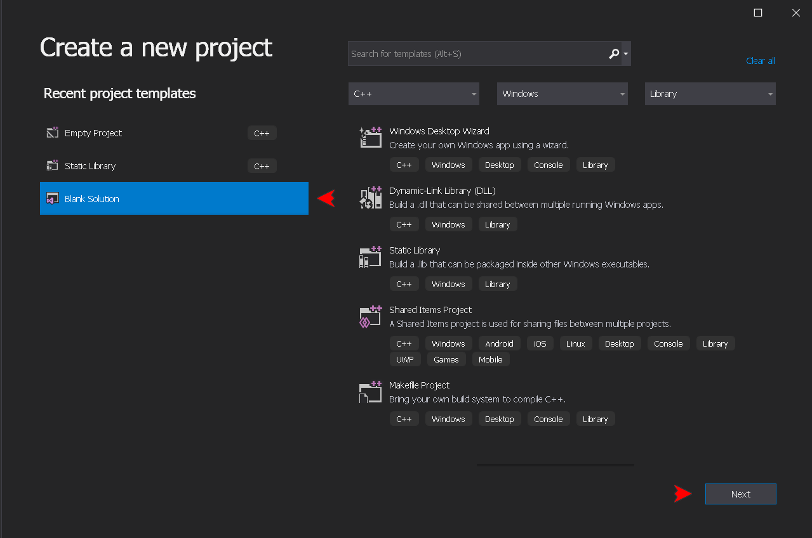

Choose any name and path to solution, e.g. _OpenGL_ on the appropriate drive, hit **`Create`**, then close the IDE for now:

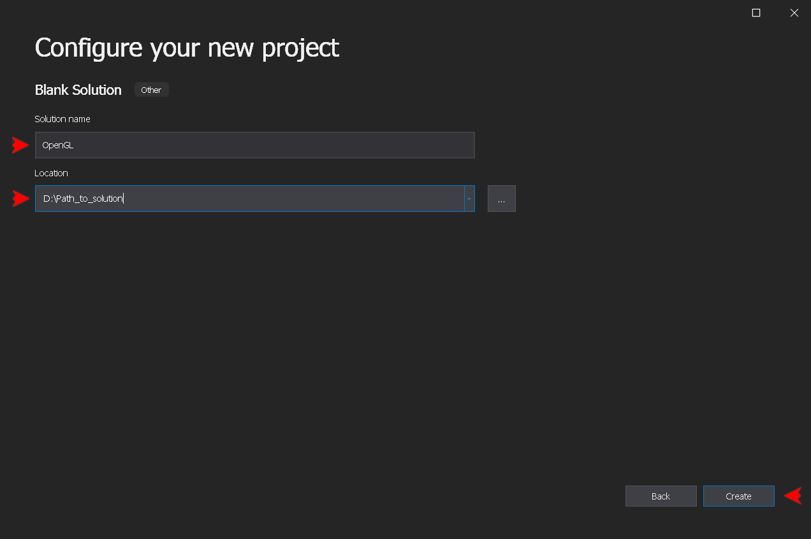

### 2. Download the OpenGL components
> [!TIP]
> For the quick testing, all the following steps of the installation may be skipped, while using the repository **`Common.7z`** archive. In this case, download it on the [repository page](https://github.com/dmitrycello/glpp/tree/main), and extract into **`Common`** folder within the newly created solution directory. However, it is still recommended to follow all steps, at least for the first time, not just to feel the process, but also to understand how it works. This is also the way the most programmers do, to ensure that each component is up to date and fit to computer's environment.

- [GLAD](https://glad.dav1d.de) archive generated with _Specification_ set to **`OpenGL`**, _Profile_ set to **`Core`**, _API gl_ set to **`Version 4.6`**. Keep _API gles1, gles2, glsc2_ as **`None`**. Do not select any extension;
- [GLFW](https://www.glfw.org/download) Source package archive v3.4 or later. Older versions could be found [here](https://github.com/glfw/glfw/releases);
- [GLM](https://github.com/g-truc/glm/releases) pack v1.0.1 or later;
- [Assimp](https://github.com/assimp/assimp/releases) release v5.4.3 or later;
- [stb_image](https://github.com/nothings/stb/tree/master) library. It is important to use the file versions tested with the current release. Every newer version of a file may require additional testings. If there is no such version, try using newer version (it usually works), or get the one preserved in **`Common.7z`** archive of this repository. The required files are:
	+ **stb_image.h** v2.29,
	+ **stb_image_resize2.h** v2.06,
	+ **stb_image_write.h** v1.16;
- [Latest release](https://github.com/dmitrycello/yaglpp/releases) of YAGL++ library.

### 3. Prepare the components's folder
Create the new folder under the name **`Common`** within the newly created solution directory. In that folder create four (4) subfolders: **`bin`**, **`include`**, **`lib`**, and **`res`**. Create two subfolders **`Win32`** within **`Common/bin`** and **`Common/lib`** directories. The last **`Common/res`** directory contains the common project resources of different kind. To follow the [Learn OpenGL tutorial](https://learnopengl.com/), download the resources from [here](https://github.com/JoeyDeVries/LearnOpenGL/tree/master/resources), and move to this subfolder. At the moment it could be left empty. The folder tree should be as following:

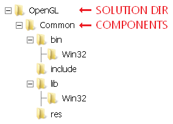

Extract all downloaded components, and copy into the following subdirectories:
```
Common/include/glad/   <- Header (glad.h) and source (glad.c) files from GLAD archive
Common/include/GLFW/   <- Two (2) header files from GLFW Source package
Common/include/glm/    <- The entire subfolder from the GLM archive
Common/include/KHR/    <- KHR header file (khrplatform.h) from GLAD archive
Common/include/stb/    <- Three (3) header files from stb_image library
Common/include/yaglpp/ <- YAGL++ header files from latest release
```

> [!NOTE]
> The library works with OpenGL versions 2.0 to 3.3. However, it is still possible to set the context version up to 4.6 using the **`GLPP_CONTEXT_VERSION_MAJOR`** and **`GLPP_CONTEXT_VERSION_MINOR`** main switches. But at the moment, the library includes only the assets from OpenGL 3.3 (Core Profile) standard. On the contrary, if the graphic card does not support the default version (3.3), it is possible to try an earlier one. Note that prior to version _3.2_, the _OpenGL Core Profile_ is unavailable, the _Any Profile_ or _Compat Profile_ should be used instead.

### 4. Install CMake
If it was not done before, the CMake application must be installed, in order to build CMake projects. Download the [CMake](https://cmake.org/download/) latest application installer, lunch the wizard, and hit **`Next`**:


Accept the License Agreement, and hit **`Next`**:

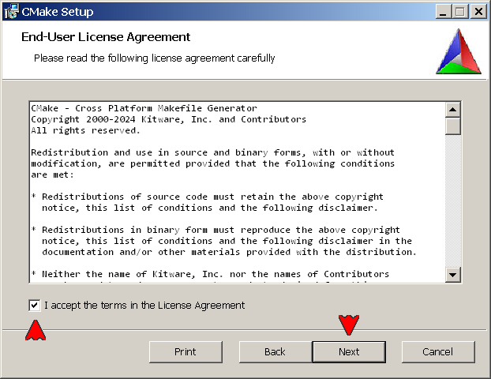

Leave the default setting, and hit **`Next`**:

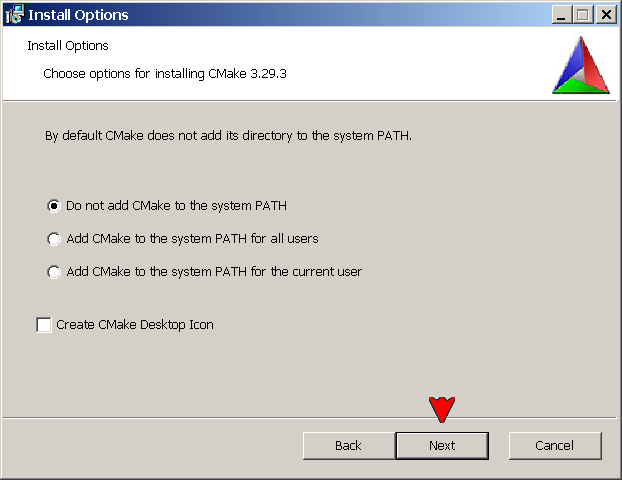

Leave the default destination folder, and hit **`Next`**:

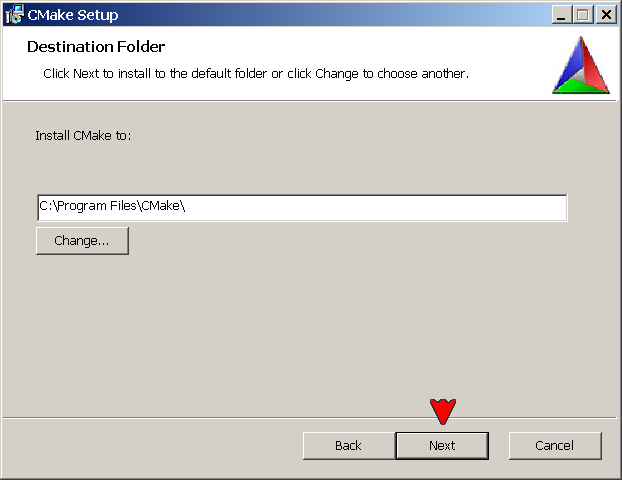

Click **`Install`** to begin the installation:

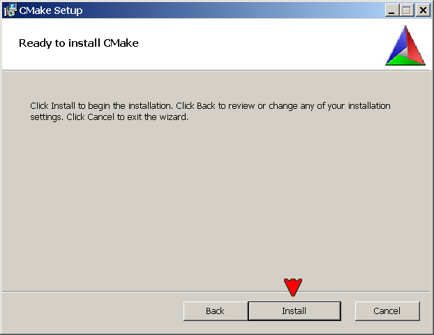

After installation is complete, hit **`Finish`** to exit the wizard:

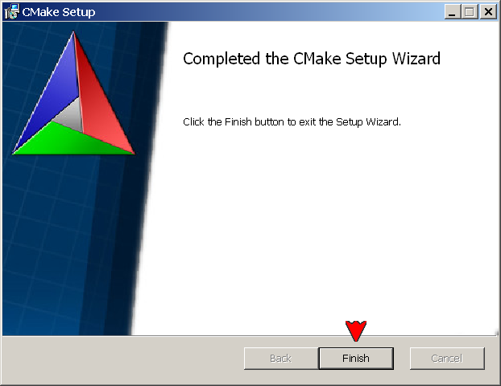

### 5. Generate GLFW project files
The GLFW source package has to be extracted anywhere on the hard drive. In order to save disk space, the offered installation is using only Release version of its dependencies, this requires to set the _/NODEFAULTLIB_ linker option in Debug mode, to remove the LNK4098 warning. The YAGL++ respects four (4) platform configurations: _Debug x64_, _Release x64_, _Debug Win32_, and _Release Win32_. So, the GLFW library should be built only for two of them. Before building from the GLFW Source package, in is necessary to generate its project files with CMake, so let's lunch it first.

Hit **`Browse Source...`** and navigate to the directory with the extracted source package, select the **`glfw-3.4`** package folder. Create an empty **`build`** folder anywhere on the hard drive. Hit **`Browse Build...`**, navigate to and select the created **`build`** folder to set the destination for library files. Then hit **`Configure`**:

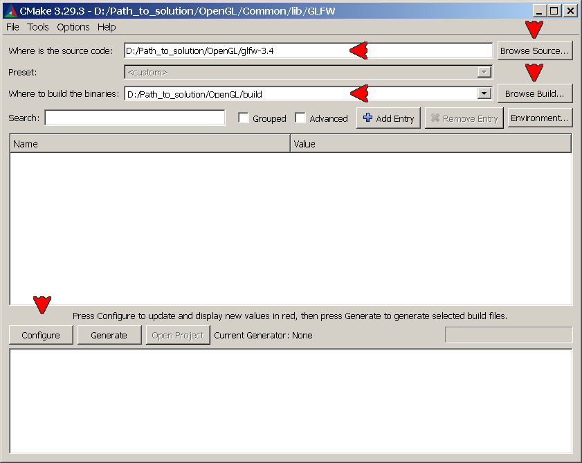

Choose the appropriate IDE, and select the **`x64`** platform. Then hit **`Finish`**:

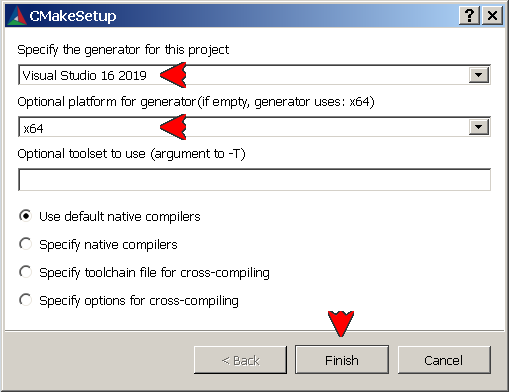

Ignore the red background, and click again **`Configure`** to let errors dissipate. Then hit **`Generate`**:

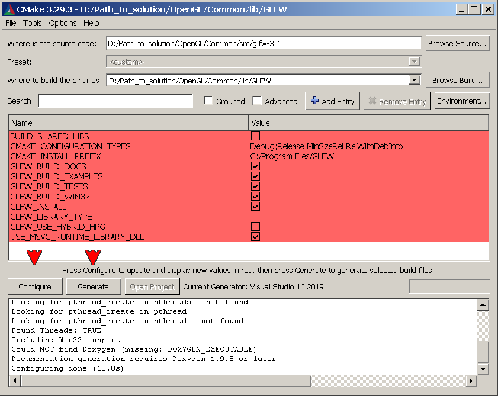

Make sure that the generating is done, do not close the window yet:

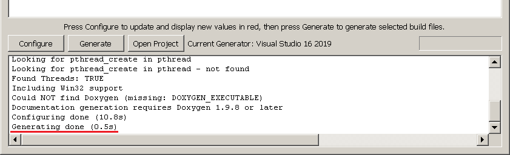

Now repeat these steps for Win32 platform. Create another empty **`build32`** folder anywhere on the hard drive, once again hit **`Browse Build...`**, navigate to and select the created **`build32`** folder, hit **`Configure`**, keep the same IDE, but select the **`Win32`** platform instead. Then click **`Finish`**:

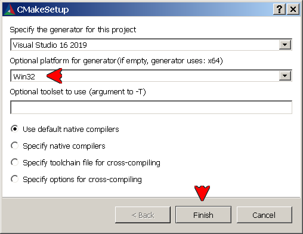

As before, don't mind the red background, once again hit **`Configure`** and **`Generate`**. Make sure that the generating is done, and at this point close the window:

### 6. Build the GLFW library
The GLFW project files for _x64_ and _Win32_ platforms are now in **`build`** and **`build32`** folders. To start the build, navigate to **`build`** folder, and double-click the **`GLFW.sln`** solution file:

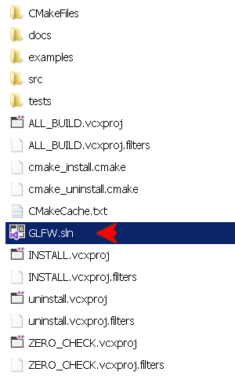

In the opened IDE, select _Release x64_ configuration. In the _Solution Explorer_, right-click the Solution bar, then click the **`Rebuild Solution`** command:

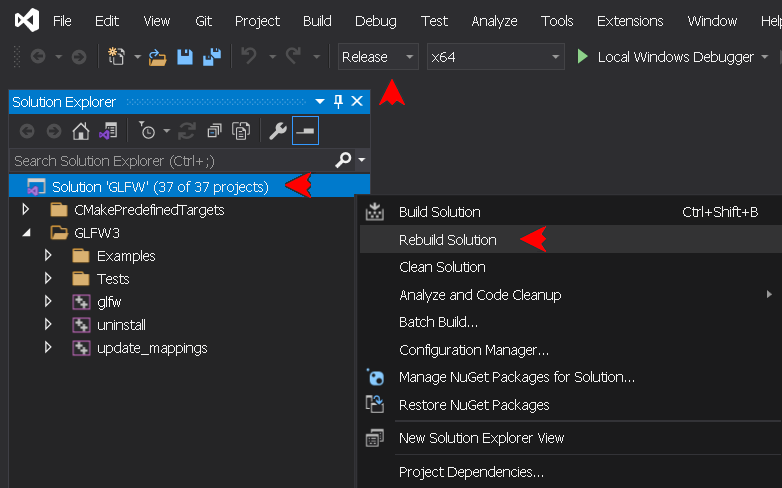

The output should be as follows:
```
Rebuild started...
1>------ Rebuild All started: Project: ZERO_CHECK, Configuration: Release x64 ------
1>1>Checking Build System
2>------ Rebuild All started: Project: glfw, Configuration: Release x64 ------
2>Building Custom Rule D:/Path_to_solution/OpenGL/Common/build/src/CMakeLists.txt
...
2>glfw.vcxproj -> D:\Path_to_solution\OpenGL\Common\build\src\Debug\glfw3.lib
========== Rebuild All: 2 succeeded, 0 failed, 0 skipped ==========
```
Close the IDE. Open the **`build`** folder, navigate to **`build/src/Release`** subfolder, copy the resulting **`glfw3.lib`** file into **`Common/lib`** subfolder.

> [!NOTE]
> Pressing the **`Build Solution (Ctrl+Shift+B)`** command should do the same, but the **`Rebuild Solution`** ensures to process the every source file from scratch.

Now repeat these steps for Win32 platform using files in **`build32`** folder. Make sure to select _Release x86_ configuration. Copy the resulting **`glfw3.lib`** file into **`Common/lib/Win32`** subfolder, and close the IDE. Now it is possible to permanently delete **`build`**, **`build32`**, and the extracted **`glfw-3.4`** source package folders.

### 7. Build the Assimp library
The process for the Assimp library is identical as in the previous two sections. The Assimp source package has to be extracted anywhere on the hard drive. The project files have to be generated by CMake into **`build`** and **`build32`** folders for _x64_ and _Win32_ platforms. Then the library must be built from each folder using **`Assimp.sln`** solution file, under the _Release x64_ and _x86_ configurations. The Assimp library header files are generated in the process. The build takes quite a while, please be patient! The output should be as follows:
```
Rebuild started...
1>------ Rebuild All started: Project: ZERO_CHECK, Configuration: Release x64 ------
1>1>Checking Build System
2>------ Rebuild All started: Project: zlibstatic, Configuration: Release x64 ------
3>------ Skipped Rebuild All: Project: UpdateAssimpLibsDebugSymbolsAndDLLs, Configuration: Release x64 ------
3>Project not selected to build for this solution configuration 
4>------ Skipped Rebuild All: Project: uninstall, Configuration: Release x64 ------
4>Project not selected to build for this solution configuration 
2>Building Custom Rule D:/Path_to_solution/OpenGL/Common/assimp-5.4.3/contrib/zlib/CMakeLists.txt
...
2>zlibstatic.vcxproj -> D:\Path_to_solution\OpenGL\Common\build\contrib\zlib\Release\zlibstatic.lib
5>------ Rebuild All started: Project: assimp, Configuration: Release x64 ------
5>Building Custom Rule D:/Path_to_solution/OpenGL/Common/assimp-5.4.3/code/CMakeLists.txt
...
5>Creating library D:/Path_to_solution/OpenGL/Common/build/lib/Release/assimp-vc142-mt.lib and object D:/Path_to_solution/OpenGL/Common/build/lib/Release/assimp-vc142-mt.exp
5>assimp.vcxproj -> D:\Path_to_solution\OpenGL\Common\build\bin\Release\assimp-vc142-mt.dll
6>------ Rebuild All started: Project: unit, Configuration: Release x64 ------
6>Building Custom Rule D:/Path_to_solution/OpenGL/Common/assimp-5.4.3/test/CMakeLists.txt
...
6>unit.vcxproj -> D:\Path_to_solution\OpenGL\Common\build\bin\Release\unit.exe
7>------ Rebuild All started: Project: ALL_BUILD, Configuration: Release x64 ------
7>Building Custom Rule D:/Path_to_solution/OpenGL/Common/assimp-5.4.3/CMakeLists.txt
8>------ Skipped Rebuild All: Project: INSTALL, Configuration: Release x64 ------
8>Project not selected to build for this solution configuration 
========== Rebuild All: 5 succeeded, 0 failed, 3 skipped ==========
```
After the both builds are completed, follow the following steps: 
- Copy the entire **`assimp-5.4.3/include/assimp`** subfolder from the source package into **`Common/include`** subfolder. These files was generated during the build;
- Copy the two (2) configuration header files from the **`build/include/assimp`** subfolder into the **`Common/include/assimp`** subfolder. The header files should be identical in both build folders;
- Copy the two (2) resulting **`*.lib`** and **`*.exp`** files from the **`build/lib/Release`** subfolder into the **`Common/lib`** subfolder;
- Copy the two (2) resulting **`*.lib`** and **`*.exp`** files from the **`build32/lib/Release`** subfolder into the **`Common/lib/Win32`** subfolder;
- Copy the single resulting **`*.dll`** file from the **`build/bin/Release`** subfolder into the **`Common/bin`** subfolder;
- Copy the single resulting **`*.dll`** file from the **`build32/bin/Release`** subfolder into the **`Common/bin/Win32`** subfolder;
- Permanently delete **`build`**, **`build32`**, and the extracted **`assimp-5.4.3`** source package folders.

> [!TIP]
> If you are unsure about the path layout explained in this document, download the **`Common.7z`** archive from the [repository page](https://github.com/dmitrycello/glpp/tree/main), and check its directories.

[&uarr; TOP](INSTALLATION.md#installation) [USAGE &rarr;](USAGE.md)
