## INSTALLATION
[&nwarr; README](../README.md)<br>
- [1. Create a new solution](INSTALLATION.md#1-create-a-new-solution)
- [2. Download the OpenGL components](INSTALLATION.md#2-download-the-opengl-components)
- [3. Prepare the components's folder](INSTALLATION.md#3-prepare-the-componentss-folder)
- [4. Install CMake](INSTALLATION.md#4-install-cmake)
- [5. Build GLFW project files](INSTALLATION.md#5-build-glfw-project-files)
- [6. Build the GLFW library](INSTALLATION.md#6-build-the-glfw-library)
- [7. Build the zlib, glm and Assimp libraries](INSTALLATION.md#7-build-the-zlib-glm-and-assimp-libraries)

The installation of YAGL++ library is basically a collection of the original OpenGL API components. The offered setup allows to build an application with a static runtime libraries, which is the preferred way in the game developper world. This makes the application file slightly bigger, but in return it improves the component loading speed along with the better compatibility. To be honest, this way is harder to achieve, since many components are using DLL runtime by default. It also takes significant space on the hard drive (around 700mb), but the the game is worth the candle. Anyways, it is always possible to revert to dynamic runtime scheme, and thus save the space. The path layout can be different, but it is strongly recommended to use the suggested way, at least for the first time. The setup supports _x64_ and _Win32_ platforms under Microsoft Visual Studio 2019 or later, producing the console application in Debug mode, and Windows application in Release mode.

> [!IMPORTANT]
> Before the installation, make sure your graphics card supports OpenGL 3.3+. Download [GLview](https://www.realtech-vr.com/glview-download/), install it, and run the test. If OpenGL 3.3 in not supported, try to update the graphics card driver.

### 1. Create a new solution
It is possible to create a large number of projects under the same solution, so the future reinstallation of the library is not required. To create the solution for the YAGL++ projects, under the Visual Studio click **`File -> New -> Project... (Ctrl+Shift+N)`**:

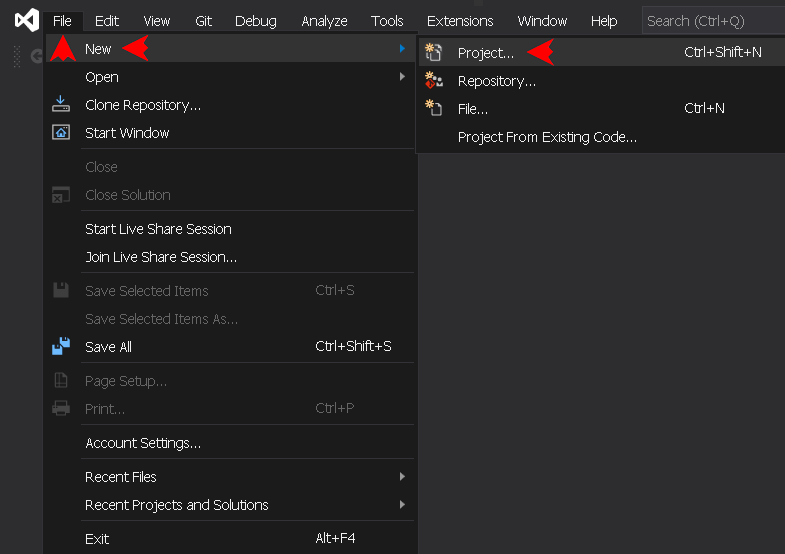

Select **`Blanc Solution`**, hit **`Next`**:

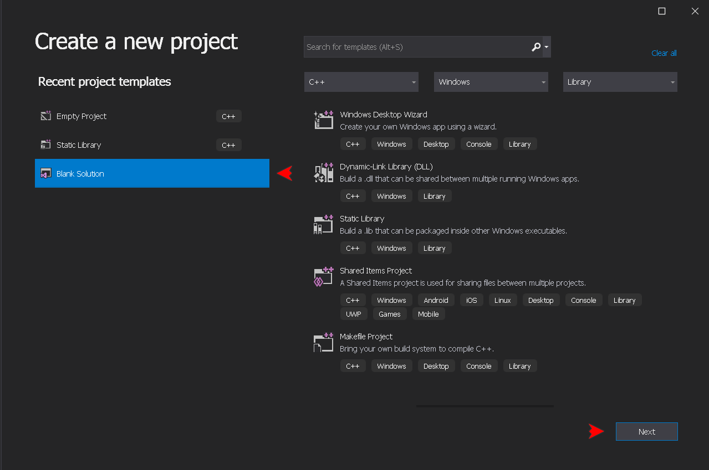

Choose any name and path to solution, e.g. _OpenGL_ on the appropriate drive, hit **`Create`**, then close the IDE for now:

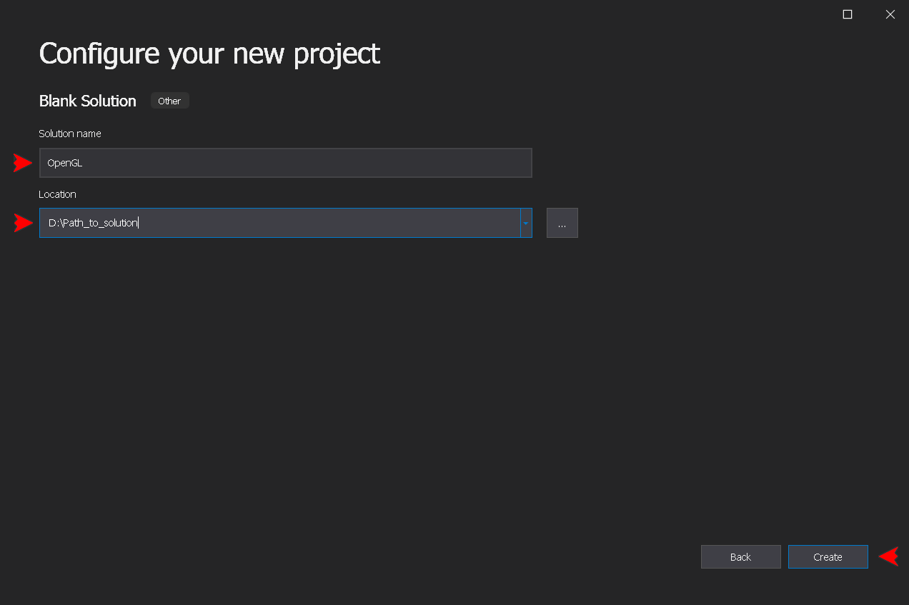

### 2. Download the OpenGL components
> [!TIP]
> For the quick testing, all the following steps of the installation may be skipped, by downloading the Google Drive [Common.7z](https://drive.google.com/file/d/1-Pu9Yx7ddXe1IBFABiKkT3jX-GcCxiwx/view?usp=drive_link) archive (47.1mb) with all library and header files, and extracting it into **`Common`** folder within the newly created solution directory. However, it is still recommended to populate the folder by following all steps, at least for the first time, not just to feel the process, but to understand how it works. This is also the way the most programmers do, to ensure that each component fits to computer's environment and is up to date.

- [GLAD](https://glad.dav1d.de) archive generated with _Specification_ set to **`OpenGL`**, _Profile_ set to **`Core`**, _API gl_ set to **`Version 4.6`**. Keep _API gles1, gles2, glsc2_ as **`None`**. Do not select any extension;
- [GLFW](https://www.glfw.org/download) source package v3.4 or later. Older versions could be found [here](https://github.com/glfw/glfw/releases);
- [glm](https://github.com/g-truc/glm/releases) source package v1.0.3 or later;
- [Assimp](https://github.com/assimp/assimp/releases) source package v6.0.4 or later;
- [zlib](https://github.com/madler/zlib/releases) source package v1.3.2 or later. This component is required to link Assimp as static build;
- [stb_image](https://github.com/nothings/stb/tree/master) library. It is important to use the file versions tested with the current release. Every newer version of the header file may require additional testings. If there is no such version, try using newer version (it usually works), or get the preserved ones from the **`Common.7z`** archive. The required files are:
	+ **stb_image.h** v2.30,
	+ **stb_image_resize2.h** v2.18,
	+ **stb_image_write.h** v1.16;
- [Latest YAGL++ archive](https://github.com/dmitrycello/yaglpp/archive/refs/heads/main.zip)

### 3. Prepare the components's folder
Create the new folder under the name **`Common`** within the newly created solution directory. In that folder create four (4) subfolders: **`bin`**, **`include`**, **`lib`**, and **`res`**. Create two subfolders **`Win32`** within **`Common/bin`** and **`Common/lib`** directories. The last **`Common/res`** directory contains the common project resources of different kinds. To follow the [Learn OpenGL tutorial](https://learnopengl.com/), download the resources from [here](https://github.com/JoeyDeVries/LearnOpenGL/tree/master/resources), and move them into this subfolder. At the moment it could be left empty. The folder tree should be as following:

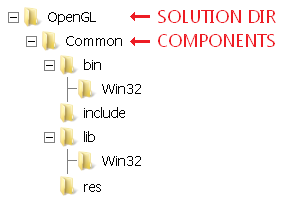

Extract all downloaded components, and copy into the following subdirectories:
```
Common/include/glad/   <- Header (glad.h) and source (glad.c) files from GLAD archive
Common/include/GLFW/   <- Two (2) header files from GLFW Source package
Common/include/glm/    <- The entire subfolder from the GLM archive
Common/include/KHR/    <- KHR header file (khrplatform.h) from GLAD archive
Common/include/stb/    <- Three (3) header files from stb_image library
Common/include/yaglpp/ <- YAGL++ header files from repository include folder
```
> [!NOTE]
> The library works with OpenGL versions 2.0 to 3.3. However, it is still possible to set the context version up to 4.6 using the **`GLPP_CONTEXT_VERSION_MAJOR`** and **`GLPP_CONTEXT_VERSION_MINOR`** main switches. For the time being, the library only includes the assets up to the OpenGL 3.3 (Core Profile) standard. On the contrary, if the graphic card does not support the default version (3.3), it is possible to try an earlier one. Note that prior to version 3.2 the _OpenGL Core Profile_ is unavailable, and the _Any Profile_ (default) or _Compat Profile_ will be used instead.

### 4. Install CMake
If it was not done before, the CMake application must be installed, in order to build CMake projects. Download the [CMake](https://cmake.org/download/) latest application installer, lunch the wizard, and hit **`Next`**:

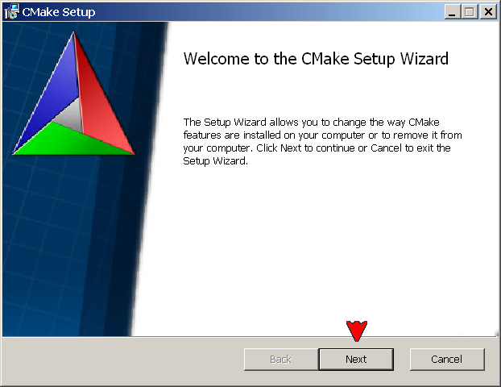

Accept the License Agreement, and hit **`Next`**:

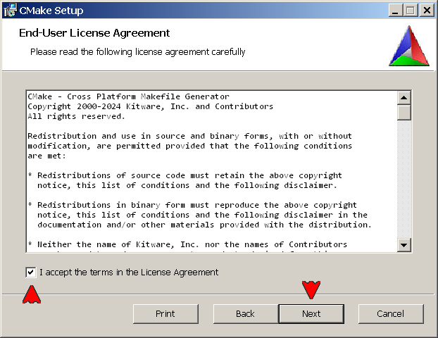

Make sure the option **`Add CMake to the system PATH for all users`** is selected, and hit **`Next`**:

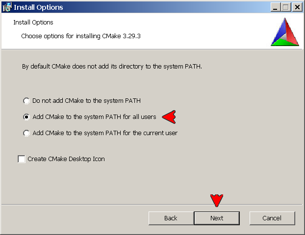

Leave the default destination folder, and hit **`Next`**:

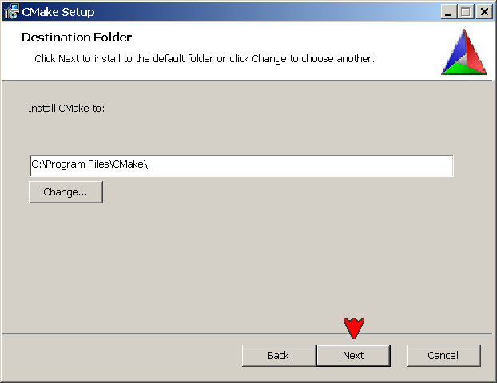

Click **`Install`** to begin the installation:

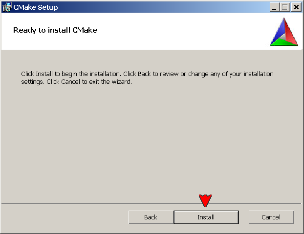

After installation is complete, hit **`Finish`** to exit the wizard:

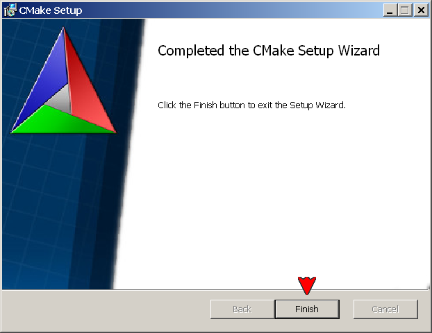

### 5. Build GLFW project files
The GLFW source package can be extracted anywhere on the hard drive. In order to save disk space, the offered installation will optionally strip off the PDB files under Debug mode. However, it is possible to keep them, and preserve the ability to Debug the library at the expense of an extra space on the hard drive. The YAGL++ respects four (4) platform configurations: _Debug x64_, _Release x64_, _Debug Win32_, and _Release Win32_. To build the project with the static runtime libaries, it is mandatory to create the library **`*.lib`** file for each project configuration. Before building from the GLFW Source package, it is necessary to generate its project files with CMake. The statically linked projects are quite tricky to set up. In order to avoid the disappointing errors, it is advised to use command line script, instead of CMake GUI. To do so, create the _CMakeGLFW.bat_ file in the package root directory along with the _CMakeLists.txt_ file, and copy-paste into it the following content:
```
@echo off
echo CMakeGLFW.bat
echo =============
echo.
mkdir build32
cmake -A Win32 -DUSE_MSVC_RUNTIME_LIBRARY_DLL=OFF -DBUILD_SHARED_LIBS=OFF -DCMAKE_CONFIGURATION_TYPES=Debug;Release -DCMAKE_DEBUG_POSTFIX=d -S . -B build32
mkdir build64
cmake -A x64 -DUSE_MSVC_RUNTIME_LIBRARY_DLL=OFF -DBUILD_SHARED_LIBS=OFF -DCMAKE_CONFIGURATION_TYPES=Debug;Release -DCMAKE_DEBUG_POSTFIX=d -S . -B build64
echo.
echo Done. Press any key to exit...
pause >nul
```
Running that file from its directory will create **`build64`** and **`build32`** subfolders with Visual Studio solutions to build the _Win32_ and _x64_ GLFW libraries. When the console shows **`Done. Press any key to exit...`**, close it and proceed to next step.

### 6. Build the GLFW library
To start the build, navigate first to **`build64`** folder, and double-click the **`GLFW.sln`** solution file:

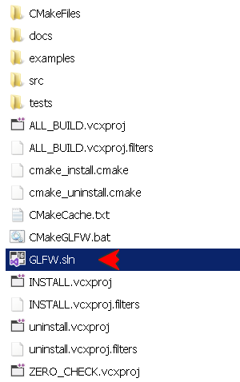

In the opened IDE right-click the _glfw_ project and select _Properties_: 

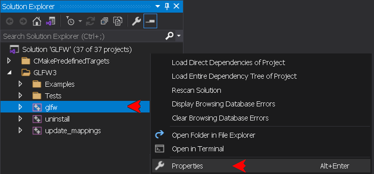

Make sure the _Debug_ configuration is set, under ```C/C++ &rarr; General``` click drop-down menu against **`Debug Information Format`** option, and select **`None`**. Hit **`Apply`** and close the window.

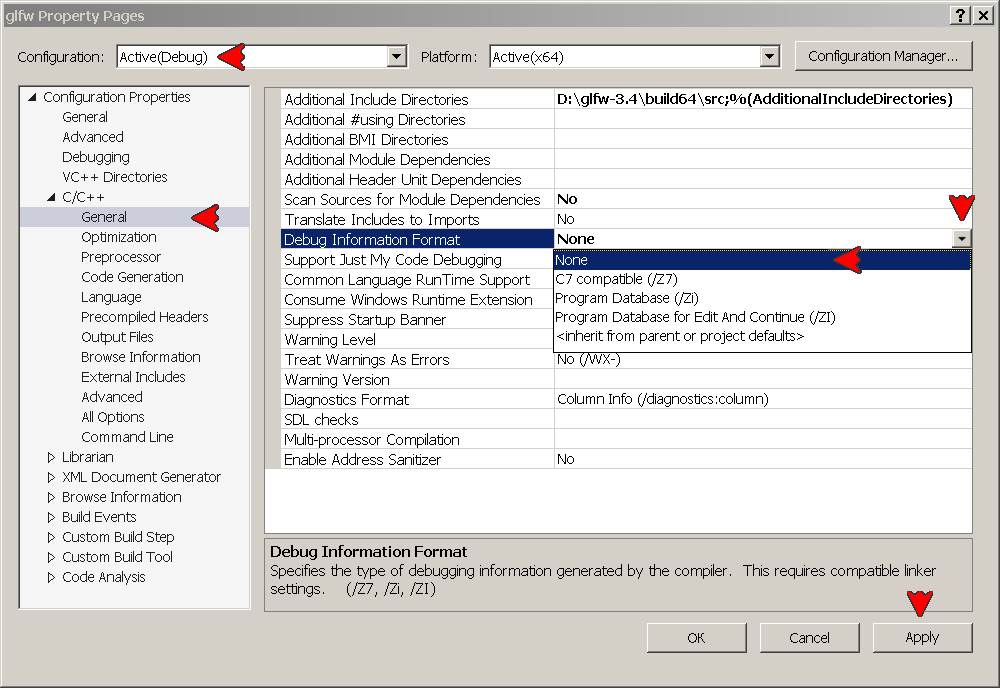

This prevents PDB files generation under _Debug_ configuration, and thus saves space. In the _Solution Explorer_, make sure the _Debug_ configuration is set, right-click the Solution bar, then click the **`Rebuild Solution`** command:

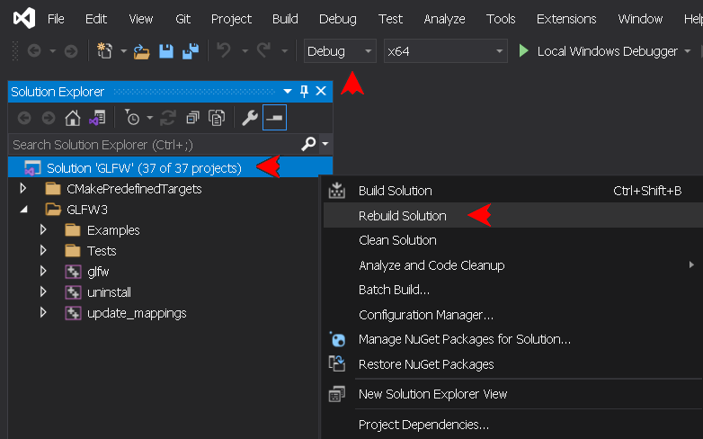

The output should be as follows:
```
Rebuild started...
1>------ Rebuild All started: Project: ZERO_CHECK, Configuration: Debug x64 ------
1>1>Checking Build System
2>------ Rebuild All started: Project: glfw, Configuration: Debug x64 ------
...
37>Project not selected to build for this solution configuration 
========== Rebuild All: 34 succeeded, 0 failed, 3 skipped ==========
```
Now change the configuration to _Release_, run the build of GLFW again under that configuration, wait until the process is complete, and close the IDE. Repeat all these steps for Win32 platform configuration using files in **`build32`** folder.

> [!NOTE]
> Pressing the **`Build Solution (Ctrl+Shift+B)`** command should do the same, but the **`Rebuild Solution`** ensures to process the every source file from scratch.

### 7. Build the zlib, glm and Assimp libraries
The process for _zlib_, _glm_ and _Assimp_ libraries is identical to the described above. Despite the _glm_ library can be used as header only component, here it will be installed as static library to optimize it for large projects. Extract the source packages anywhere on the hard drive. Create three **`CMakeZlib.bat`**, **`CMakeGlm.bat`** and **`CMakeAssimp.bat`** script files within the **`zlib-1.3.2`**, **`glm`** and **`assimp-6.0.4`** package root folders along with _CMakeLists.txt_ files, and copy-paste into them the following content:
```
@echo off
echo CMakeZlib.bat
echo =============
echo.
mkdir build32
cmake -A Win32 -DCMAKE_MSVC_RUNTIME_LIBRARY="MultiThreaded$<$<CONFIG:Debug>:Debug>" -DZLIB_BUILD_SHARED=OFF -DCMAKE_CONFIGURATION_TYPES=Debug;Release -S . -B build32
mkdir build64
cmake -A x64 -DCMAKE_MSVC_RUNTIME_LIBRARY="MultiThreaded$<$<CONFIG:Debug>:Debug>" -DZLIB_BUILD_SHARED=OFF -DCMAKE_CONFIGURATION_TYPES=Debug;Release -S . -B build64
echo.
echo Done. Press any key to exit...
pause >nul
```
```
@echo off
echo CMakeGlm.bat
echo ============
echo.
mkdir build32
cmake -A Win32 -DCMAKE_MSVC_RUNTIME_LIBRARY="MultiThreaded$<$<CONFIG:Debug>:Debug>" -DBUILD_SHARED_LIBS=OFF -DCMAKE_CONFIGURATION_TYPES=Debug;Release -DCMAKE_DEBUG_POSTFIX=d -S . -B build32
mkdir build64
cmake -A x64 -DCMAKE_MSVC_RUNTIME_LIBRARY="MultiThreaded$<$<CONFIG:Debug>:Debug>" -DBUILD_SHARED_LIBS=OFF -DCMAKE_CONFIGURATION_TYPES=Debug;Release -DCMAKE_DEBUG_POSTFIX=d -S . -B build64
echo.
echo Done. Press any key to exit...
pause >nul
```
```
@echo off
echo CMakeAssimp.bat
echo ===============
echo.
mkdir build32
cmake -A Win32 -DUSE_STATIC_CRT=ON -DASSIMP_INSTALL_PDB=OFF -DBUILD_SHARED_LIBS=OFF -DCMAKE_CONFIGURATION_TYPES=Debug;Release -S . -B build32
mkdir build64
cmake -A x64 -DUSE_STATIC_CRT=ON -DASSIMP_INSTALL_PDB=OFF -DBUILD_SHARED_LIBS=OFF -DCMAKE_CONFIGURATION_TYPES=Debug;Release -S . -B build64
echo.
echo Done. Press any key to exit...
pause >nul
```
To set the PDB file generation off, use the _zlibstatic_, _glm_ and _assimp_ projects within the **`zlib`**, **`glm`** and **`assimp`** solutions. After all builds are completed, follow these steps:

- Copy the entire **`glfw-3.4/include/GLFW`** subfolder from the source package into **`Common/include`** subfolder;
- Copy the entire **`glm/glm`** subfolder from the source package into **`Common/include`** subfolder;
- Copy the entire **`assimp-5.4.3/include/assimp`** subfolder from the source package into **`Common/include`** subfolder;
- Copy the two (2) configuration header files from the **`build64/include/assimp`** subfolder into the **`Common/include`** subfolder. These files were generated during the build, they are identical in every build folder;
- Copy all resulting **`*.lib`** files (16) from every **`build64`** folder into **`Common/lib`** subfolder, and from every  **`build32`** folder into **`Common/lib/Win32`** subfolder, for _x64_ and _Win32_ configurations respectively. The resulting **`*.lib`** files can be found in following package subfolders:
	+ **`glfw-3.4/build<64|32>/src/<Debug|Release>`**;
	+ **`zlib-1.3.2/build<64|32>/<Debug|Release>`**;
	+ **`glm/build<64|32>/glm/<Debug|Release>`**;
	+ **`assimp-6.0.4/build<64|32>/lib/<Debug|Release>`**;
- Permanently delete every source package folder.

> [!TIP]
> If you are unsure about the path layout explained in this document, download the [Common.7z](https://drive.google.com/file/d/1-Pu9Yx7ddXe1IBFABiKkT3jX-GcCxiwx/view?usp=drive_link) archive, and check its directories. Keeping the PDB files option at its default setting allows to Debug through the library source, in this case the **`*.pdb`** files should be used along with their **`*.lib`** counterparts. This also requires to keep the source files in their package folders.

[&uarr; TOP](INSTALLATION.md#installation) [USAGE &rarr;](USAGE.md)
