## USAGE
[&nwarr; README](../README.md)<br>
- [1. Add the application project](USAGE.md#1-add-the-application-project)
- [2. Add resources to the application project](USAGE.md#2-add-resources-to-the-application-project)
- [3. Add source files to the application project](USAGE.md#3-add-source-files-to-the-application-project)
- [4. Add the project configuration file](USAGE.md#4-add-the-project-configuration-file)
- [5. Set the application project properties](USAGE.md#5-set-the-application-project-properties)
	- [Debug x64 (EXE) configuration properties](USAGE.md#debug-x64-exe-configuration-properties)
	- [Release x64 (EXE) configuration properties](USAGE.md#release-x64-exe-configuration-properties)
	- [Debug Win32 (EXE) configuration properties](USAGE.md#debug-win32-exe-configuration-properties)
	- [Release Win32 (EXE) configuration properties](USAGE.md#release-win32-exe-configuration-properties)
- [6. Setup precompiled headers](USAGE.md#6-setup-precompiled-headers)
- [7. Type the code](USAGE.md#7-type-the-code)
- [8. Create YAGL++ project template](USAGE.md#8-create-yagl-project-template)
- [9. Install Visual Studio GLSL add-on](USAGE.md#9-install-visual-studio-glsl-add-on)

The described earlier library installation setup requires the OpenGL application project to be added to the solution created in previous document. The project described below may seem complicated, but at the end there will be a section about creating a [Project Template](USAGE.md#7-create-yagl-project-template). This allows to save all the work, and later reuse it in a few clicks. Therefore, it is advised to accuratelly follow the present project setup, at least for the fires time. After creating the template, it would be easy to undo all unnecessary features. The offered project will contain resources, main source file, YAGL++ configuration file, and precompiled header.

### 1. Add the application project
Reopen the previously created solution. In the _Solution Explorer_ right-click the solution name bar (1st line), click **`Add`** &rarr; **`New project...`**:


Select **`Empty Project (C++)`**, press **`Next`**:

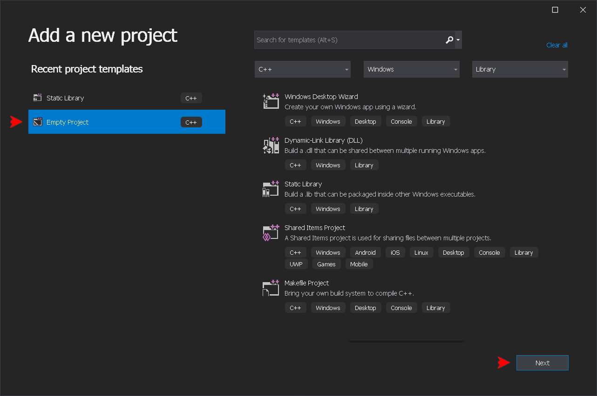

Choose any project name, check the path to the solution, and hit **`Create`**:

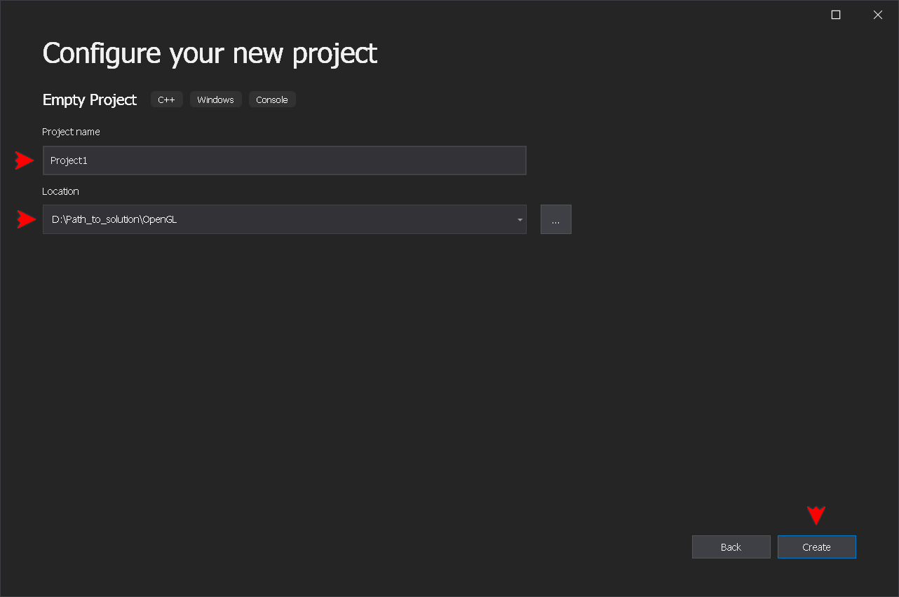

In the _Solution Explorer_, right-click the project's name and click **`Set as Startup Project`**, to set default running output application:

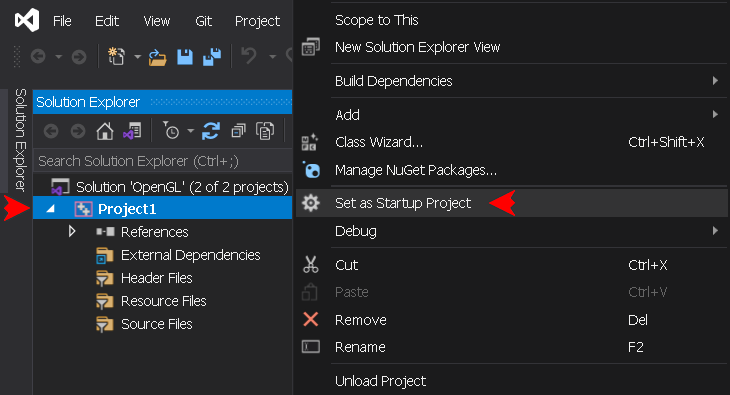

### 2. Add resources to the application project
The resources allow a quick access to files included into the output execitable as [Binary Resources](https://learn.microsoft.com/en-us/windows/win32/menurc/resources), this also allows to build a portable application. Such files as GLSL shader script files could be then hidden within the executable, and therefore can't be accidentally modified.

> [!TIP]
> If the resources aren't added to the project, the _Resource_ option would not be accessible in the _Project Property Pages_ window later on.

In the _Solution Explorer_, right-click the project's _Resource Files_ filter icon. Click **`Add`** &rarr; **`New Item... (Ctrl+Shift+A)`**:

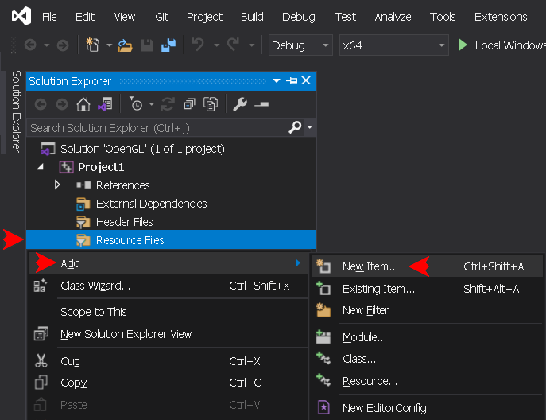

Select **`Resource`** &rarr; **`Resource File (.rc)`**, keep **`Resource.rc`** file name, check the path, and hit **`Add`**:

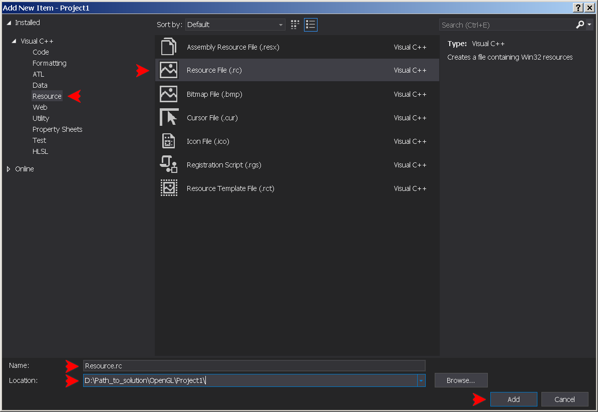

Open the two newly created flies in the editor window, and replace their content with the following code:
```
// resource.h
```
```
// Resource.rc
#include "resource.h"
```

> [!NOTE]
> For simplicity, each code exemple in the present tutorial begins with its commented file name.

### 3. Add source files to the application project
In the _Solution Explorer_, right-click the project's _Source Files_ filter icon. Click **`Add`** &rarr; **`New Item... (Ctrl+Shift+A)`**:


Select **`Code`** &rarr; **`C++ File (.cpp)`**, type **`main.cpp`** _(as main function)_, check the path, and hit **`Add`**:

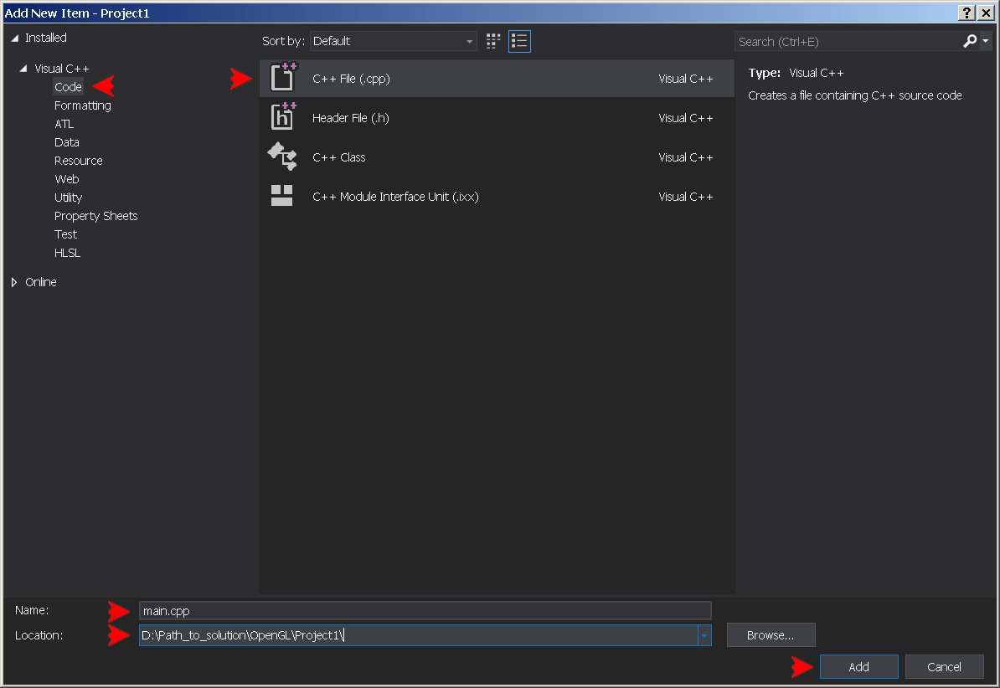

Next, it is necessary to add the GLAD source file to the project. Copy the **`glad.c`** file from the **`Common/include/glad`** directory into the project directory. Now, once again in the _Solution Explorer_, right-click the project's _Source Files_ filter icon. Click **`Add`** &rarr; **`Existing Item... (Shift+Alt+A)`**:

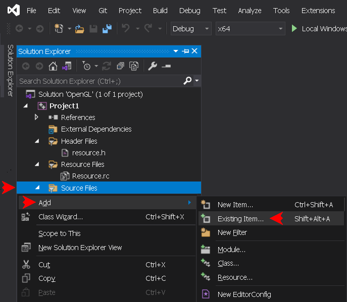

In the opened project directory select the **`glad.c`** file, and hit **`Add`** button.

Finally there are two more files, **`stdafx.cpp`** and **`yaglpp.cpp`**, to be added via the _Source Files_ filter icon. The first file is being used by the precompiled header, and the second one is the YAGL++ implementation source. Both files will always remain unchanged and rarely compiled. Create them the same way as **`main.cpp`**, open in the editor and type or copy-paste the following code:
```
// stdafx.cpp
#include "stdafx.h"
```
```
// yaglpp.cpp
#define YAGLPP_IMPLEMENTATION
#include "config.h"
#include <yaglpp/glpp.h>
```

### 4. Add the project configuration file
The YAGL++ project configuration file is the convenient way of keeping the main library switches in the project file, without the need to modify the library file when necessary. The configuration file swithes will be then applied only for the local project. To do that, the **`YAGLPP_CONFIG`** symbol has to be defined prior to include the main library file, which will override the main file switches.

In the _Solution Explorer_, right-click the project's _Header Files_ filter icon. Click **`Add`** &rarr; **`New Item... (Ctrl+Shift+A)`**:

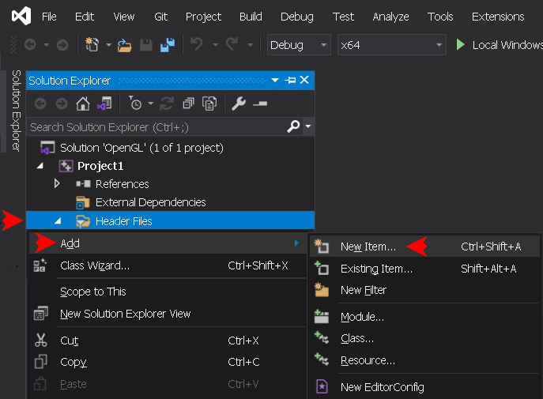

Select **`Code`** &rarr; **`Header File (.h)`**, type the file name **`config.h`**, check the path, and hit **`Add`**:


The default main switches could be copied from [glpp.h](../include/glpp.h) file, between _MAIN SWITCHES BEGIN_ and _MAIN SWITCHES END_ labels. The entire content of the configuration file should be as follows:
```
// config.h
#pragma once
/*Custom config override*/
#define YAGLPP_CONFIG

/*Define <CocoaChdirResources> pre-initialize GLFW hint*/
#define YAGLPP_COCOA_CHDIR_RESOURCES

/*Define <CocoaMenubar> pre-initialize GLFW hint*/
#define YAGLPP_COCOA_MENUBAR

/*Define <JoystickHatButtons> pre-initialize GLFW hint*/
#define YAGLPP_JOYSTICK_HAT_BUTTONS

/*Include the class properties along with existing getters and setters*/
#define YAGLPP_CLASS_PROPERTIES

/*Include all GLM library headers, slightly affects the compilation time*/
#define YAGLPP_GLM_HEADERS

/*Do not include main entry point into YAGL++ library*/
#define YAGLPP_NO_AFX_LAYOUT

/*Compile with the most recent GLFW nonlegacy library*/
#define YAGLPP_NO_GLFW_LEGACY

/*Define the minimum supported OpenGL context major version value, do not comment*/
#define YAGLPP_CONTEXT_VERSION_MAJOR 3

/*Define the minimum supported OpenGL context minor version value, do not comment*/
#define YAGLPP_CONTEXT_VERSION_MINOR 3

/*Define Assimp library file name, comment to exclude Assimp*/
#define YAGLPP_ASSIMP "assimp-vc142-mt.lib"

/*Define GLFW library file name, comment to exclude GLFW*/
#define YAGLPP_GLFW "glfw3.lib"
```

The last file to be added via the _Header Files_ filter icon is **`stdafx.h`**, the project precompiled header. Create it the same way as **`config.h`**, open in the editor and type or copy-paste the following code:
```
// stdafx.h
#pragma once

// Winows API
#include <windows.h>
#include <iostream>

// YAGL++ header
#include "config.h"
#include <yaglpp/glpp.h>
```

### 5. Set the application project properties
Right-click application project name bar and press **`Proprties (Alt+Enter)`**:

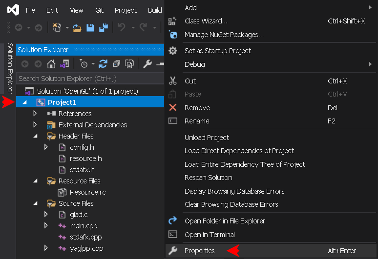

In the Property Pages window set **`Configuration`** and **`Platform`** drop-down menus to **`Debug`** and **`x64`**. It is going to be the first platform configuration to set up:

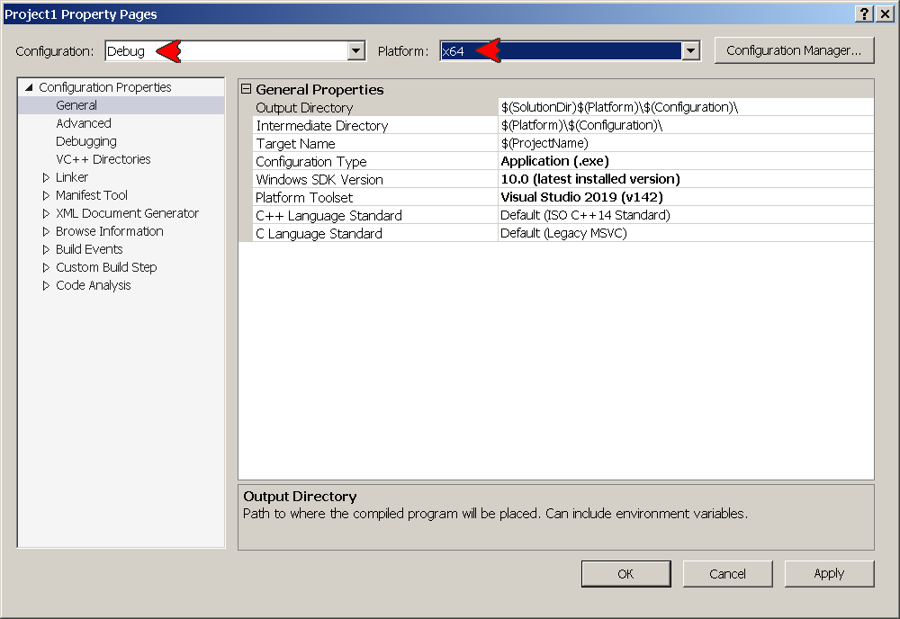

The application project may be used in one of the four (4) platform configurations. It is necessary to set the eight (8) project properties under each configuration. Among the other properties, the Release platform configuration requires to set the [entry point](https://learn.microsoft.com/en-us/cpp/build/reference/entry-entry-point-symbol), where as the Debug platform configuration is using _NODEFAULTLIB_ linker option, to remove the [Linker Tools Warning LNK4098](https://learn.microsoft.com/en-us/cpp/error-messages/tool-errors/linker-tools-warning-lnk4098?view=msvc-170), appearing since only the _Release_ version of external libraries is being used. To set up a property, select it, press the rightmost drop-down control, and hit **`<Edit...>`**:


In the appeared window, type the string value into the first field, check how it expands in the second field, make sure to keep the **`Inherit from parent or project defaults`** flag set, then hit **`OK`**. Note that some property editor windows may look differently:

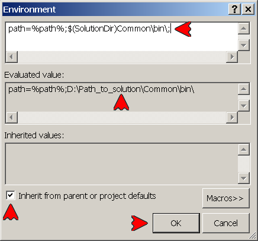

> [!IMPORTANT]
> In the next four subsections, copy the property string value into the appropriate field, or select an appropriate option in the _Property Pages_ window, as explained in the above section. Make sure to hit the **`Apply`** button after setting up each platform configuration.

#### Debug x64 (EXE) configuration properties
- Debugging &rarr; Environment:```path=%path%;$(SolutionDir)Common\bin\;```
- VC++ Directories &rarr; Include Directories:```$(SolutionDir)Common\include\;```
- VC++ Directories &rarr; Library Directories:```$(SolutionDir)Common\lib\;```
- C/C++ &rarr; Precompiled Headers &rarr; Precompiled Header: select _Use (/Yu)_ option
- C/C++ &rarr; Precompiled Headers &rarr; Precompiled Header File: keep ```stdafx.h```
- Linker &rarr; System &rarr; SubSystem: select _Console (/SUBSYSTEM:CONSOLE)_ option
- Linker &rarr; Command Line &rarr; Additional Options:```/NODEFAULTLIB:msvcrt.lib```
- Resources &rarr; Additional Include Directories:```$(SolutionDir)Common\res\;```

#### Release x64 (EXE) configuration properties
- Debugging &rarr; Environment:```path=%path%;$(SolutionDir)Common\bin\;```
- VC++ Directories &rarr; Include Directories:```$(SolutionDir)Common\include\;```
- VC++ Directories &rarr; Library Directories:```$(SolutionDir)Common\lib\;```
- C/C++ &rarr; Precompiled Headers &rarr; Precompiled Header: select _Use (/Yu)_ option
- C/C++ &rarr; Precompiled Headers &rarr; Precompiled Header File: keep ```stdafx.h```
- Linker &rarr; System &rarr; SubSystem: select _Windows (/SUBSYSTEM:WINDOWS)_ option
- Linker &rarr; Advanced &rarr; Entry Point:```mainCRTStartup```
- Resources &rarr; Additional Include Directories:```$(SolutionDir)Common\res\;```

#### Debug Win32 (EXE) configuration properties
- Debugging &rarr; Environment:```path=%path%;$(SolutionDir)Common\bin\Win32\;```
- VC++ Directories &rarr; Include Directories:```$(SolutionDir)Common\include\;```
- VC++ Directories &rarr; Library Directories:```$(SolutionDir)Common\lib\Win32\;```
- C/C++ &rarr; Precompiled Headers &rarr; Precompiled Header: select _Use (/Yu)_ option
- C/C++ &rarr; Precompiled Headers &rarr; Precompiled Header File: keep ```stdafx.h```
- Linker &rarr; System &rarr; SubSystem: select _Console (/SUBSYSTEM:CONSOLE)_ option
- Linker &rarr; Command Line &rarr; Additional Options:```/NODEFAULTLIB:msvcrt.lib```
- Resources &rarr; Additional Include Directories:```$(SolutionDir)Common\res\;```

#### Release Win32 (EXE) configuration properties
- Debugging &rarr; Environment:```path=%path%;$(SolutionDir)Common\bin\Win32\;```
- VC++ Directories &rarr; Include Directories:```$(SolutionDir)Common\include\;```
- VC++ Directories &rarr; Library Directories:```$(SolutionDir)Common\lib\Win32\;```
- C/C++ &rarr; Precompiled Headers &rarr; Precompiled Header: select _Use (/Yu)_ option
- C/C++ &rarr; Precompiled Headers &rarr; Precompiled Header File: keep ```stdafx.h```
- Linker &rarr; System &rarr; SubSystem: select _Windows (/SUBSYSTEM:WINDOWS)_ option
- Linker &rarr; Advanced &rarr; Entry Point:```mainCRTStartup```
- Resources &rarr; Additional Include Directories:```$(SolutionDir)Common\res\;```

### 6. Setup the precompiled header
The [Precompiled header files](https://learn.microsoft.com/en-us/cpp/build/creating-precompiled-header-files?view=msvc-170) feature allows the faster compilation, which is critical for a large projects. The modern IDEs are using **`pch.h`** as precompiled header name. In fact, it is possible to use any name, as long as it is set in the project properties. In the present setup the default name **`stdafx.h`** is left unchanged.

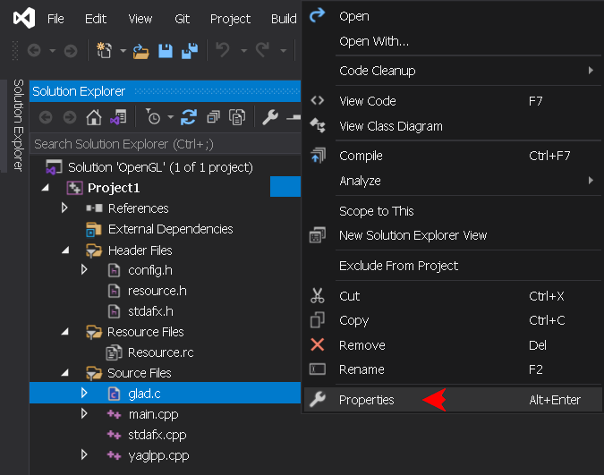

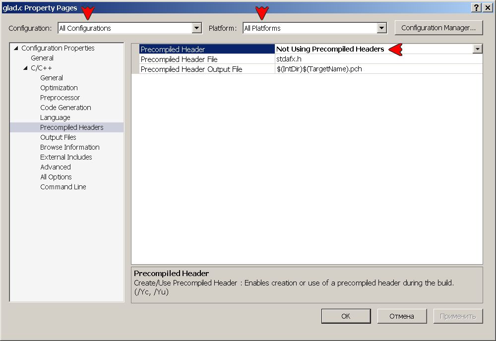

### 7. Type the code
Open the project's **`main.cpp`** file. In the editor window type the minimal YAGL++ application code:
```
// main.cpp
#include "config.h"
int main(int argc, char** argv)
{
	glfw::Window window(800, 600, "YAGL++ Application");
	window.makeContextCurrent();
	while (!window.windowShouldClose)
	{
		gl::clearColor(0.2f, 0.3f, 0.3f, 1.0f);
		gl::clear(gl::BufferBitMask::ColorBufferBit);
		window.swapBuffers();
		glfw::pollEvents();
	}
	return 0;
}
```

> [!WARNING]
> The original API assets are still available in the source file, but the combination of thoses with the YAGL++ objects in some cases may affect the proper functionality of the library, since some of its routine work is performed on the background.

Now the IntelliSense shows the description of every library member:

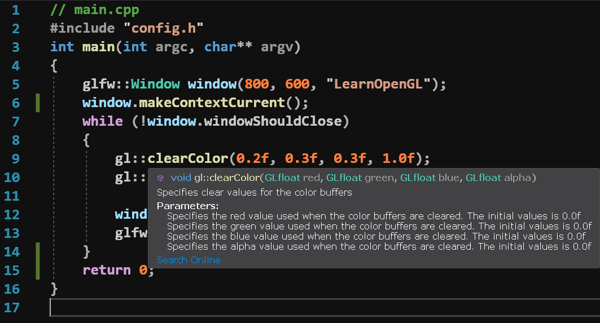

Rebuild the project, the output should look like this:
```
Rebuild started...
1>------ Rebuild All started: Project: Project1, Configuration: Debug x64 ------
1>glad.c
1>main.cpp
1>YAGL++: Compiling with OpenGL 3.3 context version support...
1>Project1.vcxproj -> D:\Path_to_solution\OpenGL\x64\Debug\Project1.exe
========== Rebuild All: 1 succeeded, 0 failed, 0 skipped ==========
```

> [!NOTE]
> The **`glad.c`** source file was spotted to be seen by IDE as being altered. _This makes the project to be rebuit everytime_. Replacing this file with a newer version could fix the issue. Generate a newer GLAD archive, or take the file from **`Common.7z`** archive.

Now hit **`F5`** to run the application:

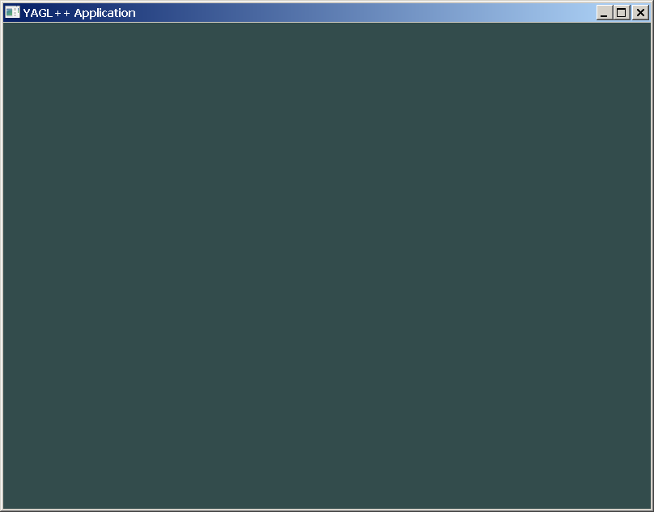

To overload window events, use the new window class derived from **`glfw::Window`**:
```
// main.cpp
#include "stdafx.h"
class GLWindow : public glfw::Window
{
	using Window::Window;                         // Base constructors
	void onFramebufferSize(int width, int height) // Framebuffer size callback
	{
		gl::viewport(0, 0, width, height);
	}
};

int main(int argc, char** argv)
{
	GLWindow window(800, 600, "Overloaded Event Application");
	//...
```
Finally, here is the example of the library usage in AFX-alike layout. In order to use it, comment the **`GLPP_NO_AFX_LAYOUT`** switch in the configuration file prior to build the project. The global application variable is defined as an anonymous class derived from **`glfw::Thread`**:
```
// main.cpp
#include "stdafx.h"
class : public glfw::Thread
{
	void onInit()   // Create window
	{
		context = new glfw::Window(800, 600, "AFX-alike Mode Application");
		context->makeContextCurrent();
	}
	void onRender() // Rendering loop
	{
		gl::clearColor(0.2f, 0.3f, 0.3f, 1.0f);
		gl::clear(gl::BufferBitMask::ColorBufferBit);
	}
} application;
```
AFX-alike layout is rather experimental, and at the moment can be used only with a single class. But it could become a promising trend in future development.

### 8. Create YAGL++ project template
At this point, it would be wise to save all performed work by creating a Visual Studio project template from the current project. Later, it would be possible to create a new project, without the need to set all required parameters. The template will work with the similar solution path layout. Download the [template icon](template_icon.png) and [template preview](template_preview.png) files, or use any other with transparent background. The source code could be reduced to the following:
```
// main.cpp
#include "config.h"
int main(int argc, char** argv)
{
	return 0;
}
```

Click **`Project menu -> Export Template...`**:

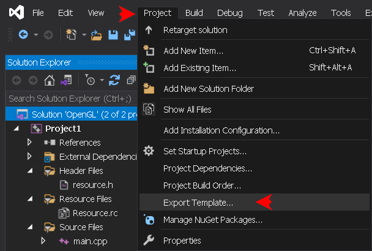

In the opened window, keep the template type as _Project template_, select the project to export from, then hit **`Next`**:

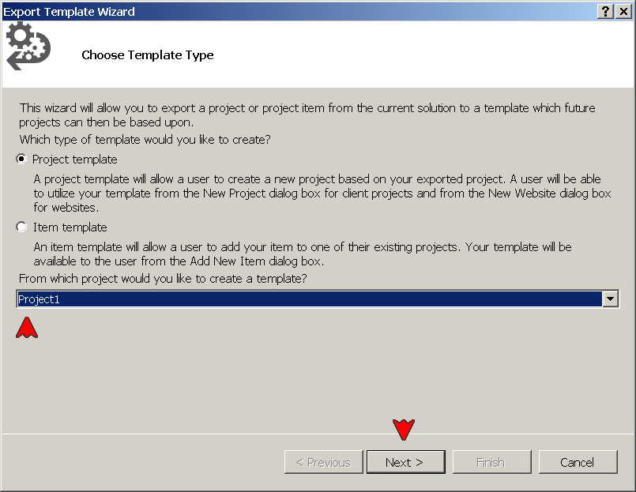

In the next window, copy the project name and description (or type any other):

```YAGL++ Application```

```Windows and Console C++ Application using YAGL++ library```

Hit **`Browse...`** to select the path to downloaded project icon for both _Icon image_ and _Preview image_ edit boxes. Then hit **`Finish`**:

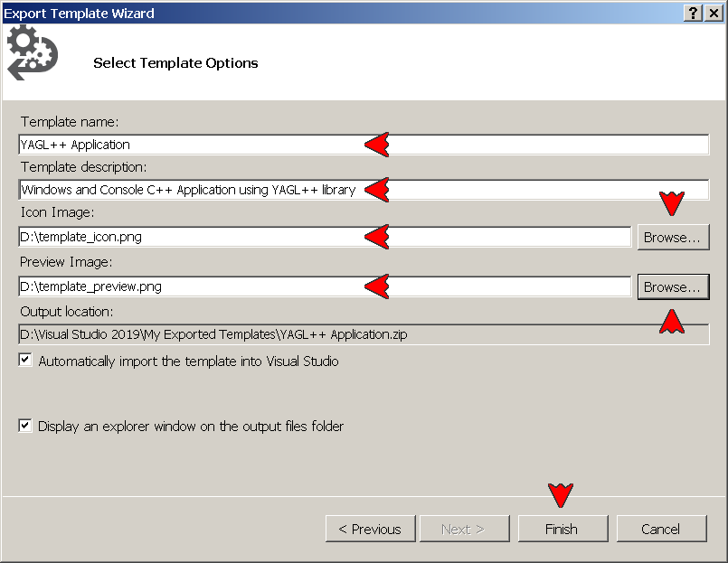

Close the opened folder with the new template _.zip_ archive, and restart the IDE. Now, in the _Solution Explorer_ right-click the solution name bar (1st line), click **`Add -> New Project...`**:


Make sure to set filters to _All languages_, _All platforms_ and _All project types_. This will show all project templates. Alternatively, type **`yagl`** in the search bar:

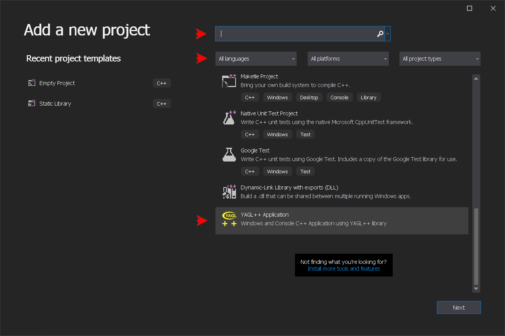

> [!NOTE]
> Unfortunatelly, the Visual Studio does not allow to add the _tags_ to a custom template. Therefore it does not show up immediately in the _Add a new project_ dialog, ousted by the built-in templates. But after some time, it will appear under _Recent project templates_, where it could be then pinned.

### 9. Install Visual Studio GLSL add-on
Optionally, download the [GLSL language integration](https://marketplace.visualstudio.com/items?itemName=DanielScherzer.GLSL) add-on by Daniel Scherzer, or from [this repository](GLSL.vsix), then run downloaded file. This allows to view the .vert and .frag files with the appropriate color highlighting.

[&uarr; TOP](USAGE.md#usage) [EXAMPLES &rarr;](EXAMPLES.md)
