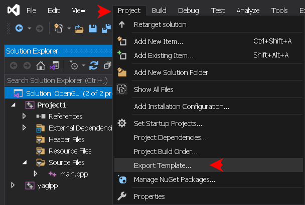

## USAGE
[&nwarr; README](../README.md)<br>
- [1. Add the application project](USAGE.md#1-add-the-application-project)
- [2. Set the application project properties](USAGE.md#2-set-the-application-project-properties)
- [3. Add the source file to the application project](USAGE.md#3-add-the-source-file-to-the-application-project)
- [4. Type the code](USAGE.md#4-type-the-code)
- [5. Create YAGL++ project template](USAGE.md#5-create-yagl-project-template)

The described earlier library installation setup requires the OpenGL application project to be added to the same solution. It is possible to create mutiple projects under the same solution, so the reinstallation of the library in not required.

### 1. Add the application project
To add the application project to the solution, use the same way as for the static library: in the _Solution Explorer_ right-click the solution name bar (1st line), Click **`Add -> New project...`**:


Select **`Empty Project (C++)`**, press **`Next`**:


Choose any project name, check the path to the solution, and hit **`Create`**:


In the _Solution Explorer_, right-click the project's name and click **`Set as Startup Project`**, to set default running output application:


### 2. Set the application project properties
Right-click application project name bar and press **`Proprties (Alt+Enter)`**. In the Properties window set Configuration and Platform to _Debug x64_:


In the Properties window set **`Configuration`** and **`Platform`** drop-down menus to **`Debug`** and **`x64`**. It is going to be the first platform configuration to set up:


As the library project, the application project may be used in one of the 4 platform configurations. In order to change the application platform configuration, it is necessary to build the library under that configuration. The application Debug platform configuration requires to set 4 configuration options, the application Release platform configuration requires an extra option to set the [entry point](https://learn.microsoft.com/en-us/cpp/build/reference/entry-entry-point-symbol).

- **_Debug x64 (EXE)_**:
```
Debugging -> Environment: path=%path%;$(SolutionDir)\Common\bin\
VC++ Directories -> Include Directories: $(SolutionDir)\Common\include\;$(IncludePath)
VC++ Directories -> Library Directories: $(SolutionDir)\Common\lib\;$(LibraryPath)
Linker -> System -> SubSystem: 'Console (/SUBSYSTEM:CONSOLE)'
```
- **_Release x64 (EXE)_**:
```
Debugging -> Environment: path=%path%;$(SolutionDir)\Common\bin\
VC++ Directories -> Include Directories: $(SolutionDir)\Common\include\;$(IncludePath)
VC++ Directories -> Library Directories: $(SolutionDir)\Common\lib\;$(LibraryPath)
Linker -> System -> SubSystem: 'Windows (/SUBSYSTEM:WINDOWS)'
Linker -> Advanced -> Entry Point: mainCRTStartup
```
- **_Debug Win32 (EXE)_**:
```
Debugging -> Environment: path=%path%;$(SolutionDir)\Common\bin\Win32\
VC++ Directories -> Include Directories: $(SolutionDir)\Common\include\;$(IncludePath)
VC++ Directories -> Library Directories: $(SolutionDir)\Common\lib\Win32\;$(LibraryPath)
Linker -> System -> SubSystem: 'Console (/SUBSYSTEM:CONSOLE)'
```
- **_Release Win32 (EXE)_**:
```
Debugging -> Environment: path=%path%;$(SolutionDir)\Common\bin\Win32\
VC++ Directories -> Include Directories: $(SolutionDir)\Common\include\;$(IncludePath)
VC++ Directories -> Library Directories: $(SolutionDir)\Common\lib\Win32\;$(LibraryPath)
Linker -> System -> SubSystem: 'Windows (/SUBSYSTEM:WINDOWS)'
Linker -> Advanced -> Entry Point: mainCRTStartup
```

> [!WARNING]
> Make sure to hit the **`Apply`** button after setting up each platform configuration.

### 3. Add the source file to the application project
In the _Solution Explorer_, right-click the project's Source Files filter icon. Click **`Add -> New Item... (Ctrl+Shift+A)`**:


Select **`C++ File (.cpp)`**, type  **`main.cpp`** _(as main function)_, check the path, and hit **`Add`**


### 4. Type the code
In the editor window type the minimal YAGL++ application code:
```
// main.cpp
#include <yaglpp/yaglpp.h>

int main(int argc, char** argv)
{
	glfw::Window window(800, 600, "YAGL++");
	window.makeContextCurrent();
	while (!window.windowShouldClose())
	{
		gl::clearColor(0.2f, 0.3f, 0.3f, 1.0f);
		gl::clear(gl::BufferBitMask::ColorBufferBit);
		window.swapBuffers();
		glfw::pollEvents();
	}
	return 0;
}
```
The IntelliSense now shows the description of every library member:


Rebuild the project, the output should look like this:
```
Rebuild started...
1>------ Rebuild All started: Project: Project1, Configuration: Debug x64 ------
1>main.cpp
1>Project1.vcxproj -> D:\Path_to_solution\OpenGL\x64\Debug\Project1.exe
========== Rebuild All: 1 succeeded, 0 failed, 0 skipped ==========
```
Now hit **`F5`** to run the application:


To overload window events, use the new window class derived from **`glfw::Window`**:
```
// main.cpp
#include <yaglpp/yaglpp.h>

class GLWindow : public glfw::Window
{
	using Window::Window;                     // Base constructors
	void onFramebuffer(int width, int height) // Framebuffer callback
	{
		gl::viewport(0, 0, width, height);
	}
};

int main(int argc, char** argv)
{
	GLWindow window(800, 600, "Overloaded event");
	//...
```
Lastly, the example of the library usage in AFX-alike layout. The application class must be derived from **`glfw::Thread`** or **`glfw::ThreadWnd`** class:
```
// main.cpp
#include <yaglpp/yaglpp.h>

class GLApplication : public glfw::ThreadWnd
{
	void onInitThread()   // Create window
	{
		m_pWindow = new glfw::Window(800, 600, "AFX-alike mode");
		m_pWindow->makeContextCurrent(this);
	}
	void onRenderWindow() // Rendering loop
	{
		gl::clearColor(0.2f, 0.3f, 0.3f, 1.0f);
		gl::clear(gl::BufferBitMask::ColorBufferBit);
	}
} application;
```
> [!NOTE]
> AFX-alike layout is rather experimental, and at the moment can be used only with two classes. But it could become very promising direction for development in the future. In order to use it, comment the **`GLPP_NO_AFX_LAYOUT`** switch in the [yaglpp.h](../include/yaglpp.h) library header, and rebuild the library.

### 5. Create YAGL++ project template
At this point, it would be wise to save all performed work by creating a Visual Studio project template from the current project. Later, it would be possible to create a new project, without the need to set all required parameters. The template will work with the same solution, or with the solution with similar path layout. Download the project icon [logo.png](logo.png), or use another one of a personal taste. Click **`Project menu -> Export Template...`**:



In the opened window, select the project to export from, then hit **`Next`**:


In the next window, type the project name (or any other):
```
YAGL++ Application
```
Type the project description (or any other):
```
Windows and Console C++ Application using YAGL++ library
```
Hit **`Browse...`** to select the path to downloaded project icon for both _Icon image_ and _Preview image_ edit boxes. Then hit **`Finish`**:


Close the opened folder with the new template _.zip_ archive, then restart the IDE. Right-click the solution bar name in the _Solution Explorer_, click **`Add -> New Project...`**:


Make sure to set filters to _All languages_, _All platforms_ and _All project types_. This will show all project templates. Alternatively, type **`yagl`** in the search bar:


> [!NOTE]
> Unfortunatelly, the Visual Studio does not allow to add a tags to custom templates. Therefore they do not show up immediately in the _Add a new project_ dialog.

[&uarr; TOP](USAGE.md#usage)
