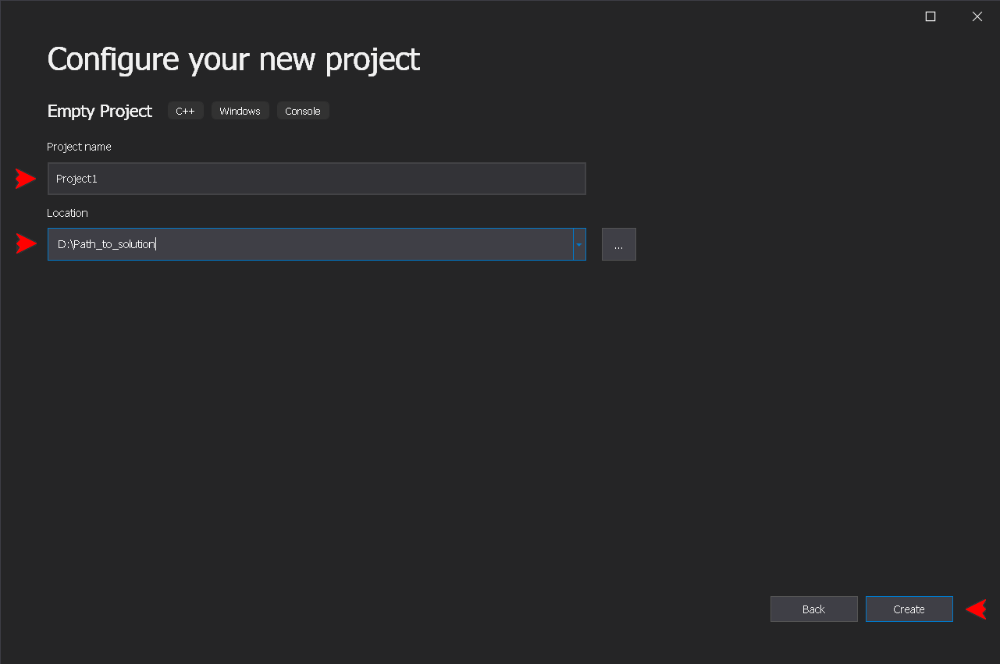
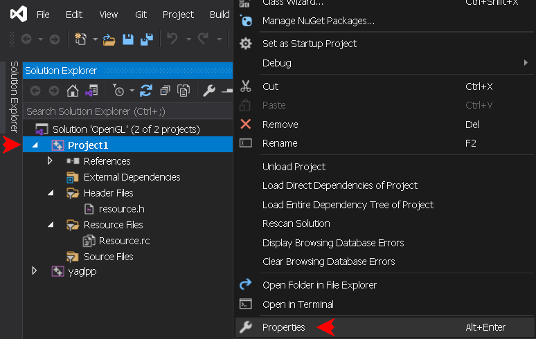
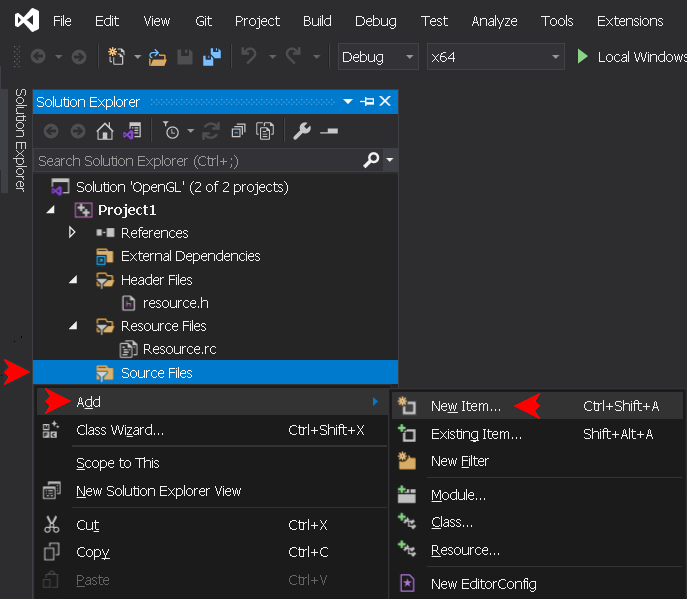
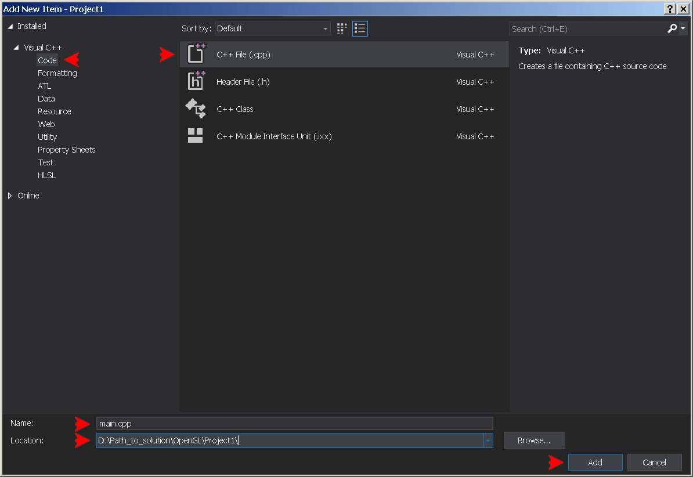
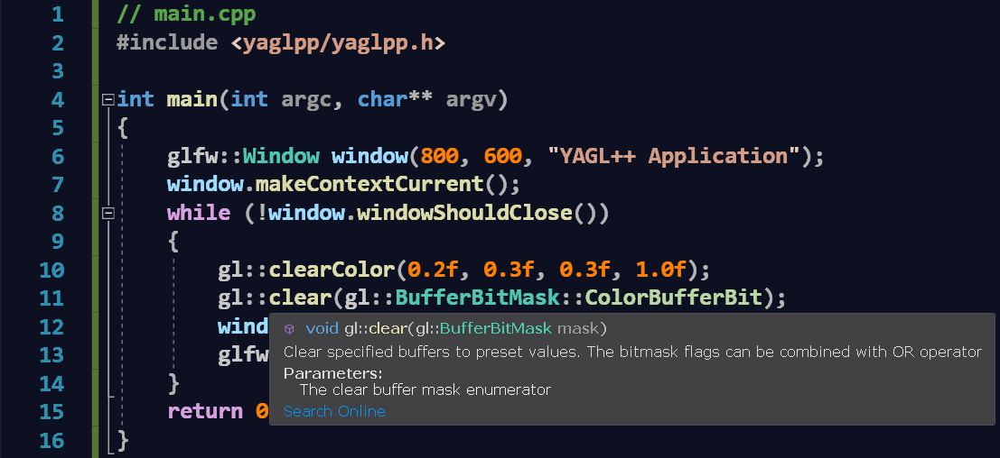
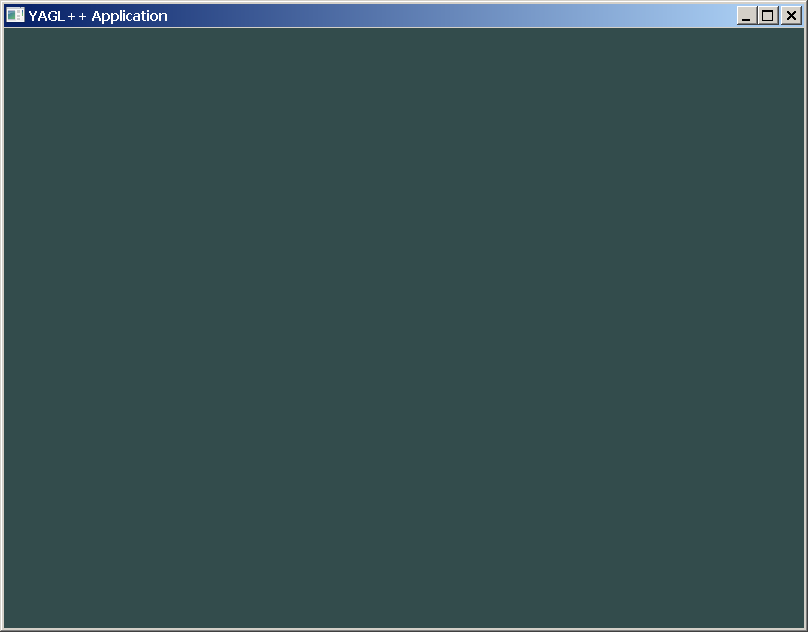
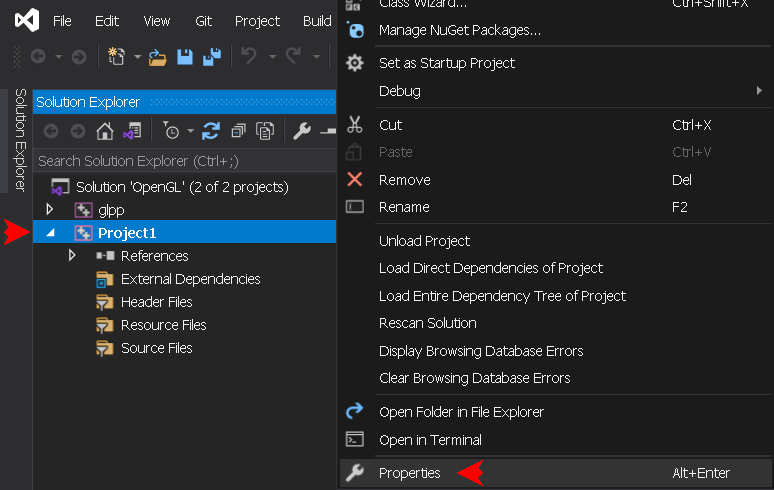
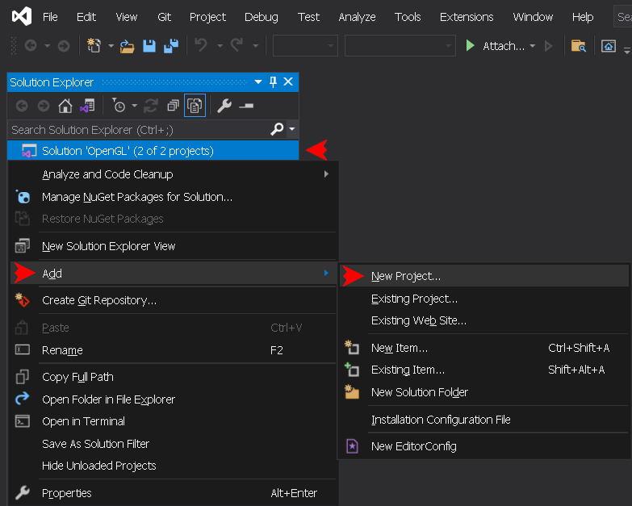
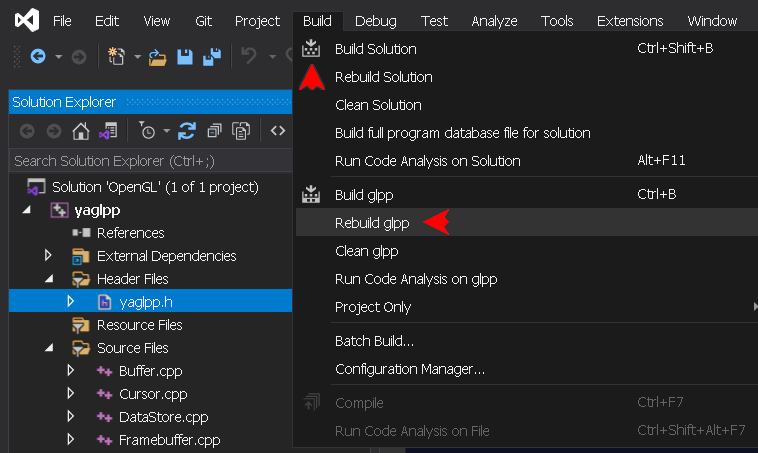

## USAGE
[&nwarr; README](../README.md)<br>
- [1. Add the application project](USAGE.md#1-add-the-application-project)
- [2. Add the resources to the application project](USAGE.md#2-add-the-resources-to-the-application-project)
- [3. Set the application project properties](USAGE.md#3-set-the-application-project-properties)
- [4. Add the source file to the application project](USAGE.md#4-add-the-source-file-to-the-application-project)
- [5. Type the code](USAGE.md#5-type-the-code)
- [6. Create YAGL++ project template](USAGE.md#6-create-yagl-project-template)
- [7. Install Visual Studio GLSL add-on](USAGE.md#7-install-visual-studio-glsl-add-on)

The described earlier library installation setup requires the OpenGL application project to be added to the same solution. It is possible to create mutiple projects under the same solution, so the reinstallation of the library in not required.

### 1. Add the application project
To add the application project to the solution, use the same way as for the static library: in the _Solution Explorer_ right-click the solution name bar (1st line), click **`Add -> New project...`**:


Select **`Empty Project (C++)`**, press **`Next`**:


Choose any project name, check the path to the solution, and hit **`Create`**:



In the _Solution Explorer_, right-click the project's name and click **`Set as Startup Project`**, to set default running output application:


### 2. Add the resources to the application project
The resources allow a quick access to files included into the output execitable as _binary resources_. Setting it up here may be optional, but it is strongly advised for the first time, to be later included in the project template. In the _Solution Explorer_, right-click the project's _Resource Files_ filter icon. Click **`Add -> New Item... (Ctrl+Shift+A)`**:


Select **`Resource -> Resource File (.rc)`**, keep **`Resource.rc`** file name, check the path, and hit **`Add`**:


Open the two newly created flies in the editor window, and replace their content with the following in _resource.h_ file:
```
// resource.h

```
and in _Resource.rc_ file:
```
// Resource.rc
#include "resource.h"

```

> [!NOTE]
> If the **`Resource.rc`** file isn't added to the project, the _Resource_ option would not be accessible in the project Properties window later on.

### 3. Set the application project properties
Right-click application project name bar and press **`Proprties (Alt+Enter)`**. In the Properties window set Configuration and Platform to _Debug x64_:



In the Properties window set **`Configuration`** and **`Platform`** drop-down menus to **`Debug`** and **`x64`**. It is going to be the first platform configuration to set up:


The application project may be used in one of the 4 platform configurations. In order to change the application platform configuration, it is necessary to set the six (6) project options under that configuration. The Release platform configuration requires to set the [entry point](https://learn.microsoft.com/en-us/cpp/build/reference/entry-entry-point-symbol), where as the Debug platform configuration is using _NODEFAULTLIB_ linker option, to suppress the warning appearing since the YAGL++ library is using only Release versions of external libraries, it saves a lot of disk space.

- **_Debug x64 (EXE)_**:

Debugging -> Environment:
```
path=%path%;$(SolutionDir)Common\bin\;
```

VC++ Directories -> Include Directories:
```
$(SolutionDir)Common\include\;
```

VC++ Directories -> Library Directories:
```
$(SolutionDir)Common\lib\;
```


```
Debugging -> Environment: path=%path%;$(SolutionDir)Common\bin\;
VC++ Directories -> Include Directories: $(SolutionDir)Common\include\;
VC++ Directories -> Library Directories: $(SolutionDir)Common\lib\;
Linker -> System -> SubSystem: 'Console (/SUBSYSTEM:CONSOLE)'
Linker -> Command Line -> Additional Options: /NODEFAULTLIB:msvcrt.lib
Resources -> Additional Include Directories: $(SolutionDir)Common\res\;
```
- **_Release x64 (EXE)_**:
```
Debugging -> Environment: path=%path%;$(SolutionDir)Common\bin\;
VC++ Directories -> Include Directories: $(SolutionDir)Common\include\;
VC++ Directories -> Library Directories: $(SolutionDir)Common\lib\;
Linker -> System -> SubSystem: 'Windows (/SUBSYSTEM:WINDOWS)'
Linker -> Advanced -> Entry Point: mainCRTStartup
Resources -> Additional Include Directories: $(SolutionDir)Common\res\;
```
- **_Debug Win32 (EXE)_**:
```
Debugging -> Environment: path=%path%;$(SolutionDir)Common\bin\Win32\;
VC++ Directories -> Include Directories: $(SolutionDir)Common\include\;
VC++ Directories -> Library Directories: $(SolutionDir)Common\lib\Win32\;
Linker -> System -> SubSystem: 'Console (/SUBSYSTEM:CONSOLE)'
Linker -> Command Line -> Additional Options: /NODEFAULTLIB:msvcrt.lib
Resources -> Additional Include Directories: $(SolutionDir)Common\res\;
```
- **_Release Win32 (EXE)_**:
```
Debugging -> Environment: path=%path%;$(SolutionDir)Common\bin\Win32\;
VC++ Directories -> Include Directories: $(SolutionDir)Common\include\;
VC++ Directories -> Library Directories: $(SolutionDir)Common\lib\Win32\;
Linker -> System -> SubSystem: 'Windows (/SUBSYSTEM:WINDOWS)'
Linker -> Advanced -> Entry Point: mainCRTStartup
Resources -> Additional Include Directories: $(SolutionDir)Common\res\;
```

> [!IMPORTANT]
> Make sure to hit the **`Apply`** button after setting up each platform configuration.

### 4. Add the source file to the application project
In the _Solution Explorer_, right-click the project's Source Files filter icon. Click **`Add -> New Item... (Ctrl+Shift+A)`**:



Select **`Code -> C++ File (.cpp)`**, type  **`main.cpp`** _(as main function)_, check the path, and hit **`Add`**:



### 5. Type the code
In the editor window type the minimal YAGL++ application code:
```
// main.cpp
#include <yaglpp/yaglpp.h>

int main(int argc, char** argv)
{
	glfw::Window window(800, 600, "YAGL++ Application");
	window.makeContextCurrent();
	while (!window.windowShouldClose())
	{
		gl::clearColor(0.2f, 0.3f, 0.3f, 1.0f);
		gl::clear(gl::BufferBitMask::ColorBufferBit);
		window.swapBuffers();
		glfw::pollEvents();
	}
	return 0;
}
```

> [!WARNING]
> The original API assets are still available in the source file, but the combination of thoses with the YAGL++ objects in most cases will affect the proper functionality of the library, since some its routine work is performed on the background.

Now the IntelliSense shows the description of every library member:



Rebuild the project, the output should look like this:
```
Rebuild started...
1>------ Rebuild All started: Project: Project1, Configuration: Debug x64 ------
1>main.cpp
1>Project1.vcxproj -> D:\Path_to_solution\OpenGL\x64\Debug\Project1.exe
========== Rebuild All: 1 succeeded, 0 failed, 0 skipped ==========
```
Now hit **`F5`** to run the application:



To overload window events, use the new window class derived from **`glfw::Window`**:
```
// main.cpp
#include <yaglpp/yaglpp.h>

class GLWindow : public glfw::Window
{
	using Window::Window;                     // Base constructors
	void onFramebuffer(int width, int height) // Framebuffer callback
	{
		gl::viewport(0, 0, width, height);
	}
};

int main(int argc, char** argv)
{
	GLWindow window(800, 600, "Overloaded Event Application");
	//...
```
Finally, the example of the library usage in AFX-alike layout. The global application variable is defined as an anonymous class derived from **`glfw::Thread`**:
```
// main.cpp
#include <yaglpp/yaglpp.h>

class : public glfw::Thread
{
	void onInit()   // Create window
	{
		context = new glfw::Window(800, 600, "AFX-alike Mode Application");
		context->makeContextCurrent();
	}
	void onRender() // Rendering loop
	{
		gl::clearColor(0.2f, 0.3f, 0.3f, 1.0f);
		gl::clear(gl::BufferBitMask::ColorBufferBit);
	}
} application;
```
> [!NOTE]
> AFX-alike layout is rather experimental, and at the moment can be used only with a single class. But it could become very promising direction for development in the future. In order to use it, comment the **`GLPP_NO_AFX_LAYOUT`** switch in the [yaglpp.h](../include/yaglpp.h) library header file, and rebuild the library.

### 6. Create YAGL++ project template
At this point, it would be wise to save all performed work by creating a Visual Studio project template from the current project. Later, it would be possible to create a new project, without the need to set all required parameters. The template will work within the same solution, or within a solution with similar path layout. Download the project icon file [icon.png](icon.png), or use any other with transparent background. Click **`Project menu -> Export Template...`**:


In the opened window, keep the template type as _Project template_, select the project to export from, then hit **`Next`**:


In the next window, type the project name (or any other):
```
YAGL++ Application
```
Type the project description (or any other):
```
Windows and Console C++ Application using YAGL++ library
```
Hit **`Browse...`** to select the path to downloaded project icon for both _Icon image_ and _Preview image_ edit boxes. Then hit **`Finish`**:



Close the opened folder with the new template _.zip_ archive, and restart the IDE. In the _Solution Explorer_ right-click the solution name bar (1st line), click **`Add -> New Project...`**:



Make sure to set filters to _All languages_, _All platforms_ and _All project types_. This will show all project templates. Alternatively, type **`yagl`** in the search bar:



> [!NOTE]
> Unfortunatelly, the Visual Studio does not allow to add the _tags_ to a custom template. Therefore it does not show up immediately in the _Add a new project_ dialog, ousted by the built-in templates. But after some time, it will appear under _Recent project templates_, where it could be then pinned.

### 7. Install Visual Studio GLSL add-on
Optionally, download the [GLSL language integration](https://marketplace.visualstudio.com/items?itemName=DanielScherzer.GLSL) add-on by Daniel Scherzer, or extract the _GLSL.vsix_ file from **`Common.7z`** archive, then run downloaded file. This allows to view the .vert and .frag files with the appropriate color highlighting.

[&uarr; TOP](USAGE.md#usage) [EXAMPLES &rarr;](EXAMPLES.md)
