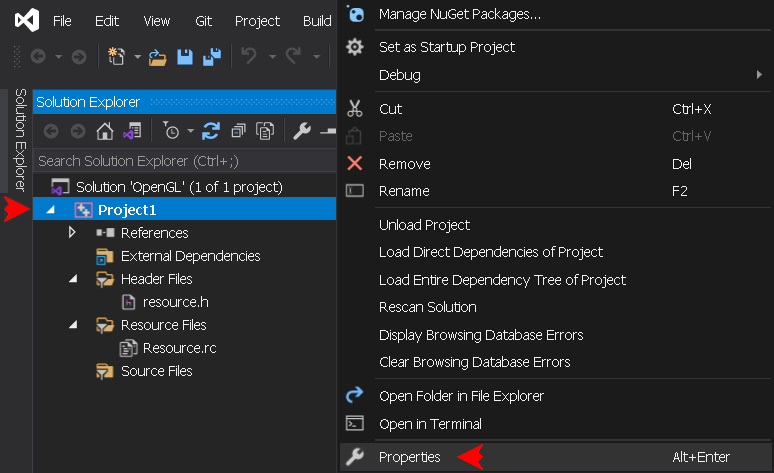
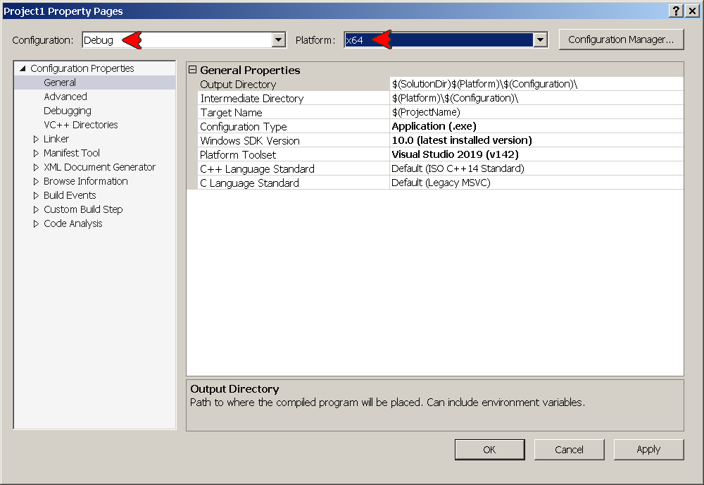
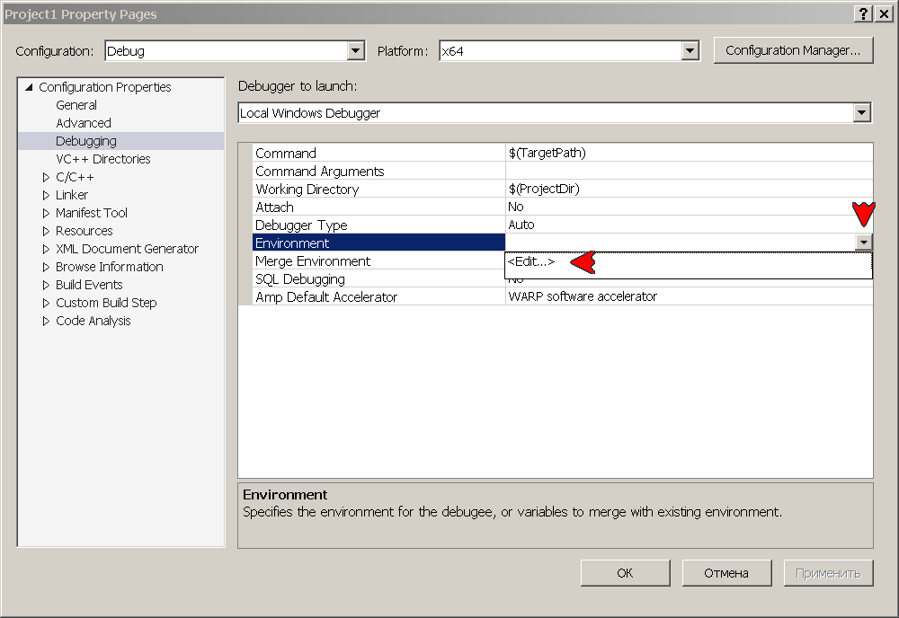
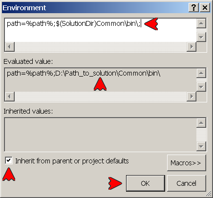
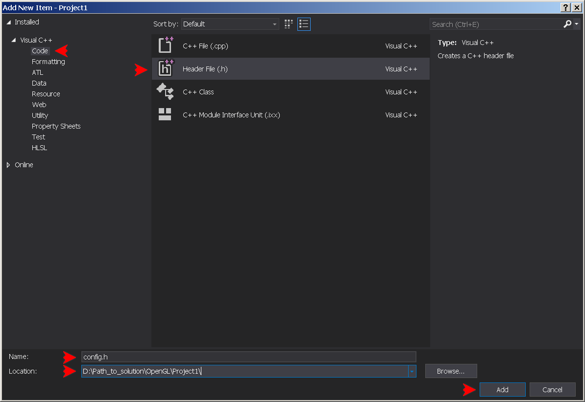

## USAGE (under revision)
[&nwarr; README](../README.md)<br>
- [1. Add the application project](USAGE.md#1-add-the-application-project)
- [2. Add the resources to the application project](USAGE.md#2-add-the-resources-to-the-application-project)
- [3. Add the source files to the application project](USAGE.md#3-add-the-source-files-to-the-application-project)
- [4. Set the application project properties](USAGE.md#4-set-the-application-project-properties)
	- [Debug x64 (EXE) configuration properties](USAGE.md#debug-x64-exe-configuration-properties)
	- [Release x64 (EXE) configuration properties](USAGE.md#release-x64-exe-configuration-properties)
	- [Debug Win32 (EXE) configuration properties](USAGE.md#debug-win32-exe-configuration-properties)
	- [Release Win32 (EXE) configuration properties](USAGE.md#release-win32-exe-configuration-properties)
- [5. Add the project config file](USAGE.md#5-add-the-project-config-file)
- [6. Type the code](USAGE.md#6-type-the-code)
- [7. Create YAGL++ project template](USAGE.md#7-create-yagl-project-template)
- [8. Install Visual Studio GLSL add-on](USAGE.md#8-install-visual-studio-glsl-add-on)

The described earlier library installation setup requires the OpenGL application project to be added to the previously created solution. It is possible to create mutiple projects under the same solution, so the reinstallation of the library in not required.

### 1. Add the application project
Reopen the previously created solution, in the _Solution Explorer_ right-click the solution name bar (1st line), click **`Add -> New project...`**:


Select **`Empty Project (C++)`**, press **`Next`**:


Choose any project name, check the path to the solution, and hit **`Create`**:


In the _Solution Explorer_, right-click the project's name and click **`Set as Startup Project`**, to set default running output application:


### 2. Add the resources to the application project
The resources allow a quick access to files included into the output execitable as _binary resources_. It is an optional step, but it is strongly advised to set it up here, to be included in the _project template_ later on. In the _Solution Explorer_, right-click the project's _Resource Files_ filter icon. Click **`Add -> New Item... (Ctrl+Shift+A)`**:


Select **`Resource -> Resource File (.rc)`**, keep **`Resource.rc`** file name, check the path, and hit **`Add`**:


Open the two newly created flies in the editor window, and replace their content with the following in _resource.h_ file:
```
// resource.h
```
and in _Resource.rc_ file:
```
// Resource.rc
#include "resource.h"
```

> [!NOTE]
> If the **`Resource.rc`** file isn't added to the project, the _Resource_ option would not be accessible in the _Project Property Pages_ window later on.

### 3. Add the source files to the application project
First, let's add a new source file to the application project. In the _Solution Explorer_, right-click the project's _Source Files_ filter icon. Click **`Add -> New Item... (Ctrl+Shift+A)`**:


Select **`Code -> C++ File (.cpp)`**, type  **`main.cpp`** _(as main function)_, check the path, and hit **`Add`**:


Next, it is necessary to add the GLAD source file to the project. Open the **`Common/include/glad`** directory, copy the 
**`glad.c`** file into the project directory. Now, once again in the _Solution Explorer_, right-click the project's _Source Files_ filter icon. Click **`Add -> Existing Item... (Shift+Alt+A)`**:


In the opened project directory select the **`glad.c`** file, and hit **`Add`** button.

### 4. Set the application project properties
Right-click application project name bar and press **`Proprties (Alt+Enter)`**. In the Properties window set Configuration and Platform to _Debug x64_:



In the Property Pages window set **`Configuration`** and **`Platform`** drop-down menus to **`Debug`** and **`x64`**. It is going to be the first platform configuration to set up:



The application project may be used in one of the 4 platform configurations. It is necessary to set the six (6) project properties under each configuration. Among the other properties, the Release platform configuration requires to set the [entry point](https://learn.microsoft.com/en-us/cpp/build/reference/entry-entry-point-symbol), where as the Debug platform configuration is using _NODEFAULTLIB_ linker option, to remove the [(Linker Tools Warning LNK4098](https://learn.microsoft.com/en-us/cpp/error-messages/tool-errors/linker-tools-warning-lnk4098?view=msvc-170), appearing since only the Release versions of external libraries is being used. To set up a property, select it, press the rightmost drop-down control, and hit **`<Edit...>`**:



In the appeared window, type the string value into the first field, check how it expands in the second field, make sure to keep the **`Inherit from parent or project defaults`** flag set, then hit **`OK`**. Note that some property editor windows may look differently:



> [!IMPORTANT]
> In the next four subsections, copy the property string value into the appropriate field, or select an appropriate option in the _Property Pages_ window, as explained in the above section. Make sure to hit the **`Apply`** button after setting up each platform configuration.

#### Debug x64 (EXE) configuration properties
- Debugging &rarr; Environment:```path=%path%;$(SolutionDir)Common\bin\;```
- VC++ Directories &rarr; Include Directories:```$(SolutionDir)Common\include\;```
- VC++ Directories &rarr; Library Directories:```$(SolutionDir)Common\lib\;```
- Linker &rarr; System &rarr; SubSystem: select _Console (/SUBSYSTEM:CONSOLE)_ option
- Linker &rarr; Command Line &rarr; Additional Options:```/NODEFAULTLIB:msvcrt.lib```
- Resources &rarr; Additional Include Directories:```$(SolutionDir)Common\res\;```

#### Release x64 (EXE) configuration properties
- Debugging &rarr; Environment:```path=%path%;$(SolutionDir)Common\bin\;```
- VC++ Directories &rarr; Include Directories:```$(SolutionDir)Common\include\;```
- VC++ Directories &rarr; Library Directories:```$(SolutionDir)Common\lib\;```
- Linker &rarr; System &rarr; SubSystem: select _Windows (/SUBSYSTEM:WINDOWS)_ option
- Linker &rarr; Advanced &rarr; Entry Point:```mainCRTStartup```
- Resources &rarr; Additional Include Directories:```$(SolutionDir)Common\res\;```

#### Debug Win32 (EXE) configuration properties
- Debugging -> Environment:```path=%path%;$(SolutionDir)Common\bin\Win32\;```
- VC++ Directories -> Include Directories:```$(SolutionDir)Common\include\;```
- VC++ Directories -> Library Directories:```$(SolutionDir)Common\lib\Win32\;```
- Linker -> System -> SubSystem**: select _Console (/SUBSYSTEM:CONSOLE)_ option
- Linker -> Command Line -> Additional Options:```/NODEFAULTLIB:msvcrt.lib```
- Resources -> Additional Include Directories:```$(SolutionDir)Common\res\;```

#### Release Win32 (EXE) configuration properties
- Debugging -> Environment:```path=%path%;$(SolutionDir)Common\bin\Win32\;```
- VC++ Directories -> Include Directories:```$(SolutionDir)Common\include\;```
- VC++ Directories -> Library Directories:```$(SolutionDir)Common\lib\Win32\;```
- Linker -> System -> SubSystem: select _Windows (/SUBSYSTEM:WINDOWS)_ option
- Linker -> Advanced -> Entry Point:```mainCRTStartup```
- Resources -> Additional Include Directories:```$(SolutionDir)Common\res\;```

### 5. Add the project config file
This is another optional step. But since we are going to create a project template, let's make it all running. In the _Solution Explorer_, right-click the project's _Header Files_ filter icon. Click **`Add -> New Item... (Ctrl+Shift+A)`**:


Select **`Code -> Header File (.h)`**, type the file name **`config.h`**, check the path, and hit **`Add`**:



The configuration file contains the YAGL++ main switches valid only for its project. Define the **`YAGLPP_CONFIG`** symbol before including the main library file. Since the project has only one source file inluding the YAGL++, it make sense to define the **`YAGLPP_IMPLEMENTATION`** symbol as well. The main switches could be copied from [glpp.h](../include/glpp.h) file, between _MAIN SWITCHES BEGIN_ and _MAIN SWITCHES END_ labels. Finally, include the main library file. The entire content of the configuration file could be copied here:
```
// config.h
#define YAGLPP_IMPLEMENTATION // Comment the line if multiple YAGL++ inclusions

/*Custom project config override*/
#define YAGLPP_CONFIG

/*Define <CocoaChdirResources> pre-initialize GLFW hint*/
#define YAGLPP_COCOA_CHDIR_RESOURCES

/*Define <CocoaMenubar> pre-initialize GLFW hint*/
#define YAGLPP_COCOA_MENUBAR

/*Define <JoystickHatButtons> pre-initialize GLFW hint*/
#define YAGLPP_JOYSTICK_HAT_BUTTONS

/*Include the class properties along with existing getters and setters*/
#define YAGLPP_CLASS_PROPERTIES

/*Include all GLM library headers, slightly affects the compilation time*/
#define YAGLPP_GLM_HEADERS

/*Do not include main entry point into YAGL++ library*/
#define YAGLPP_NO_AFX_LAYOUT

/*Compile with the most recent GLFW nonlegacy library*/
#define YAGLPP_NO_GLFW_LEGACY

/*Define the minimum supported OpenGL context major version value, do not comment*/
#define YAGLPP_CONTEXT_VERSION_MAJOR 3

/*Define the minimum supported OpenGL context minor version value, do not comment*/
#define YAGLPP_CONTEXT_VERSION_MINOR 3

/*Define Assimp library file name, comment to exclude Assimp*/
#define YAGLPP_ASSIMP "assimp-vc142-mt.lib"

/*Define GLFW library file name, comment to exclude GLFW*/
#define YAGLPP_GLFW "glfw3.lib"

/*Include YAGL++*/
#include <yaglpp/glpp.h>
```

### 6. Type the code
Open the project's **`main.cpp`** file. In the editor window type the minimal YAGL++ application code:
```
// main.cpp
#include "config.h"
int main(int argc, char** argv)
{
	glfw::Window window(800, 600, "YAGL++ Application");
	window.makeContextCurrent();
	while (!window.windowShouldClose())
	{
		gl::clearColor(0.2f, 0.3f, 0.3f, 1.0f);
		gl::clear(gl::BufferBitMask::ColorBufferBit);
		window.swapBuffers();
		glfw::pollEvents();
	}
	return 0;
}
```

> [!WARNING]
> The original API assets are still available in the source file, but the combination of thoses with the YAGL++ objects in some cases may affect the proper functionality of the library, since some of its routine work is performed on the background. Now the IntelliSense shows the description of every library member:


Rebuild the project, the output should look like this:
```
Rebuild started...
1>------ Rebuild All started: Project: Project1, Configuration: Debug x64 ------
1>main.cpp
1>YAGL++: Compiling with OpenGL 3.3 context version support...
1>Project1.vcxproj -> D:\Path_to_solution\OpenGL\x64\Debug\Project1.exe
========== Rebuild All: 1 succeeded, 0 failed, 0 skipped ==========
```
Now hit **`F5`** to run the application:


To overload window events, use the new window class derived from **`glfw::Window`**:
```
// main.cpp
#include "config.h"
class GLWindow : public glfw::Window
{
	using Window::Window;                         // Base constructors
	void onFramebufferSize(int width, int height) // Framebuffer callback
	{
		gl::viewport(0, 0, width, height);
	}
};

int main(int argc, char** argv)
{
	GLWindow window(800, 600, "Overloaded Event Application");
	//...
```
Finally, the example of the library usage in AFX-alike layout. The global application variable is defined as an anonymous class derived from **`glfw::Thread`**:
```
// main.cpp
#include <yaglpp/yaglpp.h>
class : public glfw::Thread
{
	void onInit()   // Create window
	{
		context = new glfw::Window(800, 600, "AFX-alike Mode Application");
		context->makeContextCurrent();
	}
	void onRender() // Rendering loop
	{
		gl::clearColor(0.2f, 0.3f, 0.3f, 1.0f);
		gl::clear(gl::BufferBitMask::ColorBufferBit);
	}
} application;
```
> [!NOTE]
> AFX-alike layout is rather experimental, and at the moment can be used only with a single class. But it could become very promising direction for development in the future. In order to use it, comment the **`GLPP_NO_AFX_LAYOUT`** switch in the configuration file, and rebuild the project.

### 7. Create YAGL++ project template
At this point, it would be wise to save all performed work by creating a Visual Studio project template from the current project. Later, it would be possible to create a new project, without the need to set all required parameters. The template will work with the similar solution path layout. Download the project icon file [icon.png](icon.png), or use any other with transparent background. Click **`Project menu -> Export Template...`**:


In the opened window, keep the template type as _Project template_, select the project to export from, then hit **`Next`**:


In the next window, type the project name and description (or any other):
```YAGL++ Application```
```Windows and Console C++ Application using YAGL++ library```
Hit **`Browse...`** to select the path to downloaded project icon for both _Icon image_ and _Preview image_ edit boxes. Then hit **`Finish`**:


Close the opened folder with the new template _.zip_ archive, and restart the IDE. In the _Solution Explorer_ right-click the solution name bar (1st line), click **`Add -> New Project...`**:


Make sure to set filters to _All languages_, _All platforms_ and _All project types_. This will show all project templates. Alternatively, type **`yagl`** in the search bar:


> [!NOTE]
> Unfortunatelly, the Visual Studio does not allow to add the _tags_ to a custom template. Therefore it does not show up immediately in the _Add a new project_ dialog, ousted by the built-in templates. But after some time, it will appear under _Recent project templates_, where it could be then pinned.

### 8. Install Visual Studio GLSL add-on
Optionally, download the [GLSL language integration](https://marketplace.visualstudio.com/items?itemName=DanielScherzer.GLSL) add-on by Daniel Scherzer, or extract the _GLSL.vsix_ file from **`Common.7z`** archive, then run downloaded file. This allows to view the .vert and .frag files with the appropriate color highlighting.


[&uarr; TOP](USAGE.md#usage) [EXAMPLES &rarr;](EXAMPLES.md)
