## USAGE
[&nwarr; README](../README.md)<br>
- [1. Add the application project](USAGE.md#1-add-the-application-project)
- [2. Add resources to the application project](USAGE.md#2-add-resources-to-the-application-project)
- [3. Add source files to the application project](USAGE.md#3-add-source-files-to-the-application-project)
- [4. Add header files to the application project](USAGE.md#4-add-header-files-to-the-application-project)
- [5. Set the application project properties](USAGE.md#5-set-the-application-project-properties)
	- [a. Set five proprieties for all platform configurations](USAGE.md#a-set-five-proprieties-for-all-platform-configurations)
	- [b. Set two linker proprieties for all Debug platform configurations](USAGE.md#b-set-two-proprieties-for-all-debug-platform-configurations)
	- [c. Set two linker proprieties for all Release platform configurations](USAGE.md#c-set-two-proprieties-for-all-release-platform-configurations)
	- [d. Set two proprieties for all x64 platform configurations](USAGE.md#d-set-two-proprieties-for-all-x64-platform-configurations)
	- [e. Set two proprieties for all Win32 platform configurations](USAGE.md#e-set-two-proprieties-for-all-win32-platform-configurations)
- [6. Setup precompiled headers](USAGE.md#6-setup-the-precompiled-header)
- [7. Type the code](USAGE.md#7-type-the-code)
- [8. Create YAGL++ project template](USAGE.md#8-create-yagl-project-template)
- [9. Install Visual Studio GLSL add-on](USAGE.md#9-install-visual-studio-glsl-add-on)

The described earlier library installation setup requires the OpenGL application project to be added to the solution created in previous document. The project described below may seem complicated, but at the end there will be a section about creating a [Project Template](USAGE.md#7-create-yagl-project-template). This allows to save all the work, and later reuse it in a few clicks. Therefore, it is advised to accuratelly follow the present project setup, at least for the first time. After creating the template, it would be easy to undo all unnecessary features. The offered project will contain resources, main source file, YAGL++ configuration file, and precompiled header.

### 1. Add the application project
Reopen the previously created solution. In the _Solution Explorer_ right-click the solution name bar (1st line), click **`Add`** &rarr; **`New project...`**:


Select **`Empty Project (C++)`**, press **`Next`**:

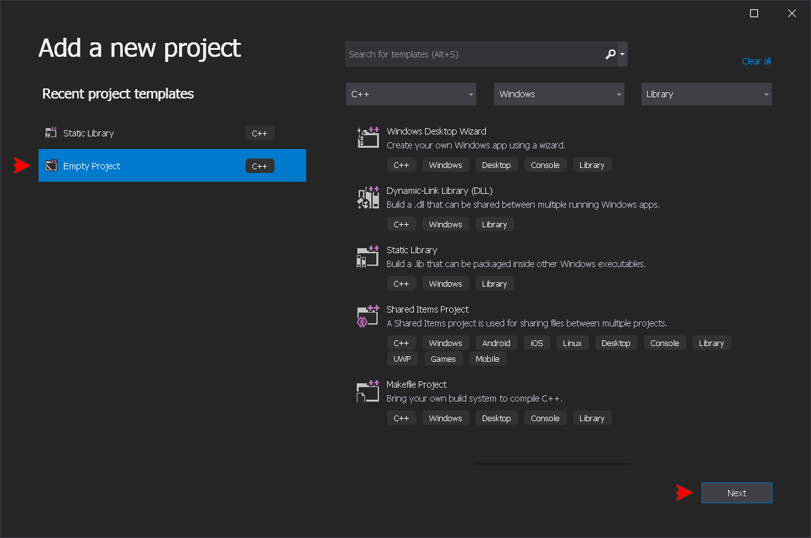

Choose any project name, check the path to the solution, and hit **`Create`**:

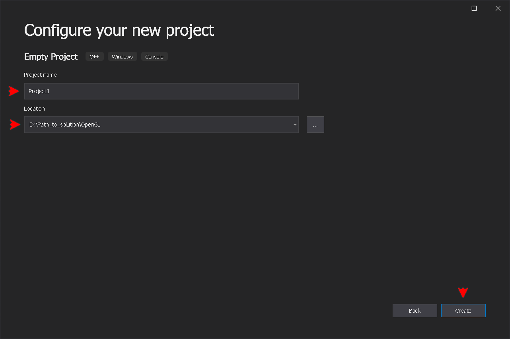

In the _Solution Explorer_, right-click the project's name and click **`Set as Startup Project`**, to set default running output application:

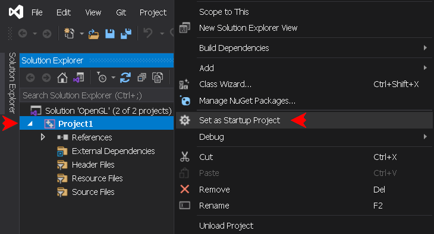

### 2. Add resources to the application project
The resources allow a quick access to files included into the output execitable as [Binary Resources](https://learn.microsoft.com/en-us/windows/win32/menurc/resources), this also allows to build a portable application. Such files as GLSL shader script files could be then hidden within the executable, and therefore can't be accidentally modified.

> [!TIP]
> If the resources aren't added to the project, the _Resource_ option would not be accessible in the _Project Property Pages_ window later on.

In the _Solution Explorer_, right-click the project's _Resource Files_ filter icon. Click **`Add`** &rarr; **`New Item... (Ctrl+Shift+A)`**:

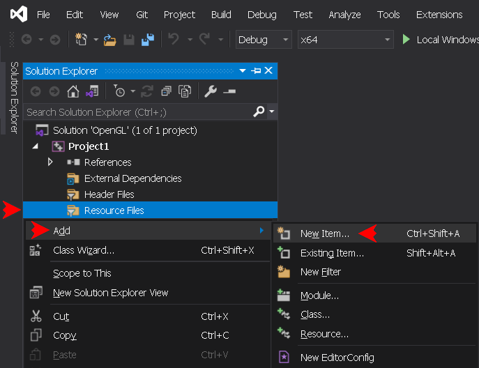

Select **`Resource`** &rarr; **`Resource File (.rc)`**, keep **`Resource.rc`** file name, check the path, and hit **`Add`**:

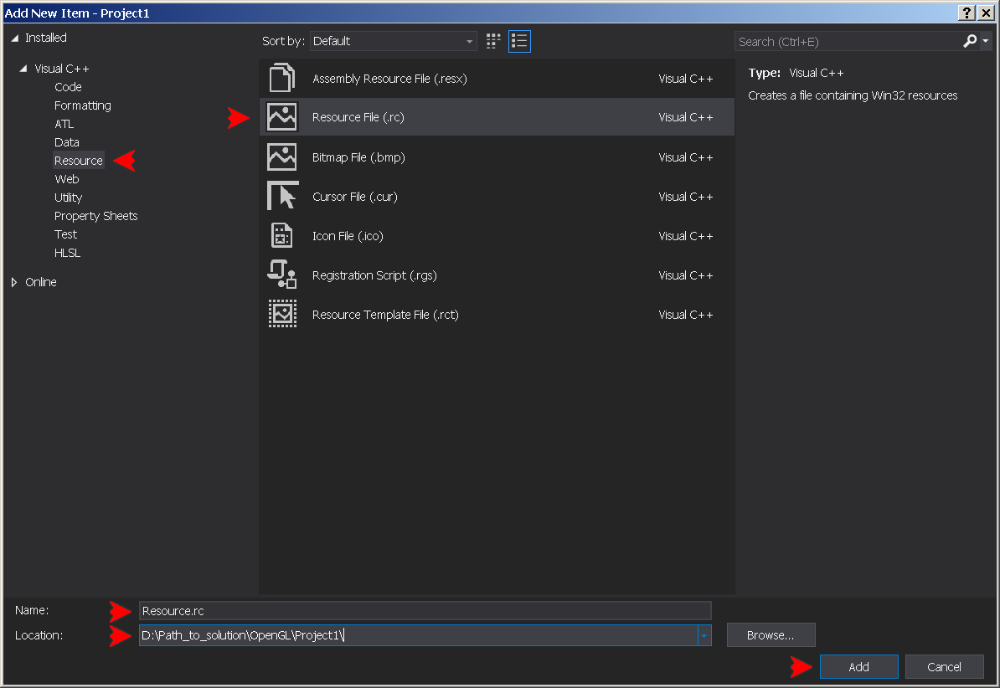

Open the two newly created flies in the editor window, and replace their content with the following code:
```
// resource.h
```
```
// Resource.rc
#include "resource.h"
```

> [!NOTE]
> For the sake of convenience, each code exemple in the present tutorial begins with its commented file name.

### 3. Add source files to the application project
In the _Solution Explorer_, right-click the project's _Source Files_ filter icon. Click **`Add`** &rarr; **`New Item... (Ctrl+Shift+A)`**:

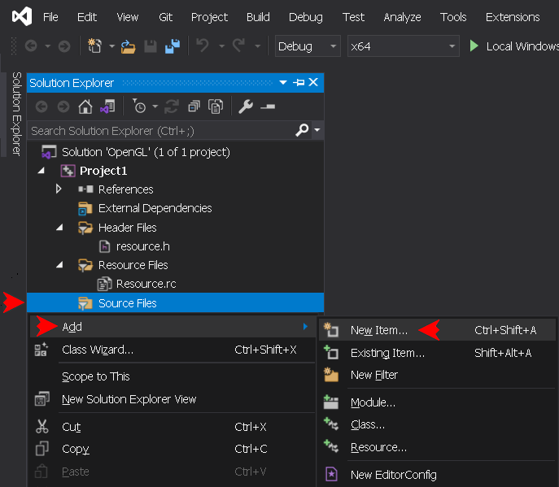

Select **`Code`** &rarr; **`C++ File (.cpp)`**, type **`main.cpp`** _(as main function)_, check the path, and hit **`Add`**:

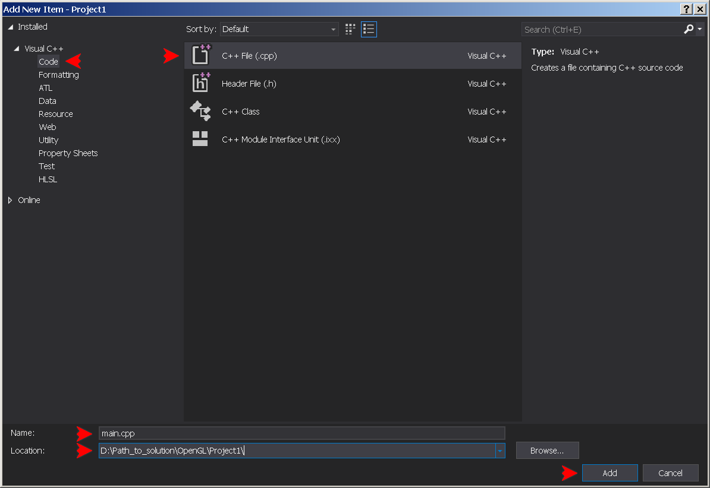

Next, it is necessary to add the GLAD source file to the project. Copy the **`glad.c`** file from the **`Common/include/glad`** directory into the project directory. Now, once again in the _Solution Explorer_, right-click the project's _Source Files_ filter icon. Click **`Add`** &rarr; **`Existing Item... (Shift+Alt+A)`**:

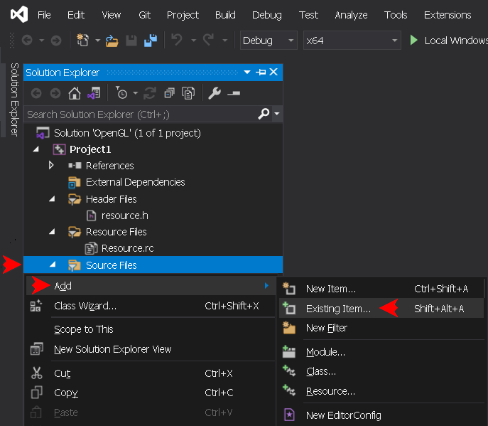

In the opened project directory select the **`glad.c`** file, and hit **`Add`** button.

Finally there are two more files, **`stdafx.cpp`** and **`stdimp.cpp`**, to be added via the _Source Files_ filter icon. The first file is being used by the precompiled header, and the second one is the YAGL++ implementation source. Both files will always remain unchanged and rarely compiled. Create them the same way as **`main.cpp`**, open in the editor and type or copy-paste the following code:
```
// stdafx.cpp
#include "stdafx.h"
```
```
// stdimp.cpp
#define YAGLPP_IMPLEMENTATION
#include <yaglpp/glpp.h>
```

### 4. Add header files to the application project
In addition to the **`resource.h`** header automatically added in previous steps, there are two (2) more files required by the present project. First, the **`config.h`** header file, which is the YAGL++ project configuration file. It provides the convenient way to keep the main library switches in the project file, rather than to modify the library's main header file. From the other hand, the configuration file swithes will be applied only for the local project, without affecting the others. To do that, the **`YAGLPP_CONFIG`** symbol has to be defined prior to include the main library file, which will override the main file switches.

In the _Solution Explorer_, right-click the project's _Header Files_ filter icon. Click **`Add`** &rarr; **`New Item... (Ctrl+Shift+A)`**:

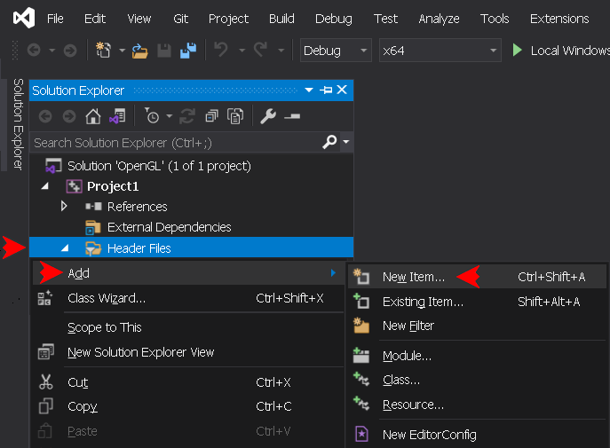

Select **`Code`** &rarr; **`Header File (.h)`**, type the file name **`config.h`**, check the path, and hit **`Add`**:

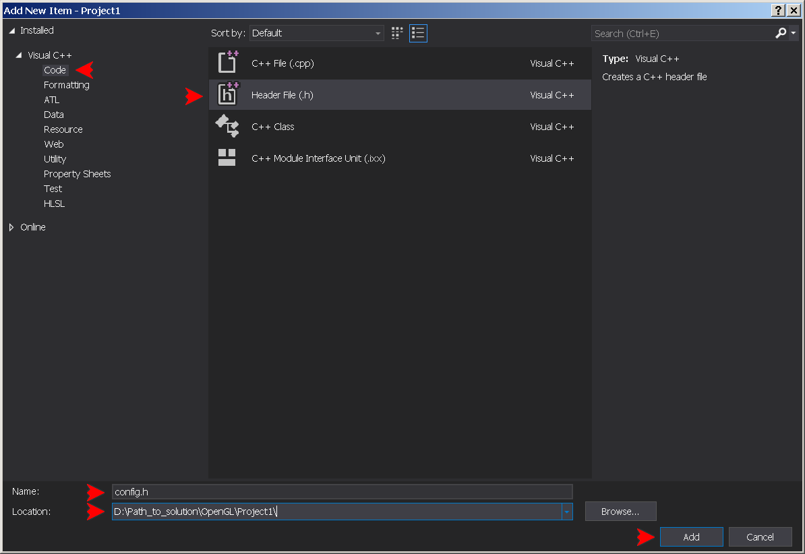

The default main switches could be copied from [glpp.h](../include/yaglpp/glpp.h) file, between _MAIN SWITCHES BEGIN_ and _MAIN SWITCHES END_ labels. The entire content of the configuration file should be as follows:
```
// config.h
#pragma once
/*Custom config override*/
#define YAGLPP_CONFIG

/*Include Assimp library headers, comment to exclude Assimp*/
#define YAGLPP_ASSIMP

/*Define <CocoaChdirResources> pre-initialize GLFW hint*/
#define YAGLPP_COCOA_CHDIR_RESOURCES

/*Define <CocoaMenubar> pre-initialize GLFW hint*/
#define YAGLPP_COCOA_MENUBAR

/*Define <JoystickHatButtons> pre-initialize GLFW hint*/
#define YAGLPP_JOYSTICK_HAT_BUTTONS

/*Include the class properties along with existing getters and setters*/
#define YAGLPP_CLASS_PROPERTIES

/*Include GLFW library headers, comment to exclude GLFW*/
#define YAGLPP_GLFW

/*Include all GLM library headers, slightly affects the compilation time*/
#define YAGLPP_GLM_HEADERS

/*Override the global new and delete operators, using the library allocator*/
#define YAGLPP_GLOBAL_ALLOCATOR

/*Do not include main entry point into YAGL++ library*/
#define YAGLPP_NO_AFX_LAYOUT

/*Compile with the most recent GLFW nonlegacy library*/
#define YAGLPP_NO_GLFW_LEGACY

/*Non-strict OpenGL loading of the higher context version supported by hardware*/
#define YAGLPP_COMPATIBLE_CONTEXT

/*Define the minimum supported OpenGL context major version value, do not comment*/
#define YAGLPP_CONTEXT_VERSION_MAJOR 3

/*Define the minimum supported OpenGL context minor version value, do not comment*/
#define YAGLPP_CONTEXT_VERSION_MINOR 3
```

The last file to be added via the _Header Files_ filter icon is **`stdafx.h`**, the project precompiled header. Create it the same way as **`config.h`**, open in the editor and type or copy-paste the following code:
```
// stdafx.h
#pragma once

// Winows API
#include <windows.h>
#include <iostream>

// YAGL++ header
#include "config.h"
#include <yaglpp/glpp.h>
```

### 5. Set the application project properties
The application project may be used in one of the four (4) platform configurations. The _Debug x64_ and _Debug Win32_ applications work with the output console window (Console Application), where as the _Release x64_ and _Release Win32_ applications have no console window (Window Application). The Debug platform configuration is using _NODEFAULTLIB_ linker option, to remove the [Linker Tools Warning LNK4098](https://learn.microsoft.com/en-us/cpp/error-messages/tool-errors/linker-tools-warning-lnk4098?view=msvc-170), appearing since only the _Release_ version of external libraries is being used, where as the Release platform configuration requires to set the [entry point](https://learn.microsoft.com/en-us/cpp/build/reference/entry-entry-point-symbol). The project is also set up to have access to common _Common/res_ resource folder, as well as to common _Common/bin_ and _Common/bin/Win32_ binary folders.

Right-click application project name bar and press **`Proprties (Alt+Enter)`**:

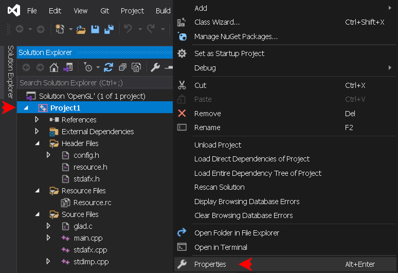

First, let's set the four (4) common properties for all configurations (a). Next, two (2) linker option for all _Debug_ and all _Release_ configurations (b, c). Finally, one (1) library path propriety for all _x64_ and all _Win32_ configurations (d, e).

> [!IMPORTANT]
> In the following subsections, copy the property string value into the appropriate field, or select an appropriate option in the _Property Pages_ window. Make sure to hit the **`Apply`** button after setting up each platform configuration.

#### a. Set five proprieties for all platform configurations

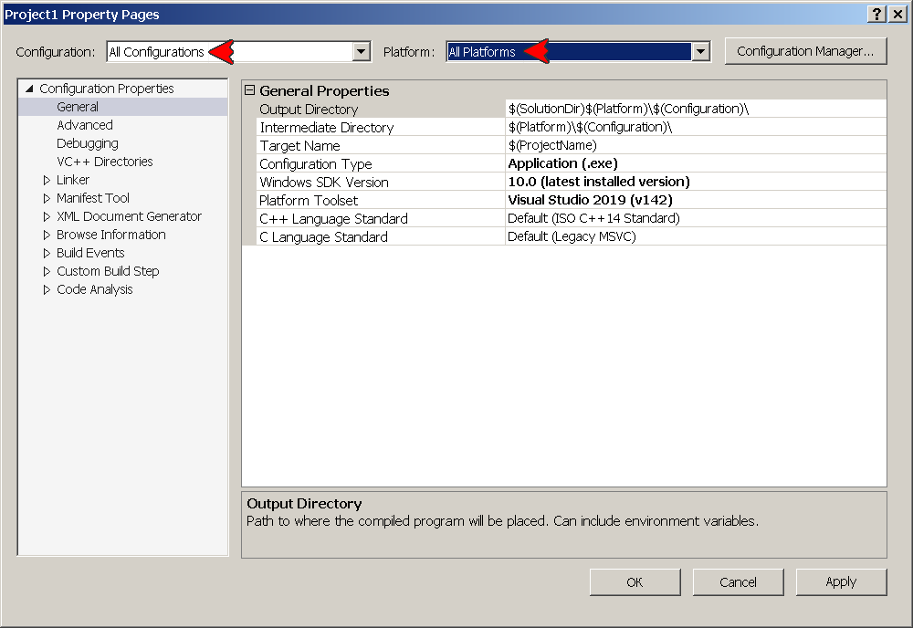

- VC++ Directories &rarr; Include Directories:```$(SolutionDir)Common\include\;$(IncludePath)```
- C/C++ &rarr; Precompiled Headers &rarr; Precompiled Header: select _Use (/Yu)_ option
- C/C++ &rarr; Precompiled Headers &rarr; Precompiled Header File: keep ```stdafx.h```
- Linker &rarr; Input &rarr; Additional Dependencies:```opengl32.lib;glfw3.lib;assimp-vc142-mt.lib;%(AdditionalDependencies)```
- Resources &rarr; Additional Include Directories:```$(SolutionDir)Common\res\;```

#### b. Set two proprieties for all Debug platform configurations

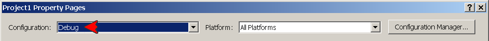

- Linker &rarr; System &rarr; SubSystem: select _Console (/SUBSYSTEM:CONSOLE)_ option
- Linker &rarr; Command Line &rarr; Additional Options:```/NODEFAULTLIB:libcmt.lib```

> [!NOTE]
> When linking application with dll CRT using /MD flag, use ```/NODEFAULTLIB:msvcrt.lib``` option.

#### c. Set two proprieties for all Release platform configurations


- Linker &rarr; System &rarr; SubSystem: select _Windows (/SUBSYSTEM:WINDOWS)_ option
- Linker &rarr; Advanced &rarr; Entry Point:```mainCRTStartup```

#### d. Set two proprieties for all x64 platform configurations

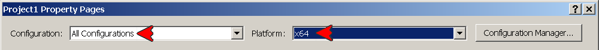

- Debugging &rarr; Environment:```path=%path%;$(SolutionDir)Common\bin\;```
- VC++ Directories &rarr; Library Directories:```$(SolutionDir)Common\lib\;$(LibraryPath)```

#### e. Set two proprieties for all Win32 platform configurations

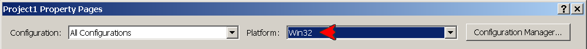

- Debugging &rarr; Environment:```path=%path%;$(SolutionDir)Common\bin\Win32\;```
- VC++ Directories &rarr; Library Directories:```$(SolutionDir)Common\lib\Win32\;$(LibraryPath)```

### 6. Setup the precompiled header
The [Precompiled header files](https://learn.microsoft.com/en-us/cpp/build/creating-precompiled-header-files?view=msvc-170) feature allows the faster compilation, which is critical for large projects. The modern IDEs are using **`pch.h`** as precompiled header name. In fact, it is possible to use any name, as long as it is set in the project properties. In the present setup the default name **`stdafx.h`** is left unchanged.

In the previous steps, the precompiled header project options was set. And from now on, all existing source files and every new one added to the project will use the precompiled header by default. It is only required to include the **`stdafx.h`** at the beginning of the file. Lastly, there are three (3) particular files to be manually adjusted:
- **`glad.c`** - does not need any includes, and should not use precompiled header;
- **`stdafx.cpp`** - is used by the precompiled header, and should be set to create the precompiled header;
- **`stdimp.cpp`** - is built with the YAGL++ implementation flag, and should not use precompiled header.

Under the project's _Source Files_ filter icon, right-click the **`glad.c`** file, and press **`Proprties (Alt+Enter)`**:

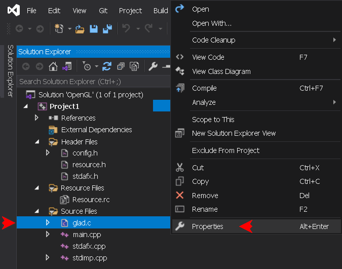

In the _glad.c_ Property Pages window set **`Configuration`** and **`Platform`** drop-down menus to **`All Configurations`** and **`All Platforms`**, since it is necessary to apply the setting to each project configurations. Under **`C/C++`** &rarr; **`Precompiled Headers`**, select the **`Precompiled Header`** file property, and set its drop-down menu to **`Not Using Precompiled Headers`**:

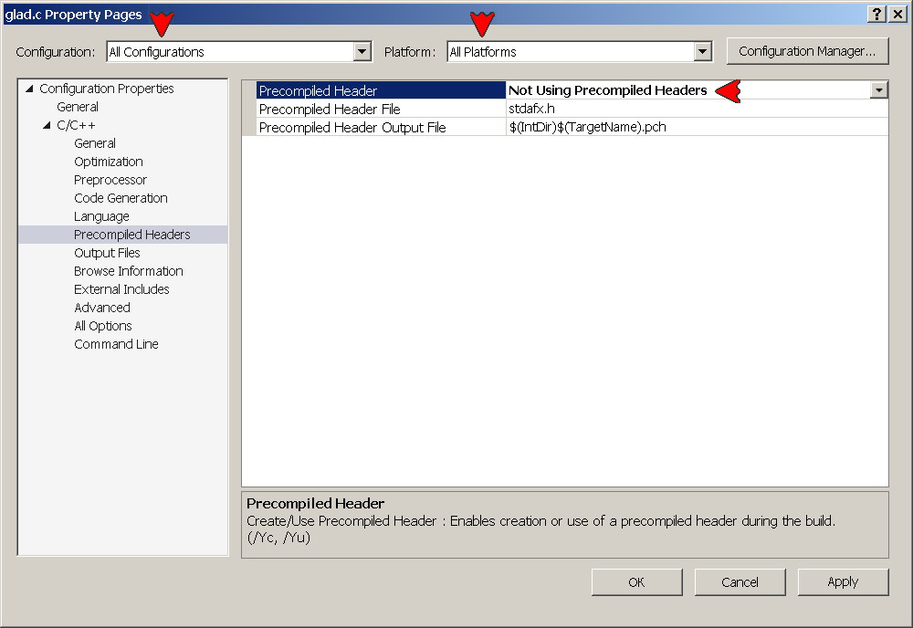

Repeat these steps to set the **`Precompiled Header`** file property of the **`stdimp.cpp`** file to **`Not Using Precompiled Headers`** (as well), where as for the **`stdafx.cpp`** file, set it to **`Create (/Yc)`**. Make sure that the **`Precompiled Header File`** file property remains set to **`stdafx.h`**.

### 7. Type the code
Open the project's **`main.cpp`** file. In the editor window type the minimal YAGL++ application code:
```
// main.cpp
#include "stdafx.h"
int main(int argc, char** argv)
{
	glfw::Window window(800, 600, "YAGL++ Application");
	window.MakeContextCurrent();
	while (!window.shouldClose)
	{
        gl::ClearColor(0.2f, 0.3f, 0.3f, 1.0f);
        gl::Clear(gl::BufferBit::Color);
		window.SwapBuffers();
		glfw::PollEvents();
	}
	return 0;
}
```
Now the IntelliSense shows the description of every library member:

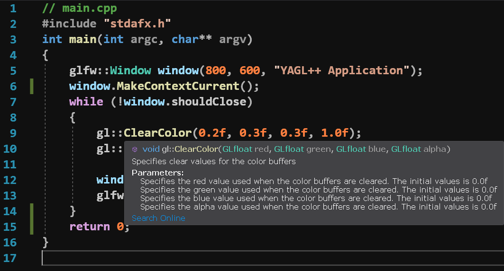

Rebuild the project under the **`Debug x64`** platform configuration. It would be wise to build it under every platform configuration, to check if there were no errors in the setting. The output should look like this:
```
Rebuild started...
1>------ Rebuild All started: Project: Project1, Configuration: Debug x64 ------
1>stdafx.cpp
1>glad.c
1>hello_window.cpp
1>stdimp.cpp
1>YAGL++: Compiling with OpenGL 3.3 context version support...
1>Project1.vcxproj -> D:\Path_to_solution\OpenGL\x64\Debug\Project1.exe
========== Rebuild All: 1 succeeded, 0 failed, 0 skipped ==========
```

> [!NOTE]
> The YAGL++ library headers were compiled twice: the first time it was compiled by the precompiled header source file **`stdafx.cpp`**, and the second time by the **`stdimp.cpp`** with the implementation flag being defined. These files are only recompiled when **`stdafx.h`** or **`config.h`** headers are modified, therefore at the next build the IDE will only recompile the **`main.cpp`** file.

Now hit **`F5`** to run the application:

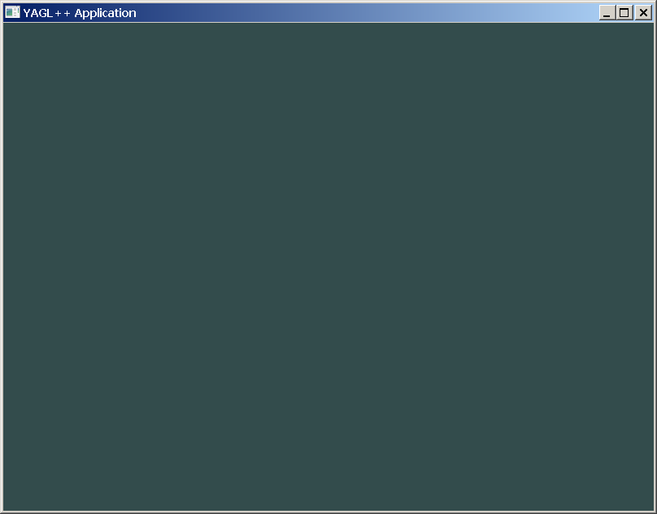

To overload window events, use the new window class derived from **`glfw::Window`**:
```
// main.cpp
#include "stdafx.h"
class MyWindow : public glfw::Window
{
	using Window::Window;                         // Base constructors
	void OnFramebufferSize(int width, int height) // Framebuffer size callback
	{
		gl::Viewport(0, 0, width, height);
	}
};

int main(int argc, char** argv)
{
	MyWindow window(800, 600, "Overloaded Event Application");
	//...
```
Finally, here is the example of the library usage in _AFX-alike layout_. In order to use it, comment the **`GLPP_NO_AFX_LAYOUT`** switch in the configuration file prior to build the project. The global application variable is defined as an anonymous class derived from **`glfw::Thread`**:
```
// main.cpp
#include "stdafx.h"
class : public glfw::Thread
{
	void OnInit()   // Create window
	{
		glfw::Window context = new glfw::Window(800, 600, "AFX-alike Mode Application");
		context->MakeContextCurrent();
	}
	void onRender() // Rendering loop
	{
		gl::ClearColor(0.2f, 0.3f, 0.3f, 1.0f);
		gl::Clear(gl::BufferBit::Color);
	}
} application;
```
AFX-alike layout is rather experimental, and at the moment can be used with a single **`glfw::Thread`** class. But it could become a promising trend in future development.

### 8. Create YAGL++ project template
At this point, it would be wise to save all performed work by creating a Visual Studio project template from the current project. Later, it would be possible to create a new project, without the need to set all required parameters. The template will work with the similar solution path layout. Download the [YAGL++ template icon](template.png), or use any other with transparent background. The source code could be reduced to the following:
```
// main.cpp
#include "stdafx.h"
#include "resource.h"

int main(int argc, char** argv)
{
	return 0;
}
```

Click **`Project`** menu &rarr; **`Export Template...`**:

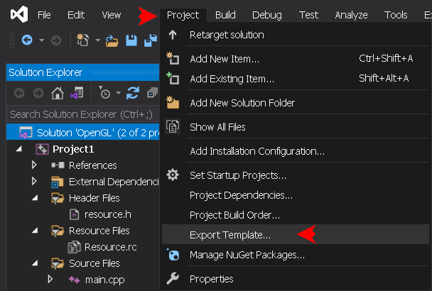

In the opened window, keep the template type as _Project template_, select the project to export from, then hit **`Next`**:

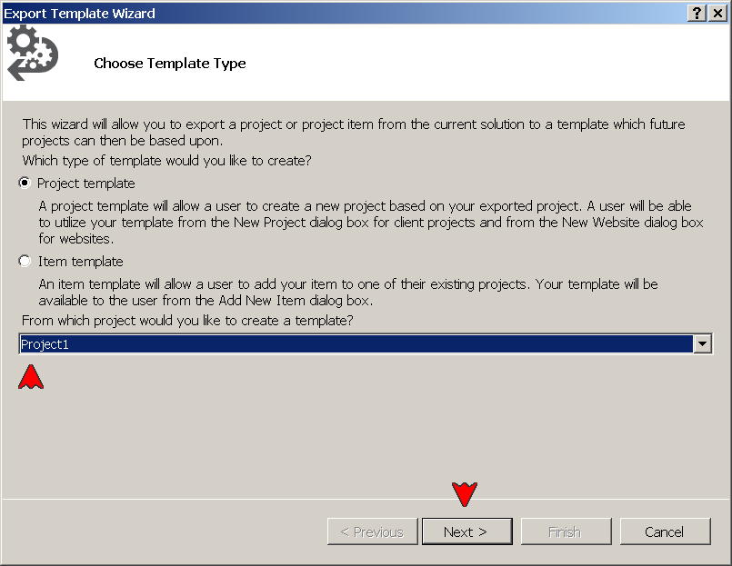

In the next window, copy the project name and description (or type any other):
```
YAGL++ Application
```
```
Windows and Console C++ Application using YAGL++ library
```

Hit **`Browse...`** to select the path to downloaded project icon for both _Icon image_ and _Preview image_ edit boxes. Then hit **`Finish`**:

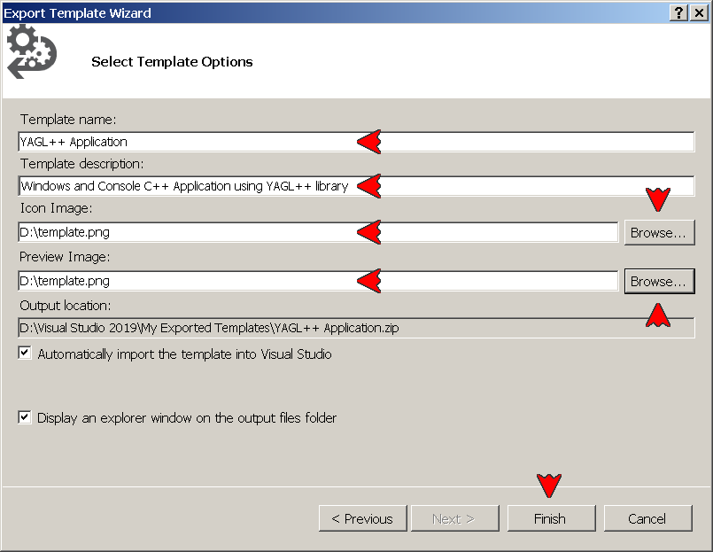

Close the opened folder with the new template _.zip_ archive, and restart the IDE. Now, in the _Solution Explorer_ right-click the solution name bar (1st line), click **`Add`** &rarr; **`New Project...`**:

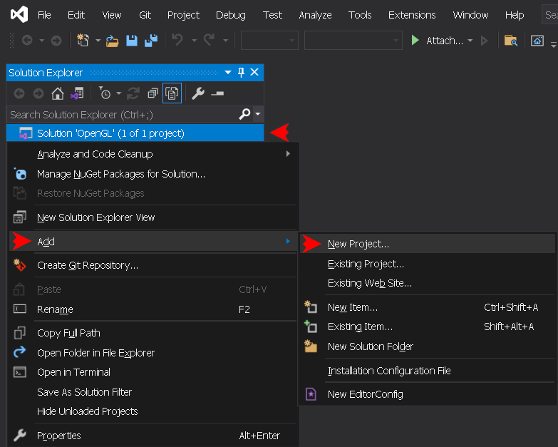

Make sure to set filters to _All languages_, _All platforms_ and _All project types_. This will show all project templates. Alternatively, type **`yagl`** in the search bar:

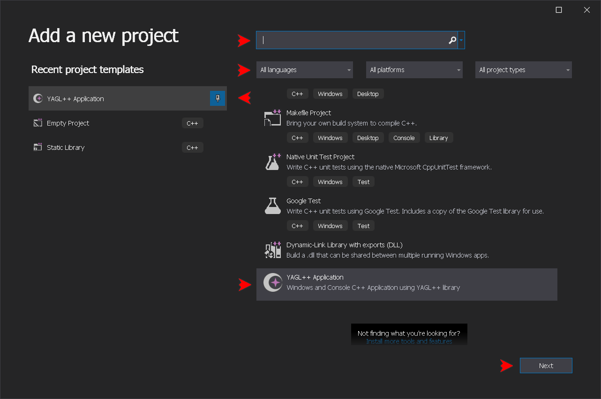

> [!NOTE]
> Unfortunatelly, the Visual Studio does not allow to add the _tags_ to a custom template. Therefore it does not show up immediately in the _Add a new project_ dialog, ousted by the built-in templates. But after some time, it will appear under _Recent project templates_, where it then could be pinned.

### 9. Install Visual Studio GLSL add-on
Optionally, download the [GLSL language integration](https://marketplace.visualstudio.com/items?itemName=DanielScherzer.GLSL) add-on by Daniel Scherzer, or from [this repository](GLSL.vsix), then run downloaded file. This allows to view the .vert and .frag files with the appropriate color highlighting.

[&uarr; TOP](USAGE.md#usage) [EXAMPLES &rarr;](EXAMPLES.md)
